Most people hear the word **neuroplasticity** and immediately think:

> “The brain can rewire itself.”

That sentence is true, but it is also dangerously incomplete.

Because if we stop there, neuroplasticity starts sounding like magic. It starts sounding like if you repeat affirmations, visualize success, or “think positive,” your brain will suddenly transform into whatever you want.

That is not how it works.

Neuroplasticity is more powerful than that — and more honest than that.

**Neuroplasticity is the nervous system’s ability to change its activity, structure, connections, and function in response to experience.** In plain English:

> Your brain changes based on what it repeatedly does, pays attention to, feels strongly about, and practices over time.

This is why a child learns language.

This is why a pianist’s fingers become fast.

This is why a driver starts changing gears without thinking.

This is why emotional pain can become a mental loop.

This is why fear can grow.

This is why recovery after injury is sometimes possible.

This is why habits become automatic.

And this is also why change is hard.

Your brain is not a motivational poster. It is a living system. It does not change just because you wish. It changes when your repeated experiences convince it that something is important enough to update.

This is Part 1 of a two-part series.

---

### The two-part series

#### Part 1 — The Brain Learns by Changing

This article covers the foundation:

- What neuroplasticity actually means.
- What neurons and synapses are.
- Why repeated experience changes the brain.
- Why plasticity can be helpful or harmful.
- How learning, habits, anxiety, skill, and recovery use the same basic principles.
- How to apply neuroplasticity in real life without falling for hype.

#### Part 2 — The Deep Machinery of Brain Change

The second article will go deeper:

- Long-term potentiation and long-term depression.
- Dopamine, BDNF, acetylcholine, glutamate, GABA, cortisol.
- Myelin and white matter plasticity.
- Critical periods and adult plasticity.
- Trauma, addiction, chronic pain, rumination, and maladaptive learning.
- Self-directed neuroplasticity systems.
- How to design your life so your brain changes in the direction you choose.

For now, we start from zero.

---

## 1. The simplest definition

Neuroplasticity comes from two words:

| Word | Meaning |
|---|---|
| Neuro | Related to the nervous system |
| Plasticity | Ability to be shaped or changed |

So neuroplasticity means:

> The nervous system can be shaped by experience.

A more formal scientific definition describes neuroplasticity as the nervous system’s ability to change its activity in response to internal or external stimuli by reorganizing its structure, function, or connections.[^1]

But let’s make it human:

> Neuroplasticity is the reason your brain becomes better at what it repeatedly does.

That sentence is the key.

Not what you do once.

Not what you think about vaguely.

Not what you say you want.

What you **repeat**.

---

## 2. The forest path model

Imagine your brain as a forest.

At first, there is no path.

```text
🌲 🌲 🌲 🌲 🌲 🌲
🌲 🌲 🌲 🌲 🌲 🌲
🌲 🌲 🌲 🌲 🌲 🌲
```

Then you walk through the forest once.

```text
🌲 🌲 🌲 🌲 🌲 🌲
🌲 🌲 . . 🌲 🌲
🌲 🌲 🌲 . 🌲 🌲
```

The grass is slightly pressed down, but the path is weak.

Then you walk the same route every day.

```text
🌲 🌲 🌲 🌲 🌲 🌲
🌲 🌲 ═══ 🌲 🌲
🌲 🌲 🌲 ║ 🌲 🌲
```

Now it becomes easier to walk that way.

Eventually, it becomes the obvious route.

This is a good beginner model of neuroplasticity:

> Repeated use makes a pathway easier to use again.

That is true for physical skills.

It is also true for emotional reactions.

It is true for thinking patterns.

It is true for habits.

It is true for avoidance.

It is true for courage.

Your brain is always asking:

> “What keeps happening? What should I make easier next time?”

---

## 3. The brain is not fixed

For a long time, many people believed the adult brain was mostly fixed. Childhood was seen as the time of learning and wiring; adulthood was seen as maintenance and decline.

Modern neuroscience changed that picture.

The adult brain is not as plastic as a child’s brain in every way, but it is still capable of change. Learning, injury, environment, attention, exercise, sleep, stress, therapy, and repeated behavior can all affect brain function and structure.

The better model is this:

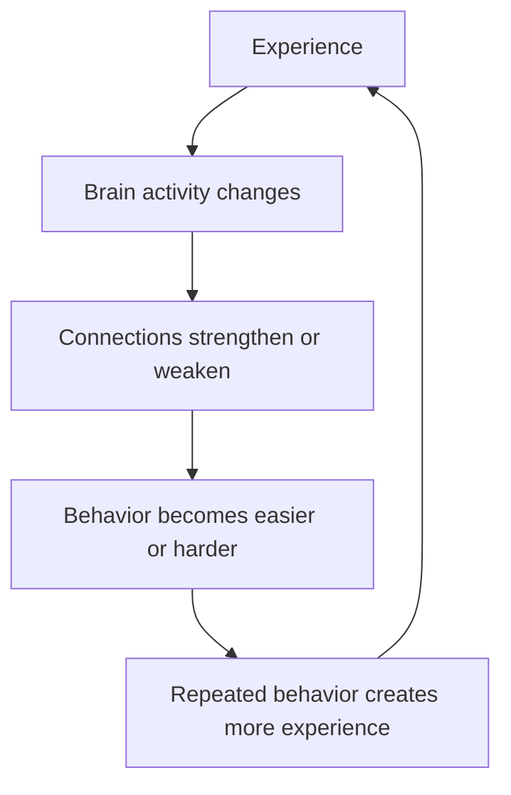

This is the loop of your life:

> Experience changes the brain.  
> The changed brain changes future experience.

That is why habits can trap you.

It is also why deliberate practice can free you.

---

## 4. Neuroplasticity is not automatically good

This is one of the most important ideas in this whole series.

Neuroplasticity is not “self-improvement energy.”

It is not automatically positive.

Plasticity simply means change.

And the brain can change in helpful or harmful directions.

| Helpful plasticity | Harmful plasticity |
|---|---|
| Learning a language | Rumination loops |
| Becoming calmer under pressure | Becoming more reactive |
| Recovering movement after injury | Chronic pain sensitization |
| Building confidence | Learned helplessness |
| Practicing deep focus | Training distraction |
| Improving social skills | Strengthening avoidance |
| Developing discipline | Strengthening addiction patterns |

The brain does not always ask:

> “Is this good for my future?”

It often asks:

> “What has been repeated, rewarded, feared, or emotionally marked?”

That is why neuroplasticity can help you learn guitar, but it can also make you better at rumination.

The brain adapts to what you train.

Sometimes you train things on purpose.

Sometimes you train them accidentally.

---

## 5. Accidental training

You may think training means sitting down with a notebook and practicing something intentionally.

But the brain is training all day.

Every repeated loop is training.

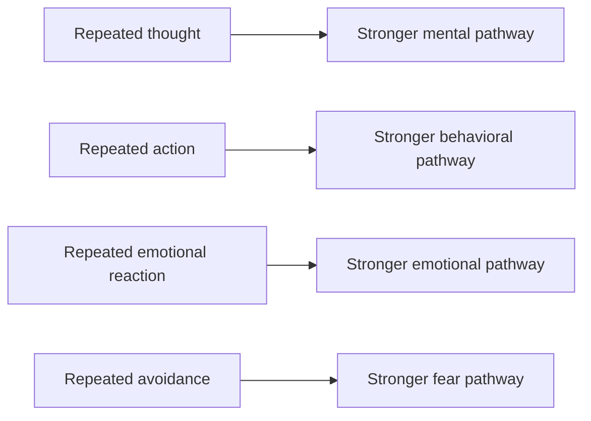

Examples:

- Every time you open your phone when bored, you train the boredom-to-phone pathway.
- Every time you avoid a difficult conversation, you train avoidance.
- Every time you sit down and write even when you do not feel like it, you train creative discipline.
- Every time you breathe and respond instead of reacting, you train emotional regulation.
- Every time you replay a stressful event for one hour, you train the replay circuit.
- Every time you solve a hard puzzle carefully, you train problem-solving circuits.

Your brain does not care whether you call it practice.

It still counts.

---

## 6. The nervous system from zero

Before we go deeper, we need the basic machinery.

Your nervous system has two major parts:

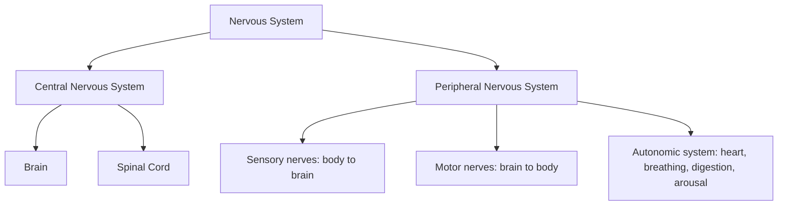

The brain and spinal cord form the **central nervous system**.

The nerves running through the body form the **peripheral nervous system**.

When you touch a hot pan, move your hand, feel fear, remember a song, solve a puzzle, speak a language, or recall an old memory, your nervous system is involved.

---

## 7. What is a neuron?

A **neuron** is a nerve cell that sends, receives, and processes signals.

A simplified neuron has:

| Part | What it does |
|---|---|
| Dendrites | Receive signals from other neurons |
| Cell body | Processes incoming signals |
| Axon | Sends signals outward |
| Axon terminals | Pass signals to other cells |
| Synapse | Connection point between neurons |

Simple picture:

```text
       Dendrites
      \   |   /
       \  |  /
      [Cell body]
           |
           |
         Axon
           |
           |
    Axon terminals
           |
        Synapse
           |
      Next neuron
```

The brain has many cell types, not only neurons. Glial cells, for example, support neurons, regulate the environment around them, participate in immune defense, help form myelin, and influence signaling. But for a beginner, neurons and synapses are the best starting point.

---

## 8. What is a synapse?

A **synapse** is the connection point where one neuron influences another.

A simple version:

```text
Neuron A  --->  Synapse  --->  Neuron B
```

Neuron A sends a signal.

Neuron B receives it.

If the same connection is used repeatedly in a meaningful way, that connection may become stronger.

```text
Before practice:

A --. . .--> B

After repeated meaningful practice:

A =========> B
```

This is one of the foundations of learning.

A memory is not stored like a file in a computer folder. A skill is not stored in one tiny box. Instead, memories and skills are distributed across patterns of activity and connection among many neurons and brain regions.

A useful simplification:

> Learning changes the probability that certain neurons will activate together again.

That is why practice makes recall faster.

---

## 9. The famous phrase: neurons that fire together wire together

You may have heard this phrase:

> Neurons that fire together wire together.

This is a simplified version of **Hebbian learning**, named after psychologist Donald Hebb.

It means:

> If one neuron repeatedly helps activate another neuron, the connection between them can become stronger.

For example, imagine you are learning a new word in another language.

At first:

```text
Sound → confusion
```

Then:

```text
Sound → meaning, but slow
```

After repeated use:

```text
Sound → meaning automatically
```

The sound pattern and meaning pattern have become linked.

This also happens in emotional learning.

Suppose someone was embarrassed while speaking in public.

```text
Speaking in public → embarrassment → fear
```

If that association is repeated or emotionally intense, the brain may learn:

```text
Speaking in public → danger
```

Now the person feels anxiety before speaking, even when the current situation is safe.

Same plasticity principle.

Different result.

This is why neuroplasticity is not only about skills. It is also about meaning.

---

## 10. A better model: the brain changes through signals of importance

The brain does not update everything equally.

If you see a random wall for two seconds, your brain usually does not redesign itself around that wall.

But if something is repeated, emotional, rewarding, threatening, surprising, or deeply attended to, the brain treats it as important.

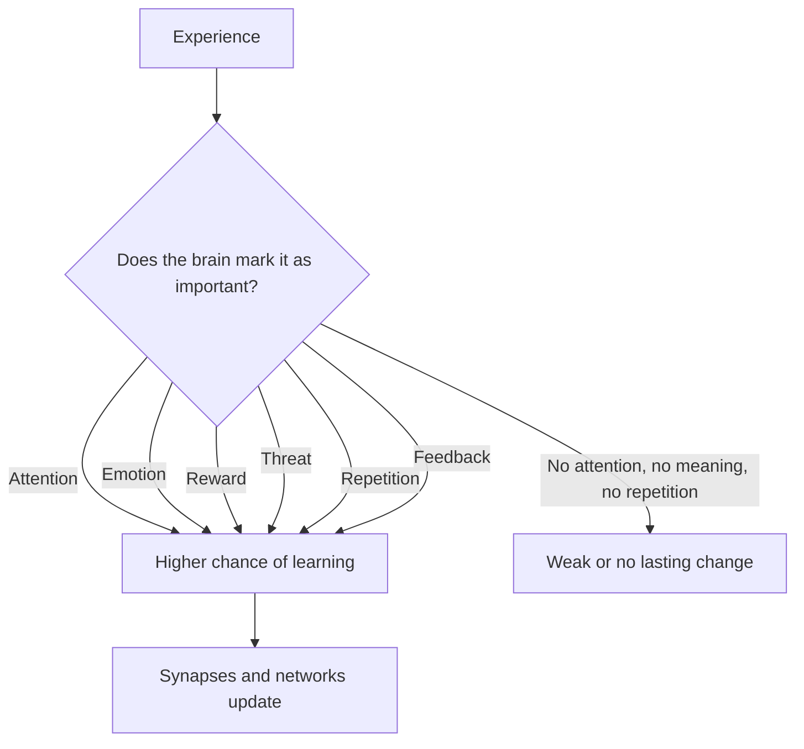

Plasticity is guided by importance.

Importance can come from:

- attention,
- repetition,
- emotion,
- reward,
- fear,
- novelty,
- error,
- feedback,
- personal meaning.

This is why you remember insults more than ordinary Tuesday afternoons.

This is why a single traumatic event can sometimes alter the nervous system strongly.

This is why progress in a skill feels motivating.

This is why boring passive repetition often fails.

---

## 11. The levels of neuroplasticity

Neuroplasticity happens at many levels.

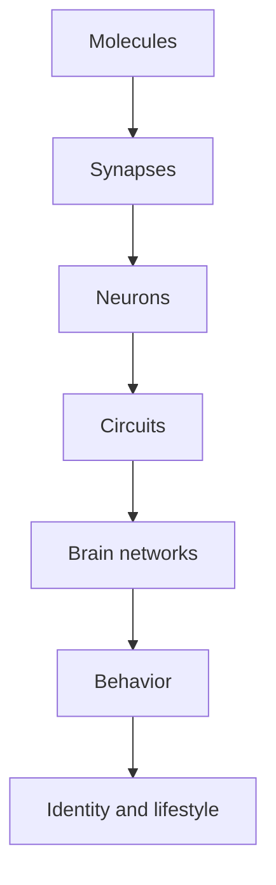

Let’s make each level simple.

### Molecular level

Inside and around neurons, chemicals influence whether cells become more or less likely to change.

This includes neurotransmitters and growth-related molecules.

We will discuss these deeply in Part 2.

### Synaptic level

Connections between neurons can become stronger or weaker.

This is central to learning and memory. The synaptic plasticity and memory hypothesis proposes that activity-dependent synaptic changes are important for creating and storing memory traces.[^2]

### Cellular level

Neuron branches, dendritic spines, axons, and support cells can change.

### Circuit level

Groups of neurons can become better coordinated.

For example, the circuits for seeing a piano key, moving a finger, hearing the sound, and correcting the movement become linked during practice.

### Network level

Large brain regions can change how they communicate.

For example, attention, emotion, memory, and movement networks can become more or less coordinated.

### Behavioral level

You experience plasticity as:

- remembering,
- reacting,
- moving,
- speaking,
- choosing,
- focusing,
- avoiding,
- craving,
- calming down,
- becoming skilled.

The science happens in the nervous system.

The result appears in daily life.

---

## 12. Six types of neuroplasticity

### 1. Synaptic plasticity

This is change in the strength of connections between neurons.

```text
Weak connection:
A --. . .--> B

Strong connection:
A =========> B
```

This is the basic language of learning.

### 2. Structural plasticity

This means the physical structure of the nervous system changes.

For example:

- dendritic branches may change,
- dendritic spines may form or disappear,
- axons may change,
- brain region volume or connectivity may shift with long-term experience.

A famous example is the study of London taxi drivers. Researchers found that licensed London taxi drivers had greater posterior hippocampal volume than control subjects, suggesting that long-term navigation training was associated with measurable brain differences.[^3]

Important: this does not mean “do one navigation exercise and grow your hippocampus.” It means long-term, demanding, specific experience can be associated with structural brain changes.

### 3. Functional plasticity

This is change in how brain areas or networks are used.

For example, after injury, some remaining networks may compensate for lost function. This is one reason rehabilitation after stroke or traumatic brain injury can sometimes improve function, though recovery depends on many factors including injury location, severity, timing, health, and therapy.[^1]

### 4. Developmental plasticity

Children’s brains are especially open to shaping.

Language, movement, vision, attachment, and social learning are strongly influenced by early experience.

This does not mean adults cannot learn. It means children’s brains have certain windows where specific kinds of input have unusually strong effects.

### 5. White matter and myelin plasticity

Neurons send signals through axons. Many axons are wrapped in **myelin**, a fatty insulating layer that helps signals travel efficiently.

```text
Unmyelinated or less optimized route:
signal - - - - - - >

More optimized myelinated route:
signal =========>
```

Research on white matter plasticity suggests experience and learning can influence white matter and myelin-related structure even in adulthood.[^4]

In simple terms:

> Learning is not only about stronger connections. It is also about better timing and communication.

### 6. Maladaptive plasticity

This is plasticity that creates suffering or dysfunction.

Examples:

- anxiety loops,
- addiction,
- chronic pain sensitization,
- avoidance habits,
- trauma responses,
- rumination,
- learned helplessness.

The brain is trying to adapt, but it may adapt to danger, repetition, or short-term relief in a way that harms long-term life.

---

## 13. Learning is not one thing

When people say “learning,” they usually imagine studying.

But the brain learns many things:

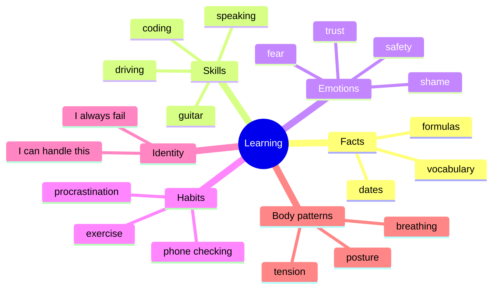

Your brain can learn a fact.

It can learn a movement.

It can learn a fear.

It can learn a craving.

It can learn confidence.

It can learn helplessness.

It can learn calm.

This is why neuroplasticity is bigger than education. It is the biology of becoming.

---

## 14. The learning loop

Most useful learning follows this pattern:

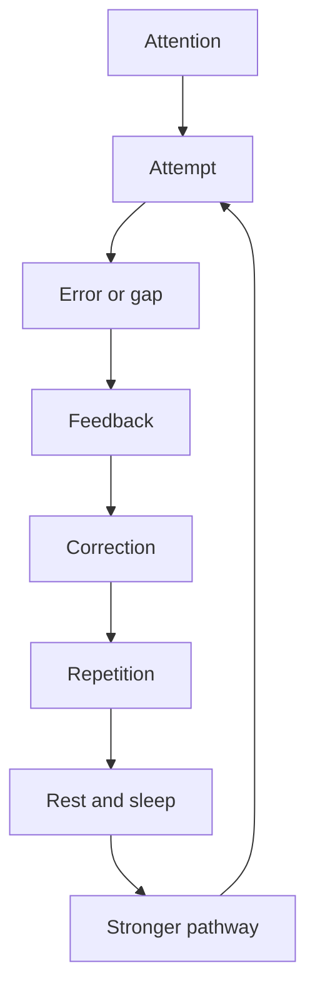

Let’s break it down.

### Attention

The brain must know what to update.

Distracted practice creates weak signals.

Focused practice tells the brain:

> “This matters.”

### Attempt

You must try.

Thinking about improvement is not the same as performing the behavior.

### Error

Error is not failure.

Error is information.

The brain needs mismatch:

```text
Expected result ≠ Actual result
```

That mismatch tells the nervous system what to adjust.

### Feedback

Feedback can come from:

- a teacher,
- a score,
- a recording,
- a mirror,
- a compiler error,
- a conversation,
- your body,
- the result itself.

No feedback means the brain may repeat the same mistake.

### Correction

Plasticity improves when you adjust.

Not just repeat.

Correct.

### Repetition

The new pattern needs enough repetitions to become easier.

### Rest and sleep

Sleep supports memory consolidation. Research on memory consolidation describes sleep as an offline period during which newly encoded memories can be stabilized and integrated.[^5]

The simple version:

> Practice writes the draft. Sleep helps edit and save it.

---

## 15. Why passive repetition often fails

Many people repeat something without improving.

Why?

Because repetition alone is not enough.

```text
Weak practice:
repeat → repeat → repeat → same mistake

Strong practice:
attempt → feedback → correction → repeat
```

Example: language learning.

Weak practice:

```text
Read word list for 1 hour.
Forget most of it.
```

Strong practice:

```text
Hear word.
Say it.
Use it in a sentence.
Recall it later without looking.
Get corrected.
Use it again in real conversation.
```

Example: coding.

Weak practice:

```text
Watch tutorials all day.
Feel productive.
Forget later.
```

Strong practice:

```text
Try problem.
Get stuck.
Debug.
Look up only the missing part.
Rewrite solution from memory.
Explain the pattern.
Solve a similar problem tomorrow.
```

Neuroplasticity rewards active engagement.

---

## 16. Why difficulty matters

The brain changes when the task is challenging enough to require adaptation.

Too easy:

```text
No new signal.
```

Too hard:

```text
Confusion, stress, shutdown.
```

Right level:

```text
Difficult but possible with effort.
```

This is the learning zone.

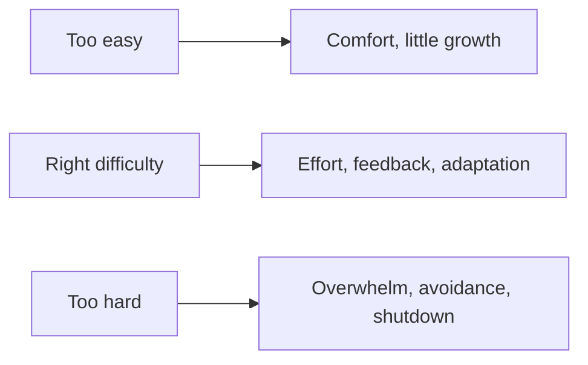

A good practice session should feel like:

> “I cannot do this automatically yet, but I can improve if I pay attention.”

That edge is where plasticity is strongest.

---

## 17. Why emotion matters

Emotion is a biological highlighter.

Your brain remembers emotionally intense things because emotion marks them as important.

That is helpful when emotion teaches you survival.

It is harmful when emotion strengthens fear, shame, obsession, or pain.

Examples:

| Experience | Possible brain lesson |
|---|---|
| Public praise | “Speaking can be rewarding.” |
| Public humiliation | “Speaking is dangerous.” |
| A successful workout | “Effort can feel good.” |
| Repeated rejection | “Trying is unsafe.” |
| Solving a hard problem | “I can figure things out.” |
| Being ignored repeatedly | “People do not care.” |

The brain does not just store facts.

It stores emotional predictions.

That is why the same event can mean different things to different people.

One person thinks:

> “I failed. I should practice.”

Another thinks:

> “I failed. This needs a better strategy.”

The event is similar.

The learned meaning is different.

---

## 18. Why attention matters

Attention acts like a spotlight.

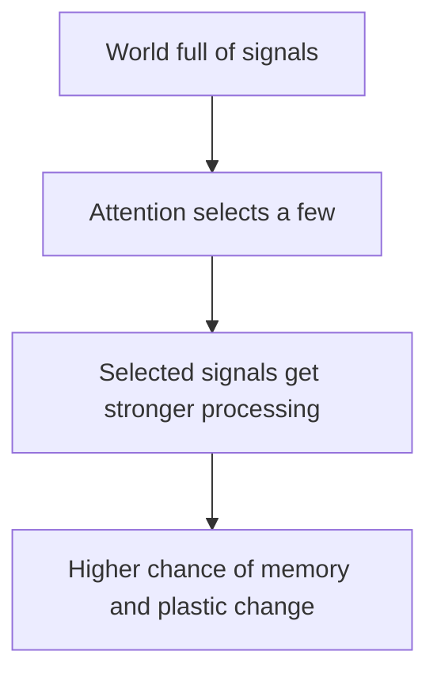

You cannot deeply learn what you barely attend to.

This is why multitasking damages learning quality.

If you are studying while checking your phone every two minutes, your brain is not only learning the subject.

It is also learning interruption.

```text
Study → discomfort → phone → relief
```

That is a plasticity loop.

You think you are failing at discipline.

But really, you are successfully training distraction.

---

## 19. Why sleep matters

Sleep is not just rest from learning.

Sleep is part of learning.

During sleep, the brain can reactivate, stabilize, and reorganize memories. This does not mean every memory is perfectly saved during sleep, but sleep is strongly connected to learning and memory consolidation.[^5]

Think of it like this:

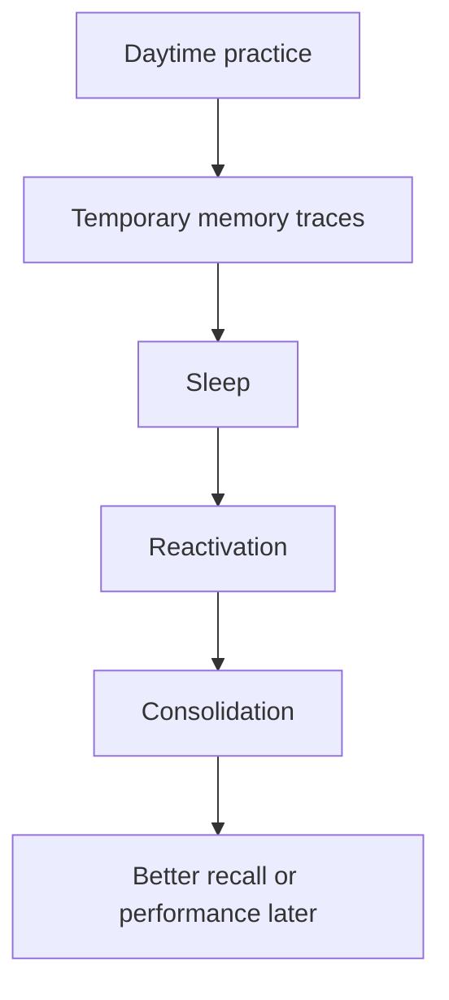

Practical meaning:

- Cramming with poor sleep is fragile.
- Skill practice improves with sleep.
- Emotional regulation becomes harder when sleep is poor.
- Bad sleep makes old habits more tempting.
- Learning plans should include rest, not just effort.

A person trying to change their brain while ignoring sleep is like someone trying to build a house while refusing delivery of materials.

---

## 20. Why exercise matters

Exercise is one of the most reliable lifestyle signals that supports brain health.

Physical activity affects blood flow, metabolism, mood, inflammation, stress regulation, and neurotrophic factors such as BDNF. Reviews have connected exercise with neuroplasticity-related changes, although the details depend on exercise type, intensity, age, health, and measurement method.[^6]

Simple version:

> Movement makes the brain more ready to learn.

You do not need to become an athlete to benefit.

A practical baseline:

- walk daily,
- do some moderate cardio,
- add strength training,
- avoid sitting all day,
- move before deep work when possible.

Exercise does not replace practice.

It supports the brain that practices.

---

## 21. Why stress is double-edged

Stress is not always bad.

Short-term challenge can sharpen focus.

But chronic, uncontrollable stress can harm learning conditions by disturbing sleep, attention, emotional control, and memory systems. Research on stress and plasticity shows that chronic stress can remodel dendrites and synaptic connections in brain regions involved in emotion, memory, and executive control.[^7]

Think of stress like heat.

Some heat helps cooking.

Too much burns the food.

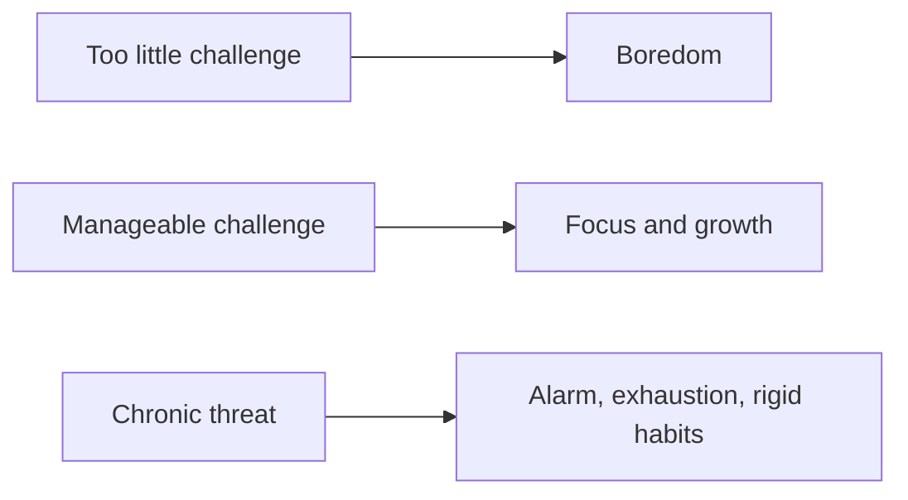

For learning, the best state is not total comfort.

It is not panic either.

It is:

> Safe enough to explore, challenged enough to adapt.

---

## 22. The habit loop

Habits are one of the easiest ways to see neuroplasticity in daily life.

A habit usually has three parts:

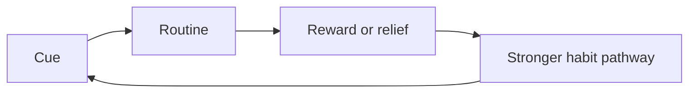

Example:

```text
Cue: boredom
Routine: open distracting app
Reward: novelty and relief
```

After enough repetitions:

```text
Boredom → phone
```

The behavior starts feeling automatic.

You may say:

> “This is a discipline problem.”

But the brain says:

> “This is the pattern that has been trained.”

A habit is not just behavior.

It is a learned prediction:

> “When this cue happens, this action gives relief or reward.”

---

## 23. How to change a habit using neuroplasticity

You usually cannot delete a habit directly.

You replace and weaken it.

The old pathway may remain available, especially under stress.

So the goal is:

1. reduce cues,
2. interrupt the old routine,
3. create a replacement routine,
4. reward the new routine,
5. repeat until the new pathway becomes easier.

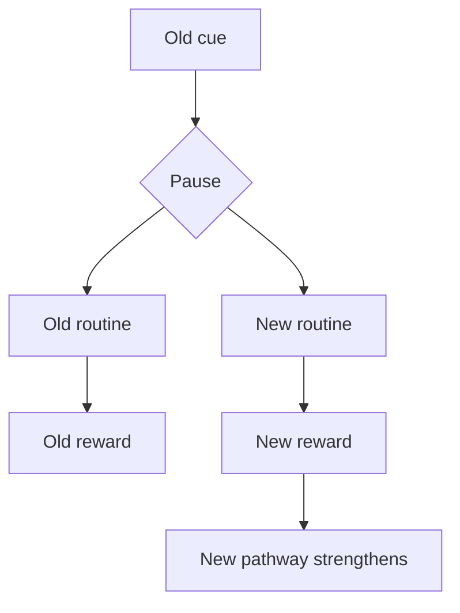

Example: phone checking during study.

Old loop:

```text
Difficult task → discomfort → phone → relief
```

New loop:

```text
Difficult task → discomfort → 3 breaths → write next tiny step → continue → relief from progress
```

Environment support:

- phone outside the room,
- website blocker,
- study timer,
- visible task list,
- reward after focused block.

The important point:

> Do not rely only on willpower. Design the loop.

---

## 24. Rumination as neuroplasticity

Rumination is rumination that feels like problem-solving but usually becomes emotional replay.

Example:

```text
Why did this happen?
What did they mean?
What if I had handled it differently?
Why did the situation go that way?
What will happen next?
What should I learn from this?
```

The brain treats repetition as importance.

So rumination trains the brain to return to the same emotional pain.

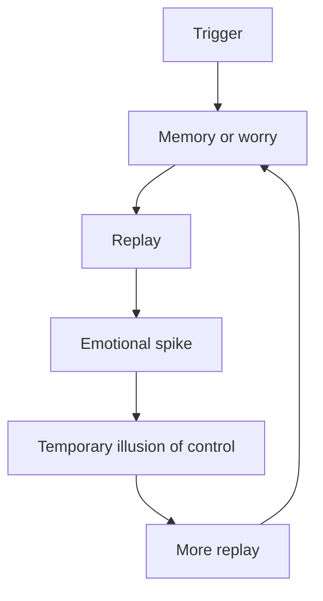

The painful part is that rumination often feels useful.

It feels like:

> “If I think about this enough, I will finally solve it.”

But many emotional problems are not solved by more replay.

They are solved by:

- naming the loop,
- regulating the body,
- choosing a next action,
- changing environment,
- creating new meaning,
- repeating the new response.

A replacement loop:

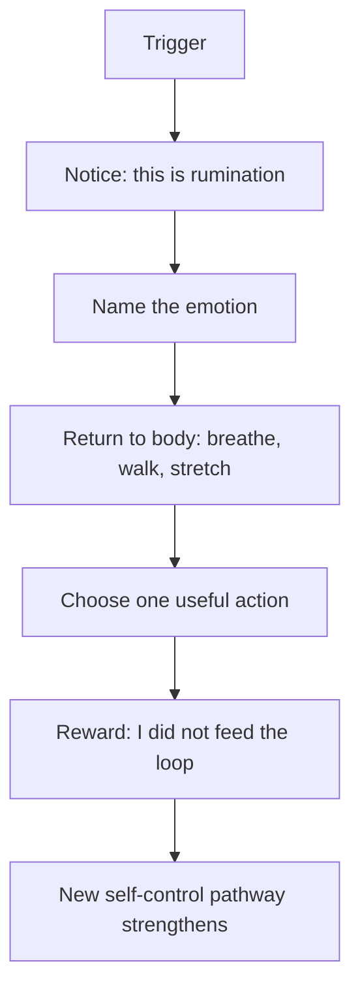

This is practical neuroplasticity.

You are not arguing with the old pathway.

You are starving it and building a new one.

---

## 25. Anxiety as learned prediction

Anxiety is not just “being weak.”

It is often the brain predicting danger.

A simplified anxiety loop:

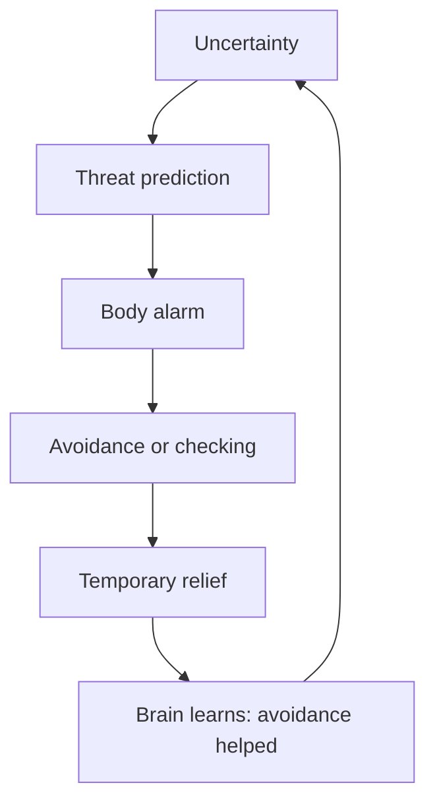

The problem is that relief becomes the reward.

Avoidance feels good short-term, so the brain strengthens it.

But long-term, avoidance teaches:

> “I survived because I escaped.”

That keeps the fear alive.

To update anxiety, the brain often needs safe corrective experience:

```text
Prediction: "I cannot handle this."
Action: face it in a manageable way.
Result: discomfort, but survival.
Update: "Maybe I can handle more than I thought."
```

That is plasticity.

Not motivational theory.

Training.

---

## 26. Skill learning: from awkward to automatic

Let’s say you are learning guitar.

At first:

```text
See chord → think slowly → fingers awkward → bad sound → correction
```

After practice:

```text
See chord → fingers move → sound comes out → tiny corrections
```

Eventually:

```text
Emotion → musical phrase → hand movement
```

The skill becomes less conscious.

Not because your soul became musical.

Because circuits became trained.

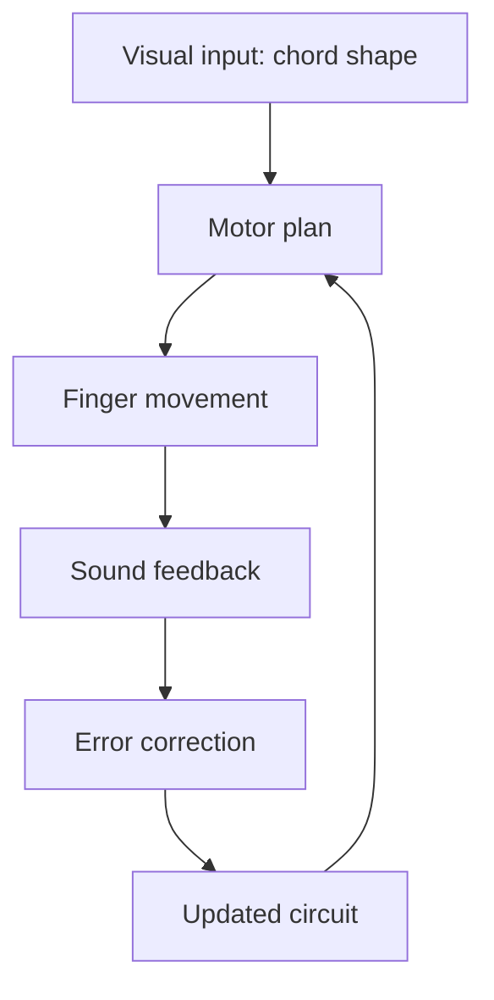

The same applies to coding.

Beginner:

```text
Problem → confusion → search randomly → copy solution
```

Intermediate:

```text
Problem → recognize pattern → attempt → debug → learn
```

Advanced:

```text
Problem → mental model → tradeoffs → implementation → testing
```

The expert is not simply “smarter.”

The expert has trained pattern libraries.

---

## 27. The difference between knowledge and wiring

You can know what to do and still not do it.

Why?

Because knowledge and wiring are different.

Example:

You may know:

> “I should not check my phone during deep work.”

But the wiring says:

```text
Boredom → phone → relief
```

You may know:

> “I should not replay that situation.”

But the wiring says:

```text
Trigger → memory → rumination → emotional stimulation
```

You may know:

> “I should exercise.”

But the wiring says:

```text
Low energy → bed → scrolling → comfort
```

Knowledge is a map.

Wiring is the road.

To change behavior, you need both:

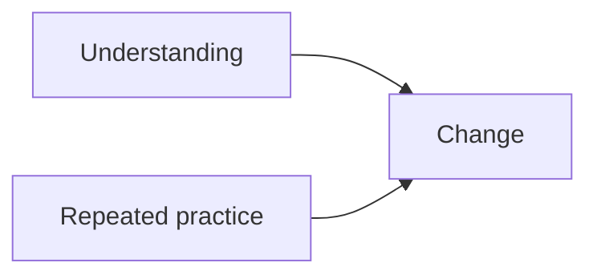

Insight can start change.

Repetition installs it.

---

## 28. A practical framework: A.R.C.

To use neuroplasticity in real life, remember:

> **A.R.C. = Attention, Repetition, Correction**

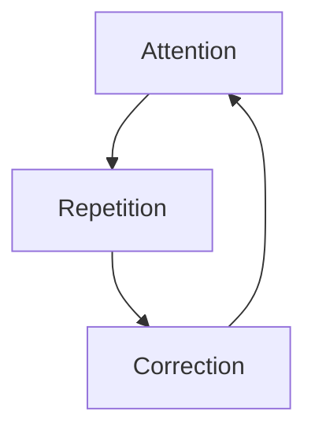

### Attention

What exactly are you training?

Be specific.

Bad:

```text
I want to become better.
```

Good:

```text
Explain one idea clearly for two minutes.
```

Bad:

```text
Reduce repetitive stressful thoughts.
```

Good:

```text
When the thought loop starts, I will label it "rumination", stand up, breathe for 60 seconds, and do one useful action.
```

### Repetition

The brain needs repeated signals.

One intense day is less useful than smaller repeated sessions.

```text
Better:
30 minutes daily for 20 days

Usually worse:
10 hours once, then nothing
```

### Correction

You need feedback.

Ask:

- What went wrong?
- What did I expect?
- What actually happened?
- What should I adjust next time?
- What is the smallest better repetition?

---

## 29. The plasticity equation

A simple practical equation:

```text
Plasticity = attention × repetition × feedback × emotion × recovery
```

If any part is zero, learning weakens.

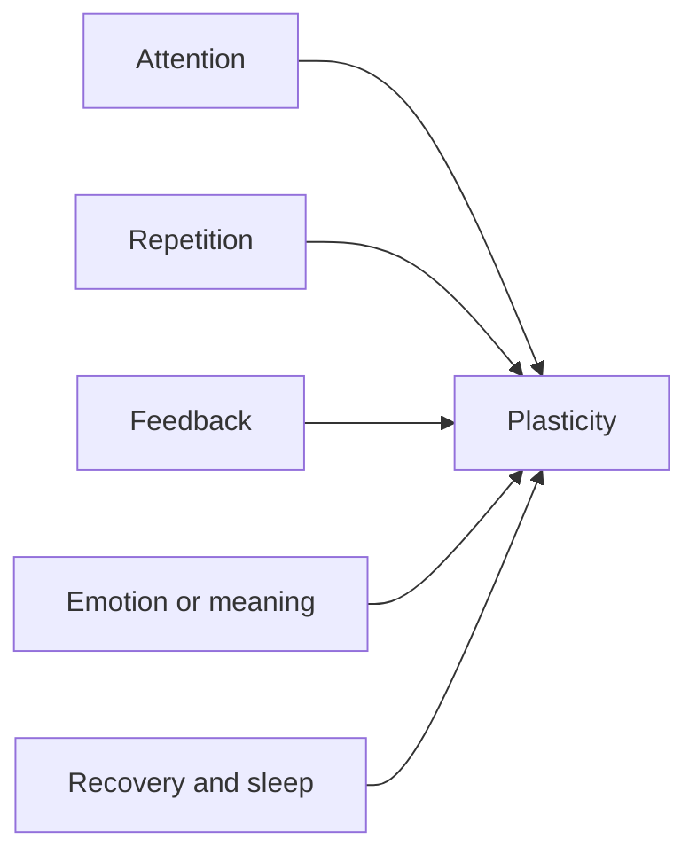

Examples:

| Situation | Plasticity quality |
|---|---|
| Focused practice with feedback | Strong |
| Passive scrolling | Strong for distraction, weak for skill |
| Repetition with no correction | Strengthens whatever you repeat, even mistakes |
| Emotional experience | Often strong |
| Sleep-deprived practice | Weaker consolidation |
| Exercise + practice + sleep | Better learning environment |

---

## 30. Neuroplasticity in daily life: five real examples

### Example 1: Practicing clear speaking

Weak method:

```text
Watch speaking videos.
Feel motivated.
Do not speak.
```

Better method:

```text
Choose one prompt.
Record a 2-minute answer.
Listen.
Find 3 mistakes.
Repeat the same answer.
Record again.
Compare.
Sleep.
Repeat tomorrow.
```

Plasticity logic:

```text
Speaking attempt → feedback → correction → repetition → confidence pathway
```

### Example 2: Learning programming

Weak method:

```text
Watch tutorial after tutorial.
Copy code.
Forget.
```

Better method:

```text
Solve one small problem.
Get stuck.
Write what you tried.
Look up one missing idea.
Solve.
Delete code.
Rewrite from memory.
Explain the pattern.
```

Plasticity logic:

```text
Problem recognition → struggle → correction → memory retrieval → stronger pattern
```

### Example 3: Getting back into fitness

Weak method:

```text
Motivation spike → intense workout → soreness → quit
```

Better method:

```text
Small workout.
Repeatable difficulty.
Track completion.
Increase slowly.
Reward identity: "This is a completed repetition."
```

Plasticity logic:

```text
Cue → workout → completion reward → identity update
```

### Example 4: Reducing rumination

Weak method:

```text
Tell yourself: stop thinking.
Then keep thinking.
```

Better method:

```text
Notice trigger.
Say: "This is rumination."
Change physical state.
Do one concrete action.
Do not negotiate with the loop.
```

Plasticity logic:

```text
Trigger → label → regulate → action → new pathway
```

### Example 5: Building confidence

Confidence is not only belief.

Confidence is remembered evidence.

Weak method:

```text
Repeat: confidence is already present.
```

Better method:

```text
Do small hard things.
Record proof.
Repeat.
Increase difficulty.
```

Plasticity logic:

```text
Action → evidence → identity → more action
```

---

## 31. The 7-day neuroplasticity starter lab

Use this as a practical experiment.

Pick one thing:

- clear speaking,
- coding,
- guitar,
- fitness,
- writing,
- reducing rumination,
- improving focus,
- waking up early.

Do not pick five things.

Pick one.

### Day 1: Define the circuit

Write:

```text
The old pattern I am training is:
The new pattern I want to train is:
The cue that starts the old pattern is:
The reward that maintains it is:
```

Example:

```text
Old pattern: boredom → phone
New pattern: boredom → stand, breathe, return to task
Cue: difficult work
Reward: relief
```

### Day 2: Make the new behavior tiny

The first version must be easy enough to repeat.

```text
Too big:
Study 5 hours daily.

Better:
One 25-minute focused block with phone outside the room.
```

### Day 3: Add feedback

Ask:

```text
Did I do the behavior?
What interrupted me?
What adjustment would make tomorrow easier?
```

### Day 4: Add emotion or meaning

Connect the behavior to identity.

```text
I am not just practicing a skill.
I am becoming someone who can communicate clearly under pressure.
```

### Day 5: Protect sleep

Do not sacrifice sleep to feel productive.

Sleep is part of the learning loop.

### Day 6: Increase difficulty slightly

Make it 5–10% harder.

Not 100% harder.

```text
25 minutes → 30 minutes
2-minute speaking → 2.5-minute speaking
1 coding problem → 1 problem + explanation
```

### Day 7: Review evidence

Write:

```text
What became easier?
What still feels hard?
What cue is most dangerous?
What replacement worked best?
What will I repeat next week?
```

This is how you turn neuroplasticity from theory into practice.

---

## 32. Common mistakes people make with neuroplasticity

### Mistake 1: Thinking insight equals change

Insight matters.

But insight is not installation.

You can understand everything in this article and still not change if you do not repeat new behavior.

### Mistake 2: Trying to change too many circuits at once

The brain changes better with focused signals.

Trying to fix sleep, diet, focus, communication, exercise, meditation, and emotional regulation all in one week usually creates overload.

Pick one main circuit.

### Mistake 3: Practicing in panic

High stress can make learning rigid.

You need challenge, not constant threat.

### Mistake 4: Repeating without feedback

Repetition strengthens what you do.

If you repeat the wrong technique, you train the wrong technique.

### Mistake 5: Ignoring environment

Your environment is a plasticity machine.

It cues behavior all day.

If your room says “scroll,” your brain listens.

If your desk says “work,” your brain listens.

Design beats willpower.

### Mistake 6: Expecting adult change to feel easy

Adult change often feels unnatural at first because the old pathway is smoother.

That does not mean the new path is false.

It means it is new.

```text
Old pathway: highway
New pathway: footpath
```

The footpath becomes a road only through use.

---

## 33. The identity layer

The deepest use of neuroplasticity is not just changing behavior.

It is changing what your brain expects from you.

Identity is built from repeated evidence.

```mermaid
flowchart TD
    A[Tiny action] --> B[Evidence]
    B --> C[Self-belief]
    C --> D[Future action becomes easier]
    D --> B
```

If you repeatedly break promises to yourself, your brain learns:

> “My intentions are not reliable.”

If you repeatedly keep small promises, your brain learns:

> “I can trust myself.”

Self-respect is plastic.

Not because you can fake it.

Because you can train evidence.

---

## 34. A better way to think about discipline

Discipline is often misunderstood.

People think discipline means forcing yourself forever.

But from a neuroplasticity perspective, discipline means:

> Using effort now to make the right action easier later.

At first:

```text
Action requires huge effort.
```

After repetition:

```text
Action requires moderate effort.
```

After identity and habit:

```text
Action becomes normal.
```

That is the point.

Discipline is not meant to feel equally hard forever.

If it does, your system may be badly designed.

---

## 35. The “brain city” metaphor

Let’s end Part 1 with one big metaphor.

Your brain is like a living city.

```mermaid
flowchart TD
    A[Neurons] --> B[Buildings]
    C[Synapses] --> D[Roads between buildings]
    E[Myelin] --> F[Road quality and speed]
    G[Attention] --> H[Construction permit]
    I[Emotion] --> J[Priority marker]
    K[Repetition] --> L[Traffic pattern]
    M[Sleep] --> N[Night repair crew]
    O[Exercise] --> P[Better construction resources]
    Q[Stress] --> R[Emergency mode]
    S[Habits] --> T[Highways]
```

If a route gets heavy traffic every day, the city expands it.

If a route is ignored, the city stops maintaining it.

If a harmful shortcut is used often, it can become a highway.

If a better route is practiced repeatedly, it slowly becomes easier.

This is neuroplasticity.

Not magic.

Construction.

---

## 36. The big takeaway

Neuroplasticity means your brain is shaped by repeated experience.

That is hopeful, but also serious.

Because it means you are always training something.

When you practice focus, you train focus.

When you practice distraction, you train distraction.

When you practice courage, you train courage.

When you practice avoidance, you train avoidance.

When you practice rumination, you train rumination.

When you practice calm action, you train calm action.

So the question is not:

> “Is the brain changing?”

It is.

The better question is:

> “What am I training my brain to become better at?”

---

## 37. Practical worksheet

Use these questions after reading.

### 1. What is being accidentally trained?

```text
A repeated thought:
A repeated emotional reaction:
A repeated behavior:
A repeated avoidance pattern:
```

### 2. What pathway do I want to build?

```text
The new pathway I want:
The cue that will trigger it:
The smallest version of the action:
The reward I will give it:
```

### 3. What will I do for 7 days?

```text
Daily practice time:
Feedback method:
Sleep protection rule:
Environment change:
Review date:
```

### 4. What is my replacement loop?

```text
When I feel/see/hear __________________,
instead of __________________,
I will __________________,
then I will reward it by __________________.
```

Example:

```text
When I feel the urge to check my phone during study,
instead of opening a distracting app,
I will stand up, take 3 breaths, write the next tiny task,
then I will reward it by marking one clean repetition.
```

---

## 38. Preview of Part 2

In Part 2, we will go under the hood.

We will study:

- how synapses strengthen,
- how synapses weaken,
- long-term potentiation,
- long-term depression,
- dopamine and reward prediction,
- BDNF and growth support,
- acetylcholine and attention,
- GABA and inhibition,
- glutamate and excitation,
- stress hormones,
- critical periods,
- myelin plasticity,
- trauma and fear learning,
- addiction loops,
- chronic pain,
- how to deliberately redesign your environment for self-directed neuroplasticity.

Part 1 gave us the map.

Part 2 opens the engine.

---

## References

[^1]: Puderbaugh, M., & Emmady, P. D. *Neuroplasticity*. StatPearls, NCBI Bookshelf. https://www.ncbi.nlm.nih.gov/books/NBK557811/

[^2]: Takeuchi, T., Duszkiewicz, A. J., & Morris, R. G. M. *The synaptic plasticity and memory hypothesis: encoding, storage and persistence*. Philosophical Transactions of the Royal Society B, 2014. https://pmc.ncbi.nlm.nih.gov/articles/PMC3843897/

[^3]: Maguire, E. A., Gadian, D. G., Johnsrude, I. S., et al. *Navigation-related structural change in the hippocampi of taxi drivers*. Proceedings of the National Academy of Sciences, 2000. https://www.pnas.org/doi/10.1073/pnas.070039597

[^4]: Sampaio-Baptista, C., & Johansen-Berg, H. *White Matter Plasticity in the Adult Brain*. Neuron, 2017. https://pmc.ncbi.nlm.nih.gov/articles/PMC5766826/

[^5]: Born, J., & Wilhelm, I. *System consolidation of memory during sleep*. Psychological Research, 2011. https://pmc.ncbi.nlm.nih.gov/articles/PMC3278619/

[^6]: Cardoso, S. V., et al. *Therapeutic Importance of Exercise in Neuroplasticity*. 2024. https://pmc.ncbi.nlm.nih.gov/articles/PMC11385284/

[^7]: McEwen, B. S., et al. Research on stress and structural plasticity shows that chronic stress can remodel dendrites and synaptic connectivity in brain systems involved in memory and emotion. See: *Stress and the brain: individual variability and the inverted-U*. https://pmc.ncbi.nlm.nih.gov/articles/PMC3753223/
