In Part 1, we built the foundation.

We defined **neuroplasticity** as the nervous system’s ability to change its activity, structure, connections, and function in response to experience.

The simple version was:

> Your brain becomes better at what it repeatedly does.

But that sentence is only the doorway.

In Part 2, we go deeper.

We are going under the hood.

We will look at the mechanisms that make brain change possible:

- how synapses strengthen,
- how synapses weaken,
- how reward teaches the brain,
- how attention opens the learning gate,
- how myelin improves timing,
- how stress changes plasticity,
- why children learn differently from adults,
- why anxiety, addiction, chronic pain, and rumination are forms of learning,
- and how to deliberately shape your brain without falling for neuroplasticity hype.

This article is still written for normal humans, not only neuroscientists.

But it will go deeper than the usual internet explanation.

---

### A quick warning before we start

Neuroplasticity is real.

But it is not magic.

It does **not** mean:

- you can rewire your whole brain overnight,
- every illness can be fixed by mindset,
- trauma disappears if you “think differently,”
- addiction is simply a bad habit,
- chronic pain is “all in your head,”
- positive thinking replaces treatment,
- adults can learn exactly like children,
- more plasticity is always better.

A more accurate view is:

> Neuroplasticity is the brain’s capacity to update itself when biology, attention, behavior, emotion, environment, and repetition push in the same direction.

That is powerful.

But it is also specific.

The brain changes according to rules.

Let’s learn those rules.

---

## 1. The full neuroplasticity stack

In Part 1, we used the forest path metaphor.

Now we need a more advanced map.

Neuroplasticity happens at multiple levels at the same time.

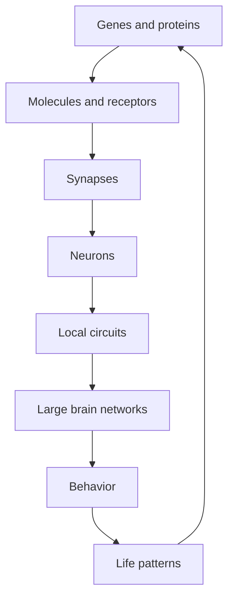

This loop is important.

Your life patterns influence your brain biology.

Your brain biology influences your life patterns.

That means change can start from many places:

- behavior,
- environment,
- sleep,
- attention,
- emotion,
- social environment,
- therapy,
- exercise,
- nutrition,
- medication,
- deliberate practice,
- repeated identity-based action.

There is no single “plasticity button.”

The nervous system is a living ecosystem.

---

## 2. Plasticity has two sides: change and stability

Most people only talk about the change side.

But the brain also needs stability.

Imagine if every emotional day completely rewired your personality.

That would be chaos.

So the brain must balance two needs:

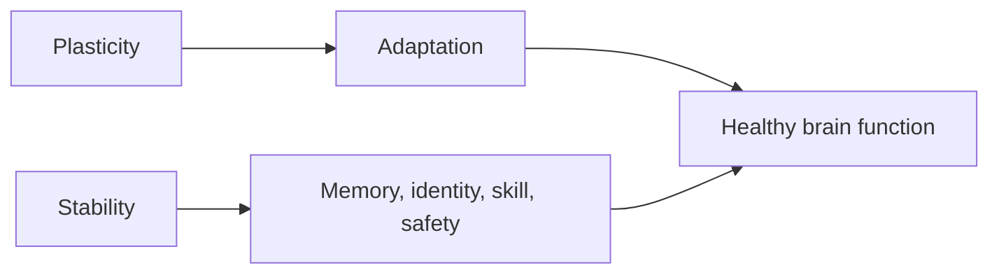

Too little plasticity:

```text
Rigidity
Stuck habits
Poor learning
Poor recovery
```

Too much or poorly regulated plasticity:

```text
Instability
Noise
Over-sensitivity
Poor filtering
Vulnerability to harmful learning
```

Healthy change requires controlled plasticity.

This is why the brain does not change deeply from every random thought.

It changes when enough signals say:

> “This matters. Update the system.”

---

## 3. Synapses: the small gates of learning

A **synapse** is the connection point where one neuron influences another.

Simple version:

```text
Neuron A  --->  Synapse  --->  Neuron B
```

At the synapse, one neuron releases chemical messengers called **neurotransmitters**.

The receiving neuron has **receptors** that detect those messengers.

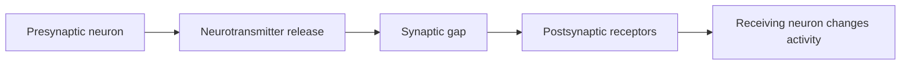

A synapse can become:

- stronger,
- weaker,
- more sensitive,
- less sensitive,
- more likely to release neurotransmitter,
- less likely to release neurotransmitter,
- physically larger or smaller,
- more stable or more temporary.

That is why synapses are central to learning and memory.

A simple memory is not stored in one synapse.

But changes across many synapses help form memory traces.

---

## 4. Long-term potentiation: strengthening a pathway

One of the most studied mechanisms of synaptic plasticity is **long-term potentiation**, usually called **LTP**.

LTP means:

> A synapse becomes stronger after certain patterns of activity.

Before LTP:

```text
Neuron A fires → weak response in Neuron B
```

After LTP:

```text
Neuron A fires → stronger response in Neuron B
```

Visual:

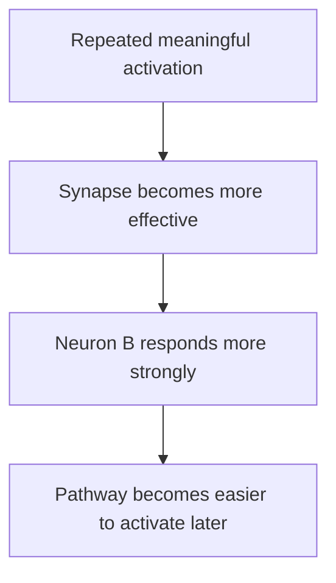

This is one reason practice works.

When a pathway is repeatedly activated with the right timing and conditions, the brain can increase the efficiency of that pathway.

LTP is strongly studied in the hippocampus, a brain region important for memory, and it remains a central model for understanding learning-related synaptic change.[^1]

---

## 5. Long-term depression: weakening a pathway

The opposite process is **long-term depression**, or **LTD**.

LTD means:

> A synapse becomes weaker after certain patterns of activity.

This is not bad.

It is necessary.

If the brain only strengthened connections, it would become noisy and overloaded.

Learning requires selection.

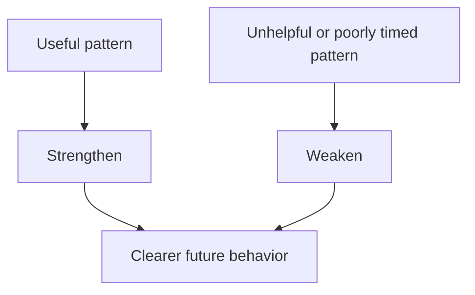

A musician does not only learn the correct notes.

The brain also suppresses wrong movements.

A speaker does not only learn better pronunciation.

The brain also reduces old pronunciation errors.

An emotionally mature person does not only learn calm responses.

The brain also weakens old reactive pathways.

Learning is not only adding.

Learning is also pruning.

---

## 6. LTP and LTD in one picture

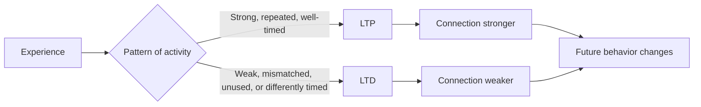

This is why practice quality matters.

You are not just “putting in hours.”

You are shaping which connections become stronger and which become weaker.

---

## 7. NMDA and AMPA receptors: the beginner-friendly version

To understand LTP, two receptor types are especially important:

- **AMPA receptors**
- **NMDA receptors**

Do not worry about memorizing the names.

Understand the logic.

### AMPA receptors

AMPA receptors help produce fast excitatory signals.

Simple metaphor:

> AMPA receptors are like ordinary doors that open when the signal arrives.

### NMDA receptors

NMDA receptors are special because they act more like coincidence detectors.

They are involved when:

1. the presynaptic neuron sends a signal,
2. the postsynaptic neuron is also sufficiently active,
3. the timing suggests the connection matters.

Simple metaphor:

> NMDA receptors ask, “Did these neurons activate together strongly enough to justify an update?”

When conditions are right, calcium enters the postsynaptic neuron and triggers biochemical processes that can strengthen or weaken the synapse. NMDA receptor-dependent calcium signaling is central to many forms of LTP and LTD.[^2]

Visual:

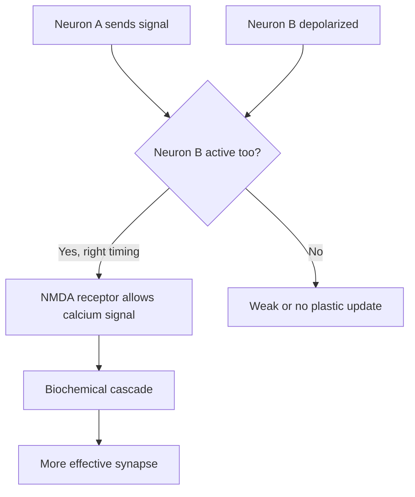

The practical meaning:

> The brain changes more when signals arrive together with attention, effort, emotion, or meaningful feedback.

---

## 8. The phrase “neurons that fire together wire together” is useful but incomplete

The phrase is useful because it captures association.

```text
Repeated co-activation → stronger connection
```

But it is incomplete.

Because plasticity also depends on:

- timing,
- attention,
- dopamine,
- acetylcholine,
- sleep,
- stress,
- inhibitory control,
- genetic and protein synthesis processes,
- whether the experience is rewarding or threatening,
- whether the brain is in a state ready to learn.

A better phrase would be:

> Neurons that fire together under meaningful biological conditions are more likely to change their future connection.

Less catchy.

More accurate.

---

## 9. The brain is a prediction machine

The brain does not simply record reality.

It predicts.

It asks:

> “What is likely to happen next, and what should I do?”

Then it updates based on error.

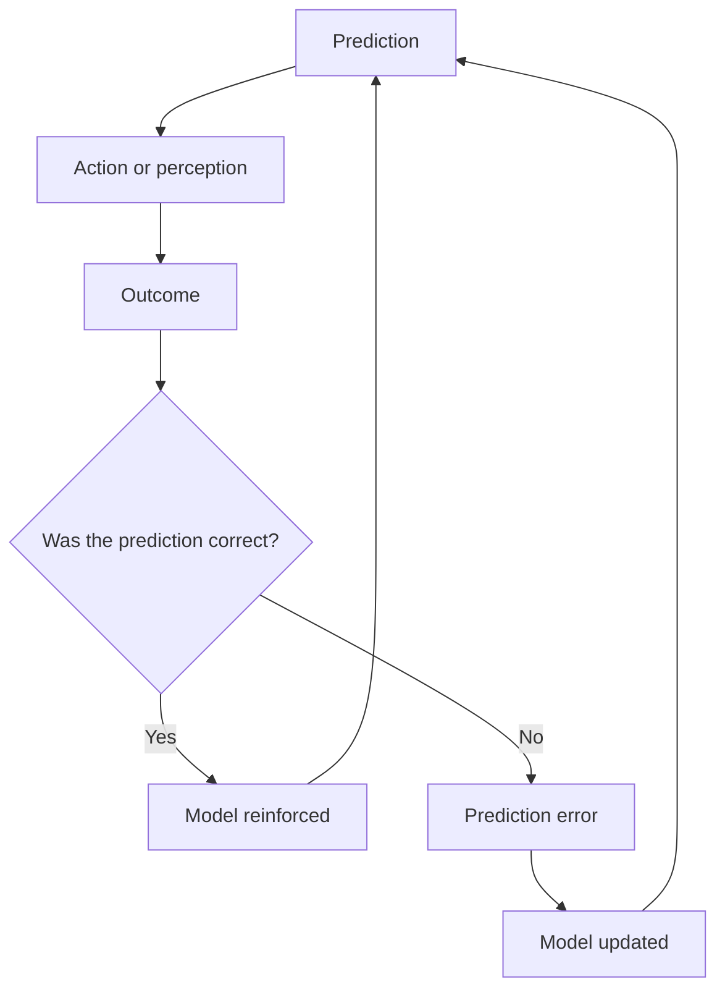

This is crucial for learning.

If you expect a basketball shot to go in but it falls short, your motor system updates.

If you expect someone to laugh at you but they respond kindly, your social prediction can update.

If you expect a puzzle solution to work but it fails, your mental model updates.

Plasticity is often driven by surprise.

Not random surprise.

Meaningful mismatch.

---

## 10. Dopamine: not pleasure, but learning from importance

Most people think dopamine means pleasure.

That is too simple.

Dopamine is involved in motivation, learning, reward, movement, salience, and prediction error.

A key idea is **reward prediction error**:

```text
Reward prediction error = actual reward - expected reward
```

If something is better than expected, dopamine activity can increase.

If something is worse than expected, dopamine activity can decrease.

If something is exactly as expected, the prediction is confirmed.

Research on dopamine reward prediction error shows that dopamine neurons can encode differences between received and predicted rewards, helping guide learning.[^3]

Simple picture:

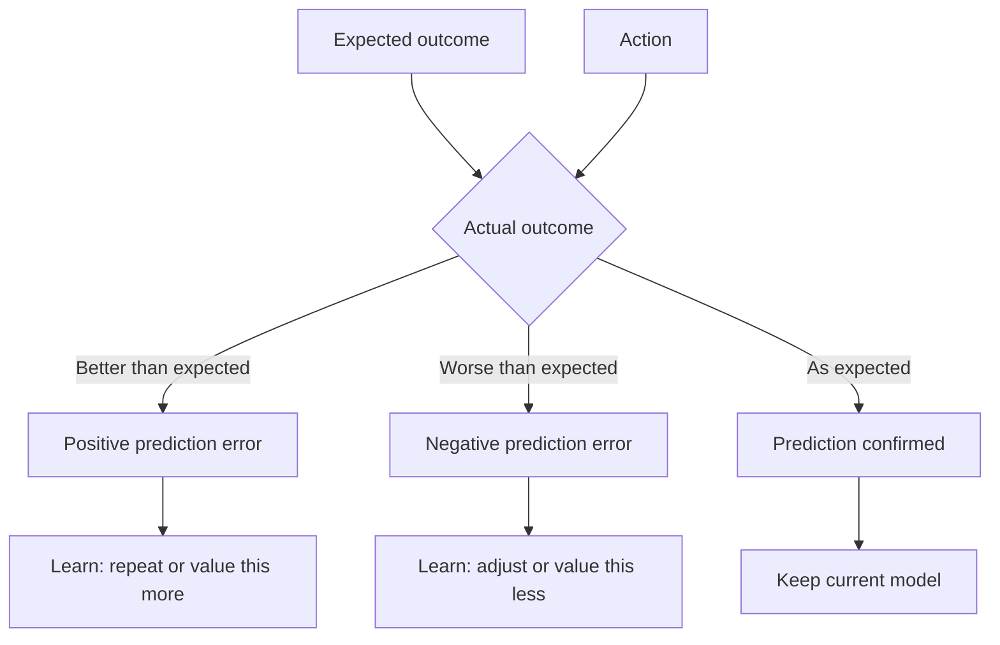

Dopamine helps the brain answer:

> “Was that worth repeating?”

This is why reward matters in learning.

But reward does not only mean pleasure.

It can mean:

- progress,
- relief,
- social approval,
- novelty,
- curiosity,
- winning,
- understanding,
- escaping discomfort.

That last one is important.

Avoidance can be rewarding because it gives relief.

That is why avoidance becomes sticky.

---

## 11. Dopamine and bad habits

Suppose you are studying.

You feel discomfort.

You check your phone.

You get novelty and relief.

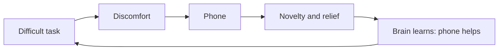

The reward is not just pleasure.

The reward is escape.

The brain learns:

> “When work feels hard, phone reduces discomfort.”

That is neuroplasticity.

This is why bad habits are not always about chasing pleasure.

Often, they are about escaping discomfort.

---

## 12. Dopamine and good learning

You can use reward prediction in a healthy way.

For example, when learning problem-solving:

```text
Expected: I cannot solve this.
Actual: I solved part of it.
Prediction error: improvement may be happening.
Brain update: continue.
```

This is why visible progress matters.

Progress creates reward.

Reward makes repetition more likely.

Repetition strengthens circuits.

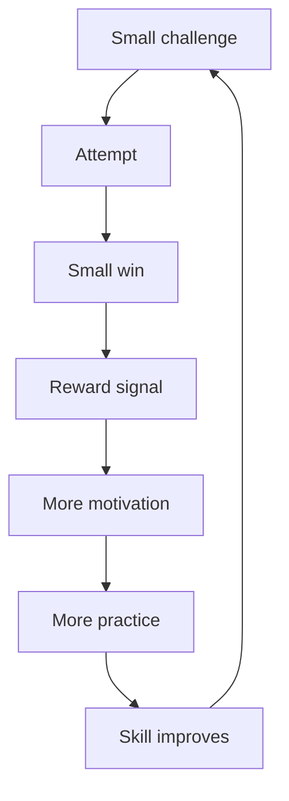

Practical rule:

> Make progress visible.

Track repetitions.

Track attempts.

Track tiny improvements.

The brain needs evidence.

---

## 13. Acetylcholine: the attention chemical

Acetylcholine is a neuromodulator involved in attention, learning, memory encoding, arousal, and plasticity. Reviews describe acetylcholine as influencing neuronal excitability, synaptic transmission, synaptic plasticity, and coordinated firing across neural groups.[^4]

Simple metaphor:

> Acetylcholine tells the brain, “Pay attention. This input matters.”

This is why focused attention changes learning.

Passive exposure is weak.

Attended experience is stronger.

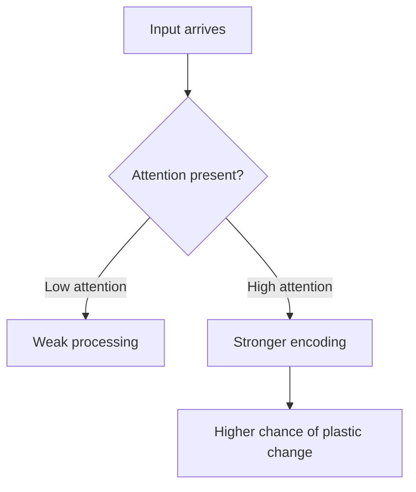

Practical meaning:

- Put the phone away.
- Reduce noise.
- Practice one subskill at a time.
- Use active recall.
- Explain out loud.
- Record and review.
- Make the brain notice the error.

Your attention is a plasticity resource.

Do not leak it everywhere.

---

## 14. Glutamate and GABA: excitation and inhibition

The brain needs balance.

Two major neurotransmitter systems help us understand this:

| System | Simple role |
|---|---|
| Glutamate | Main excitatory neurotransmitter |
| GABA | Main inhibitory neurotransmitter |

Glutamate often says:

```text
Activate.
```

GABA often says:

```text
Slow down. Filter. Inhibit.
```

Excitation is not good by default.

Inhibition is not bad by default.

A healthy brain needs both.

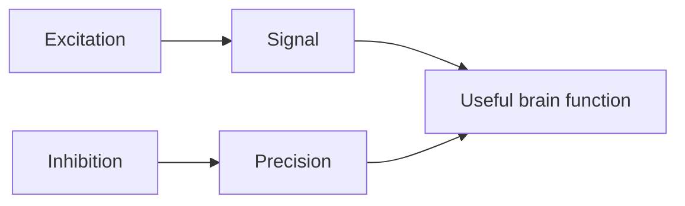

Without enough excitation, learning is weak.

Without enough inhibition, the brain becomes noisy.

Good learning requires signal plus control.

---

## 15. BDNF: support for change

BDNF stands for **brain-derived neurotrophic factor**.

It is a protein involved in neuron survival, synaptic plasticity, and activity-dependent brain change. Reviews describe BDNF as important for synaptic plasticity through both pre- and postsynaptic mechanisms.[^5]

A common metaphor is:

> BDNF is like fertilizer for plasticity.

That metaphor is useful, but imperfect.

BDNF does not automatically grow whatever you want.

It supports biological conditions related to change.

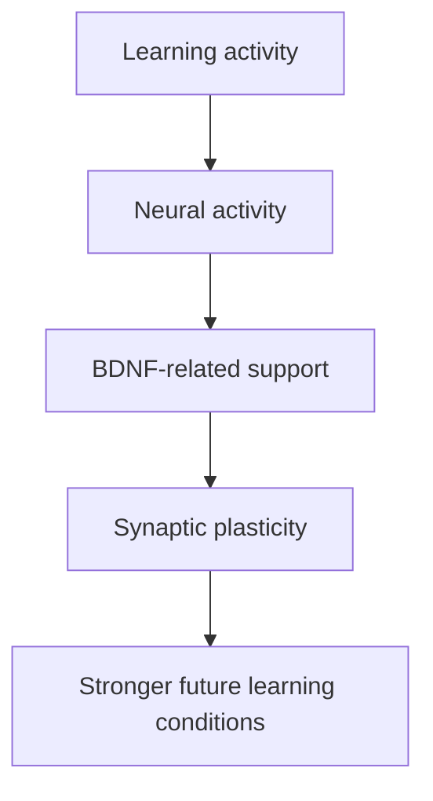

Lifestyle factors such as exercise are often studied in relation to BDNF. Recent reviews continue to investigate how different forms of physical activity affect BDNF levels and brain health, but responses can vary depending on age, intensity, method, and population.[^6]

Practical meaning:

> Exercise does not replace practice. It prepares the brain that practices.

A good learning day might look like:

```text
Move body → focused practice → feedback → food → rest → sleep
```

Not:

```text
Sit all day → force focus → scroll at night → sleep badly → repeat
```

Your biology is part of your learning system.

---

## 16. Protein synthesis and consolidation

Some plastic changes are short-term.

Others need to be stabilized.

For long-lasting change, neurons may need new proteins, receptor changes, gene expression changes, or structural remodeling.

Simple version:

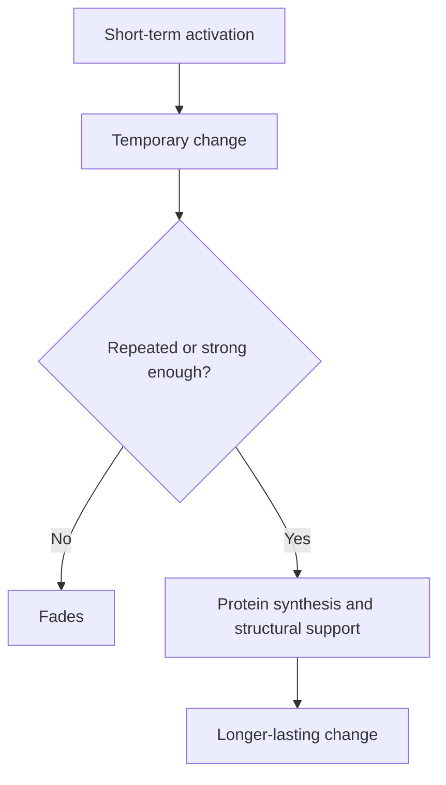

This is why one good day helps but usually does not transform you.

A single insight can open the door.

Repeated action builds the room.

---

## 17. Sleep: offline plasticity

Sleep is not wasted time.

Sleep supports memory consolidation, emotional regulation, and learning. Research on sleep and memory describes sleep as an offline period during which newly encoded memories can be stabilized, reorganized, and integrated.[^7]

Think of sleep as the brain’s night shift.

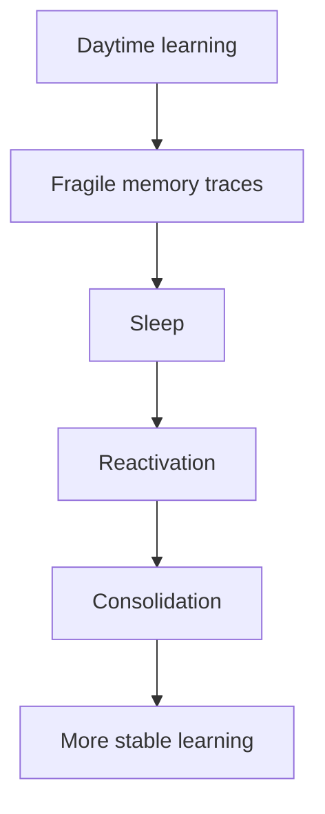

If you practice but sleep poorly, you are damaging the consolidation phase.

That does not mean sleep fixes everything.

It means sleep is part of the plasticity equation.

Practical rule:

> Do not treat sleep as the enemy of progress. Sleep is when part of progress is installed.

---

## 18. Myelin: the timing layer of learning

Many axons are wrapped in **myelin**, a fatty insulating layer that helps signals travel efficiently.

In Part 1, we said myelin is like insulation.

Now let’s go deeper.

Skills require timing.

A movement is not just “activate muscle.”

It is:

```text
activate this
inhibit that
sequence this
time that
adjust based on feedback
```

Myelin helps coordinate signal speed and timing across circuits.

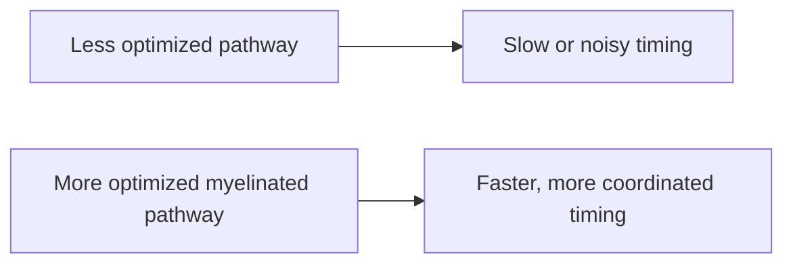

White matter plasticity research suggests that adult learning can involve changes in white matter and myelin-related structure, not only gray matter synapses.[^8]

This matters for:

- musicians,
- athletes,
- dancers,
- surgeons,
- programmers,
- language learners,
- typists,
- martial artists,
- public speakers.

A skill becomes smooth when timing becomes efficient.

---

## 19. Why slow practice works

Slow practice can feel boring.

But it is powerful because it gives the brain clean signals.

Fast sloppy practice creates noisy timing.

Slow accurate practice creates precise timing.

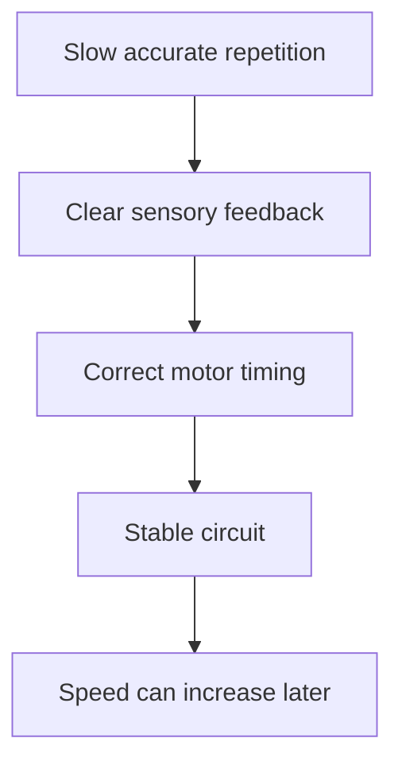

This is why musicians practice slowly.

This is why athletes drill basics.

This is why language learners repeat pronunciation.

This is why programmers should rewrite a solution from memory instead of only reading it.

Slow precision builds the pathway.

Speed comes later.

---

## 20. Critical periods and sensitive periods

A **critical period** is a developmental window when the brain is especially sensitive to certain inputs.

A **sensitive period** is a broader term for a time when learning is easier or more biologically favored, even if not absolutely limited.

Examples:

- vision development,
- language sounds,
- attachment patterns,
- motor coordination,
- social learning.

During early development, the brain is highly plastic because it is still building basic maps.

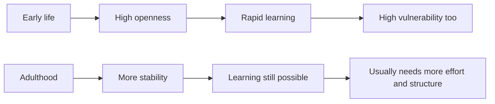

Reviews of developmental plasticity describe early life as containing windows of heightened plasticity, while adult brains retain more limited but still meaningful plasticity.[^9]

This explains two truths:

> Children often learn certain things faster.

and

> Adults can still change.

Both are true.

---

## 21. Why adult change feels hard

Adult brains are not broken.

They are optimized.

By adulthood, the brain has already built strong models:

- how to speak,
- how to move,
- how to react,
- who is safe,
- what failure means,
- how to seek reward,
- how to avoid pain,
- what identity feels true.

That stability is useful.

But it means new patterns compete against old highways.

```text
Old pathway:
Trigger =========> automatic response

New pathway:
Trigger --. . .--> deliberate response
```

At first, the old pathway feels real.

The new pathway feels fake.

This is not proof that change is impossible.

It is proof that the old pathway is well trained.

Practical meaning:

> Do not wait for the new behavior to feel natural. It becomes natural after enough correct repetitions.

---

## 22. Metaplasticity: plasticity of plasticity

There is an advanced idea called **metaplasticity**.

It means:

> The brain’s ability to change can itself change.

Your plasticity state depends on:

- sleep,
- stress,
- age,
- exercise,
- attention,
- hormones,
- inflammation,
- novelty,
- medication,
- emotional safety,
- previous activity,
- brain region,
- learning history.

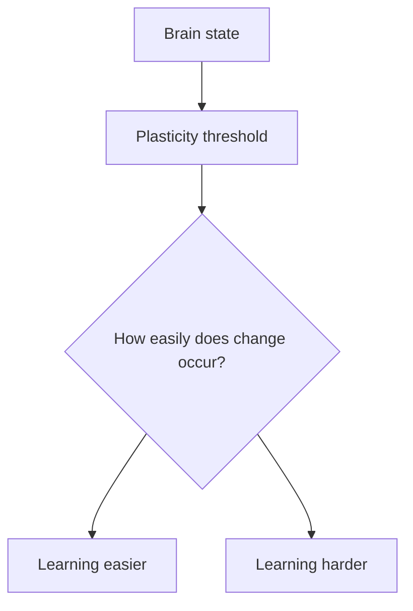

This is why the same practice can feel easy one day and impossible another day.

The brain is not a static machine.

Its readiness to change varies.

---

## 23. Stress and plasticity

Stress is complicated.

Short-term stress can improve focus.

Chronic uncontrollable stress can damage learning conditions.

Chronic stress can remodel dendrites and synaptic connections in brain regions such as the hippocampus, amygdala, and medial prefrontal cortex.[^10]

Simplified:

```mermaid
flowchart LR
    A[Manageable challenge] --> B[Focus]
    B --> C[Adaptation]

    D[Chronic uncontrollable stress] --> E[Threat mode]
    E --> F[Poor sleep, rumination, rigid behavior]
    F --> G[Maladaptive plasticity]
```

This is why “just grind harder” is not always the best advice.

Growth needs challenge.

But it also needs recovery.

The optimal zone is:

```text
High enough challenge to adapt.
Enough safety to explore.
Enough recovery to consolidate.
```

---

## 24. The inverted-U of performance

Many brain systems follow an inverted-U pattern.

Too little arousal:

```text
bored, unfocused
```

Moderate arousal:

```text
alert, engaged, adaptive
```

Too much arousal:

```text
panic, tunnel vision, poor learning
```

```mermaid
xychart-beta
    title "Arousal and learning quality"
    x-axis "Arousal / stress level" [Low, Medium, High]
    y-axis "Learning quality" 0 --> 10
    line [3, 9, 4]
```

Practical meaning:

> You do not need comfort. You need regulated challenge.

Before deep practice, ask:

```text
Am I too sleepy?
Am I too anxious?
What would bring me into the learning zone?
```

Sometimes the answer is coffee.

Sometimes it is a walk.

Sometimes it is breathing.

Sometimes it is reducing the task size.

Sometimes it is stopping for the night and sleeping.

---

## 25. Maladaptive plasticity: when the brain learns suffering

Maladaptive plasticity means the brain changes in ways that create or maintain problems.

This is not moral failure.

It is learning gone sideways.

```mermaid
flowchart TD
    A[Repeated threat, reward, pain, or relief] --> B[Brain updates]
    B --> C[Pattern becomes easier]
    C --> D[Short-term survival]
    D --> E[Long-term suffering]
```

Examples:

- anxiety,
- addiction,
- trauma responses,
- chronic pain,
- rumination,
- compulsive checking,
- avoidance,
- emotional reactivity,
- learned helplessness.

The brain is trying to help.

But it may optimize for short-term relief instead of long-term freedom.

---

## 26. Anxiety as prediction plus avoidance

Anxiety is often a learned prediction of danger.

```mermaid
flowchart TD
    A[Uncertainty] --> B[Threat prediction]
    B --> C[Body alarm]
    C --> D[Avoidance, checking, reassurance]
    D --> E[Temporary relief]
    E --> F[Brain learns: avoidance kept me safe]
    F --> A
```

The trap is relief.

Avoidance reduces anxiety now.

But it teaches the brain that the situation was dangerous.

So the next time, anxiety returns stronger or faster.

That is plasticity.

A more helpful loop is gradual corrective experience:

```mermaid
flowchart TD
    A[Feared situation] --> B[Approach safely and deliberately]
    B --> C[Feel discomfort without escaping immediately]
    C --> D[Learn: discomfort is tolerable]
    D --> E[New inhibitory memory]
    E --> F[More flexibility next time]
```

Modern exposure therapy is often explained not as “erasing fear,” but as building new inhibitory learning: the brain learns a new meaning that can compete with the old fear memory.[^11]

Practical note:

> For severe anxiety, trauma, OCD, panic, or phobia, exposure work is best done with a qualified professional. Done badly, it can overwhelm instead of retrain.

---

## 27. Trauma and the nervous system

Trauma is not simply “a bad memory.”

It can be a nervous system learning event.

The brain may learn:

```text
The world is unsafe.
The body is unsafe.
People are unsafe.
Escape is not possible.
Constant alertness is necessary.
```

A trauma response can involve:

- hypervigilance,
- avoidance,
- emotional numbness,
- flashbacks,
- body tension,
- sleep disturbance,
- exaggerated startle,
- shame,
- dissociation,
- difficulty trusting,
- threat detection even in safe situations.

From a plasticity perspective:

```mermaid
flowchart TD
    A[Overwhelming event] --> B[High emotion and threat]
    B --> C[Strong memory and body learning]
    C --> D[Future cues trigger old survival state]
    D --> E[Current safety feels like past danger]
```

Healing is not just “thinking differently.”

It often requires:

- safety,
- time,
- body regulation,
- relational trust,
- new experiences,
- therapy,
- meaning-making,
- reducing avoidance,
- rebuilding agency.

The brain needs evidence that the present is not the past.

---

## 28. Addiction as plasticity of reward, cue, and relief

Addiction is not simply weak willpower.

It involves reward learning, habit systems, stress systems, memory, cue-reactivity, and changes in motivation.

Repeated exposure to addictive substances or behaviors can reshape brain systems involved in reward, stress, self-control, memory, and motivation. Neuroscience reviews describe addiction as involving long-lasting neuroplastic changes in brain reward and control circuits.[^12]

A simplified addiction loop:

```mermaid
flowchart TD
    A[Cue] --> B[Craving]
    B --> C[Use or behavior]
    C --> D[Reward or relief]
    D --> E[Learning signal]
    E --> F[Stronger cue-craving-behavior pathway]
    F --> A
```

The cue becomes powerful.

The brain learns:

```text
This object/person/place/app/substance = relief or reward.
```

Over time, wanting can become disconnected from liking.

The person may not even enjoy the behavior much anymore.

But the circuit still pulls.

Practical implications:

- remove or reduce cues,
- create friction around the old behavior,
- build alternative rewards,
- treat stress and sleep seriously,
- restore safety, support, and meaning,
- use professional support when needed,
- expect cravings to be waves, not commands.

Recovery is also plasticity.

```mermaid
flowchart TD
    A[Old cue] --> B[Craving]
    B --> C[New response]
    C --> D[Craving passes]
    D --> E[Brain learns: I can survive urge without obeying]
    E --> F[New recovery pathway strengthens]
```

---

## 29. Chronic pain and central sensitization

Pain is real.

But pain is not a simple measurement of tissue damage.

Pain is produced by the nervous system as a protective output.

Sometimes, after injury, stress, inflammation, or repeated pain signaling, the nervous system becomes more sensitive.

This is called **central sensitization**.

Chronic pain research describes maladaptive neuroplastic changes in pain pathways, where central nervous system responsiveness can increase and pain can persist beyond the original tissue threat.[^13]

Simplified:

```mermaid
flowchart TD
    A[Injury or repeated pain] --> B[Protective pain response]
    B --> C[Nervous system becomes more sensitive]
    C --> D[Lower threshold for pain]
    D --> E[More pain signals]
    E --> C
```

This does **not** mean:

```text
The pain is imaginary.
```

It means:

```text
The nervous system has learned protection too strongly.
```

Helpful approaches often include:

- medical evaluation,
- education about pain science,
- graded movement,
- reducing fear of movement,
- sleep improvement,
- stress regulation,
- physical therapy,
- pacing,
- rebuilding confidence in the body.

The principle is:

> Teach the nervous system safety through gradual evidence.

Not by denying pain.

By retraining threat prediction.

---

## 30. Rumination as mental overpractice

Rumination is repeated mental rehearsal of pain, fear, regret, anger, or uncertainty.

It can feel like problem-solving.

But often, it is replay.

```mermaid
flowchart TD
    A[Trigger] --> B[Memory or worry]
    B --> C[Replay]
    C --> D[Emotion rises]
    D --> E[Brain marks topic as important]
    E --> F[More automatic replay]
    F --> B
```

Rumination trains access.

The brain learns:

> “Return to this topic quickly.”

This is why after repeating a thought for weeks, it starts appearing automatically.

The solution is not to fight the thought all day.

Fighting can become another form of repetition.

A better method:

```mermaid
flowchart TD
    A[Thought appears] --> B[Label: rumination]
    B --> C[Do not debate]
    C --> D[Regulate body]
    D --> E[Shift to chosen action]
    E --> F[Reward non-repetition]
```

Practical phrase:

```text
"This is the loop. I do not need to solve it right now. I need to stop feeding it."
```

Then move.

Walk.

Shower.

Clean.

Write.

Call someone.

Do a task.

The body helps exit the loop.

---

## 31. Learned helplessness and agency

The brain also learns whether action matters.

If repeated effort seems useless, the brain may learn:

```text
Nothing I do changes anything.
```

This can create passivity, low motivation, and resignation.

Plasticity of helplessness:

```mermaid
flowchart TD
    A[Repeated uncontrollable failure or stress] --> B[Action feels useless]
    B --> C[Less attempt]
    C --> D[Fewer wins]
    D --> E[Belief strengthens: I cannot change this]
    E --> C
```

The antidote is not fake positivity.

The antidote is **controlled evidence of agency**.

```mermaid
flowchart TD
    A[Small controllable action] --> B[Visible result]
    B --> C[Evidence: action matters]
    C --> D[More effort becomes possible]
    D --> E[Larger action]
    E --> B
```

Start small enough that success is real.

Not impressive.

Real.

---

## 32. Why identity changes slowly

Identity is not just a thought.

Identity is a prediction system.

When you say:

```text
This person is not disciplined.
```

your brain may be summarizing years of evidence.

So one motivational speech does not overwrite it.

You need new evidence.

```mermaid
flowchart TD
    A[Small promise kept] --> B[Evidence]
    B --> C[Self-trust]
    C --> D[Bigger promise becomes possible]
    D --> E[More evidence]
    E --> C
```

Identity-level neuroplasticity is slow because it competes with deep memory.

But it is powerful because once identity changes, behavior becomes easier.

You stop asking:

```text
Do I feel motivated?
```

and start acting from:

```text
This is what I do.
```

---

## 33. The self-directed neuroplasticity framework

Now we build the practical system.

To intentionally change your brain, you need seven ingredients:

```mermaid
flowchart TD
    A[Attention] --> H[Plastic change]
    B[Repetition] --> H
    C[Feedback] --> H
    D[Emotion and meaning] --> H
    E[Difficulty] --> H
    F[Environment] --> H
    G[Recovery] --> H
```

Let’s call this:

> **A.R.C.H.E.R.**

Because it points the brain in a direction.

| Letter | Meaning |
|---|---|
| A | Attention |
| R | Repetition |
| C | Correction |
| H | High meaning |
| E | Environment |
| R | Recovery |

Yes, the acronym bends a little.

But it is memorable.

---

## 34. A — Attention

Ask:

```text
What exactly am I training?
```

Bad:

```text
I want to improve my life.
```

Good:

```text
Practice one short presentation every morning.
```

Bad:

```text
I want to respond more calmly under pressure.
```

Good:

```text
When pressure appears before speaking, breathe, speak for 60 seconds anyway, and record what actually happened.
```

Plasticity needs specificity.

The brain cannot train “better.”

It trains patterns.

---

## 35. R — Repetition

Repetition tells the brain:

> “This pattern matters.”

But repetition must be designed.

Better:

```text
20 minutes daily for 30 days
```

Usually worse:

```text
10 hours once, then nothing
```

The brain likes repeated signals.

```mermaid
flowchart LR
    A[Small repetition] --> B[Tomorrow]
    B --> C[Next day]
    C --> D[Next week]
    D --> E[Pathway becomes easier]
```

The goal is not to destroy yourself with intensity.

The goal is to return.

---

## 36. C — Correction

Repetition without correction can strengthen mistakes.

You need feedback.

For any skill, ask:

```text
What did I expect?
What happened?
What was the error?
What is the next better repetition?
```

Example: speaking practice.

```text
Mistake: I pause too long.
Correction: practice linking phrases.
Next repetition: answer the same prompt again.
```

Example: problem-solving.

```text
Mistake: I missed an important constraint.
Correction: list constraints before starting.
Next repetition: solve a similar problem.
```

Example: emotional regulation.

```text
Mistake: I replied while angry.
Correction: pause before responding.
Next repetition: use a 10-minute delay rule.
```

Feedback makes plasticity smarter.

---

## 37. H — High meaning

Emotion and meaning mark importance.

If a goal has no emotional meaning, the brain may not prioritize it.

Connect the behavior to identity and future.

Weak:

```text
I should study.
```

Stronger:

```text
I am becoming someone who can think clearly under pressure.
```

Weak:

```text
I should exercise.
```

Stronger:

```text
I am becoming someone who keeps promises to my body.
```

Weak:

```text
I should stop ruminating.
```

Stronger:

```text
I am becoming someone who does not donate hours of life to unhelpful loops.
```

Meaning gives repetition emotional weight.

---

## 38. E — Environment

Environment is not background.

It is a training system.

Your environment repeatedly cues your brain.

```mermaid
flowchart TD
    A[Room] --> B[Cues]
    B --> C[Behavior]
    C --> D[Repetition]
    D --> E[Brain wiring]
```

If your desk contains:

- phone,
- snacks,
- open tabs,
- messy notes,
- no clear task,

your brain trains chaos.

If your desk contains:

- one notebook,
- one task,
- water,
- phone outside room,
- timer,

your brain trains focus.

Willpower fights cues.

Environment removes cues.

Design beats force.

---

## 39. R — Recovery

Plasticity needs recovery.

Recovery includes:

- sleep,
- rest,
- nutrition,
- movement,
- emotional regulation,
- social connection,
- breaks between intense sessions.

A stressed, underslept brain may still change, but not always in the direction you want.

Often it changes toward:

- anxiety,
- irritability,
- cravings,
- avoidance,
- rigid habits.

Recovery is not laziness.

Recovery is part of learning.

---

## 40. The practical plasticity formula

```text
Desired brain change =
specific target
+ repeated practice
+ clear feedback
+ emotional meaning
+ supportive environment
+ enough recovery
```

Or:

```mermaid
flowchart LR
    A[Target] --> G[Change]
    B[Practice] --> G
    C[Feedback] --> G
    D[Meaning] --> G
    E[Environment] --> G
    F[Recovery] --> G
```

If change is not happening, do not just blame yourself.

Debug the system.

Which ingredient is missing?

---

## 41. How to build a new skill

Use this for writing, music, speaking, sports, design, math, or anything else.

### Step 1: Choose one subskill

Bad:

```text
Get better at programming.
```

Good:

```text
Understand BFS and DFS well enough to solve 10 graph problems.
```

### Step 2: Create focused repetitions

```text
One problem.
One attempt.
One correction.
One explanation.
```

### Step 3: Make errors visible

Use:

- tests,
- recordings,
- mentors,
- mirrors,
- notes,
- scores,
- public output,
- comparison with expert solutions.

### Step 4: Repeat after sleep

Do not only practice once.

Return tomorrow.

### Step 5: Increase difficulty slowly

```text
Easy → moderate → hard → mixed practice
```

### Step 6: Teach it

Teaching reveals weak wiring.

If you cannot explain it, the circuit is not clear yet.

```mermaid
flowchart TD
    A[Practice] --> B[Error]
    B --> C[Correction]
    C --> D[Recall]
    D --> E[Explain]
    E --> F[Mixed practice]
    F --> G[Flexible skill]
```

---

## 42. How to weaken an old habit

You rarely erase an old habit directly.

You weaken it by reducing reinforcement and building a competing pathway.

```mermaid
flowchart TD
    A[Cue] --> B[Old routine]
    B --> C[Old reward]
    C --> D[Old pathway reinforced]

    A --> E[New routine]
    E --> F[New reward]
    F --> G[New pathway reinforced]
```

To weaken the old pathway:

1. identify the cue,
2. increase friction,
3. remove the reward when possible,
4. create a replacement routine,
5. reward the replacement,
6. repeat under real conditions.

Example: late-night scrolling.

```text
Cue: boredom or restlessness at night
Old routine: scroll
Reward: stimulation and escape

Intervention:
phone charges outside bedroom
book on bed
night walk or shower
sleep playlist
message a friend earlier, not at midnight
track clean nights
```

The goal is not “be stronger.”

The goal is to stop training the old loop.

---

## 43. How to unlearn fear

Fear learning is powerful because the brain prioritizes survival.

Unlearning fear usually means building new safety learning that competes with old danger learning.

```mermaid
flowchart TD
    A[Old fear memory] --> B[Danger prediction]
    C[New safety experience] --> D[Inhibitory learning]
    D --> E[More flexible response]
    B --> E
```

Practical principles:

- Start with manageable fear, not maximum fear.
- Stay long enough to learn something new.
- Do not use safety behaviors that secretly maintain fear.
- Vary the context.
- Repeat.
- Expect fear to return sometimes.
- Treat return of fear as retrieval failure, not total failure.

Example: social anxiety.

Weak exposure:

```text
Go to event but hide in phone all night.
```

Better exposure:

```text
Go to event.
Start one short conversation.
Notice anxiety.
Stay present.
Observe that nothing catastrophic happened.
Repeat in different settings.
```

The brain learns from lived evidence.

---

## 44. How to reduce rumination

Rumination is not solved by arguing with every thought.

That often feeds the loop.

Try this instead:

```mermaid
flowchart TD
    A[Trigger] --> B[Label]
    B --> C[Interrupt body state]
    C --> D[Choose action]
    D --> E[Return to present]
    E --> F[Repeat]
```

### The four-step anti-rumination protocol

#### 1. Label

```text
This is rumination.
```

Do not say:

```text
This is truth.
```

Say:

```text
This is a mental loop.
```

#### 2. Locate in body

Ask:

```text
Where is this showing up physically?
Chest?
Throat?
Stomach?
Jaw?
```

This shifts processing from abstract replay to embodied awareness.

#### 3. Move

Do something physical:

- walk,
- clean,
- stretch,
- shower,
- push-ups,
- breathing,
- sunlight.

#### 4. Act

Choose one useful action.

Not ten.

One.

```text
Send email.
Open book.
Cook food.
Send one useful message.
Practice speaking.
Clean desk.
```

Reward the exit.

The goal is to teach:

```text
Trigger does not require replay.
Trigger can lead to action.
```

---

## 45. How to build emotional regulation

Emotional regulation is not suppressing emotion.

It is changing your response to emotion.

Old pathway:

```text
Emotion → reaction
```

New pathway:

```text
Emotion → pause → name → regulate → choose
```

```mermaid
flowchart LR
    A[Emotion] --> B[Pause]
    B --> C[Name]
    C --> D[Body regulation]
    D --> E[Chosen response]
```

Practice:

```text
Emotion: anger.
Body signal: tension.
Impulse: react immediately.
New action: wait 10 minutes.
Response: values first, impulse second.
```

Every pause is a repetition.

At first, it feels unnatural.

Later, it becomes identity.

---

## 46. How to build confidence

Confidence is not a mood.

Confidence is remembered evidence of capability.

```mermaid
flowchart TD
    A[Attempt] --> B[Survive]
    B --> C[Learn]
    C --> D[Evidence]
    D --> E[Confidence]
    E --> F[Bigger attempt]
    F --> D
```

Fake confidence says:

```text
I am amazing.
```

Real confidence says:

```text
I have handled hard things before.
```

Build confidence by creating evidence.

Small proof repeated.

Examples:

- speak for 60 seconds,
- solve one problem,
- go to the gym,
- send one useful message,
- publish one article,
- complete one useful task,
- keep one promise.

The brain believes patterns.

Give it proof.

---

## 47. A 30-day self-directed neuroplasticity protocol

Pick one target.

Not three.

One.

### Week 1: Awareness and design

Write:

```text
The pattern I want to change:
The cue:
The current routine:
The current reward:
The new routine:
The new reward:
The environment change:
```

Example:

```text
Pattern: phone during study
Cue: difficult task
Current routine: distracting app
Reward: relief
New routine: 3 breaths + next tiny step
New reward: mark one clean repetition
Environment: phone outside room
```

### Week 2: Repetition

Do the new routine daily.

Keep it small.

Track only one thing:

```text
Did I perform the new pathway today?
Yes / No
```

Do not overcomplicate.

### Week 3: Correction

Review failures.

Ask:

```text
Where did the old loop win?
What cue was strongest?
What friction was missing?
What reward was too weak?
What adjustment will I make?
```

### Week 4: Generalization

Practice in harder contexts.

If you only train focus in perfect conditions, the skill may fail in real life.

Add controlled difficulty:

- more noise,
- longer session,
- harder task,
- real conversation,
- timed test,
- emotional trigger,
- public output.

End the month with:

```text
What became easier?
What still needs repetition?
What identity evidence did I build?
What is the next 30-day target?
```

---

## 48. The advanced plasticity checklist

Before trying to change something, ask:

### Target

```text
What exact circuit am I training?
```

### Cue

```text
What starts the old pattern?
```

### Reward

```text
What reward or relief keeps it alive?
```

### Replacement

```text
What should happen instead?
```

### Repetition

```text
How will I repeat the new pathway daily?
```

### Feedback

```text
How will I know if I am improving?
```

### Environment

```text
What cues must be removed or added?
```

### Recovery

```text
Am I sleeping and recovering enough to consolidate change?
```

### Meaning

```text
Why does this matter?
```

---

## 49. Neuroplasticity myths, advanced edition

### Myth 1: Neuroplasticity means anything is possible

No.

Biology has limits.

Injury, genetics, disease, age, environment, trauma, resources, and timing matter.

Plasticity means change is possible, not infinite.

### Myth 2: Positive thinking rewires the brain

Positive thinking can influence attention and emotion.

But deep change usually needs behavior, feedback, repetition, and environment.

Better:

```text
Accurate thinking + repeated action + recovery
```

### Myth 3: If pain involves the brain, it is fake

Wrong.

All pain involves the brain.

That does not make pain fake.

It means the nervous system produces pain as a protective experience.

### Myth 4: Addiction is just a habit

Addiction includes habit, but also reward learning, craving, stress, memory, tolerance, withdrawal, social context, and sometimes serious medical risk.

### Myth 5: Trauma is just memory

Trauma can involve body state, threat prediction, attention, sleep, emotion, and nervous system regulation.

### Myth 6: Adults cannot change

Adults can change.

But adult change often requires more deliberate repetition, feedback, and environmental design.

### Myth 7: More plasticity is always better

No.

Plasticity without stability is chaos.

The goal is not maximum plasticity.

The goal is adaptive plasticity.

---

## 50. The final model: brain change as training, prediction, and proof

By now, we can define neuroplasticity in a more advanced way:

> Neuroplasticity is the nervous system’s ability to update its future activity, structure, connectivity, and predictions based on repeated experience, biological state, attention, reward, threat, feedback, and recovery.

That definition is longer.

But it is much better.

The brain changes through:

```mermaid
flowchart TD
    A[Repeated experience] --> B[Attention and meaning]
    B --> C[Neuromodulators]
    C --> D[Synaptic change]
    D --> E[Circuit change]
    E --> F[Behavior change]
    F --> G[New evidence]
    G --> H[Prediction update]
    H --> A
```

This is the cycle of becoming.

---

## 51. What this means for your life

You are not only living.

You are training.

Every day, your brain is collecting evidence:

```text
What do I repeat?
What do I avoid?
What do I reward?
What do I fear?
What do I practice?
What do I recover from?
What do I prove to myself?
```

The brain does not become what you admire.

It becomes what you repeatedly enact.

So do not ask only:

```text
What do I want?
```

Ask:

```text
What am I training?
```

Do not ask only:

```text
What is keeping this pattern active?
```

Ask:

```text
What pathway has become too strong?
What pathway needs repetition?
```

Do not ask only:

```text
Why am I like this?
```

Ask:

```text
What evidence would teach my brain a new prediction?
```

That is the practical heart of neuroplasticity.

---

## 52. Closing

Part 1 gave us the foundation:

> The brain learns by changing.

Part 2 gave us the machinery:

> The brain changes through synapses, prediction errors, neuromodulators, myelin, attention, reward, stress, recovery, and repeated evidence.

The final lesson is simple but serious:

> Your nervous system is always adapting. The question is whether your daily life is teaching it what you actually want it to learn.

Neuroplasticity is not a motivational slogan.

It is responsibility.

It is hope.

It is construction.

It is the biology of becoming.

---

## Practical worksheet for Part 2

Use this after reading.

### 1. Identify one maladaptive loop

```text
The loop:
The cue:
The routine:
The reward or relief:
The long-term cost:
```

### 2. Design the replacement loop

```text
When this cue appears:
I will do:
The replacement reward:
The environment support:
```

### 3. Add correction

```text
How will I know I am improving?
What feedback will I use?
What mistake should I watch for?
```

### 4. Add recovery

```text
My sleep rule:
My movement rule:
My stress regulation rule:
```

### 5. Add identity

```text
The person I am training myself to become:
The daily evidence I will create:
```

---

## References

[^1]: Bliss, T. V. P., Collingridge, G. L., & Morris, R. G. M. *Synaptic plasticity in health and disease: introduction and overview*. Philosophical Transactions of the Royal Society B, 2014. Also see clinical overview of LTP/LTD: https://pmc.ncbi.nlm.nih.gov/articles/PMC3118435/

[^2]: Lüscher, C., & Malenka, R. C. *NMDA receptor-dependent long-term potentiation and long-term depression*. Cold Spring Harbor Perspectives in Biology, 2012. https://pmc.ncbi.nlm.nih.gov/articles/PMC3367554/

[^3]: Schultz, W. *Dopamine reward prediction error coding*. Dialogues in Clinical Neuroscience, 2016. https://pmc.ncbi.nlm.nih.gov/articles/PMC4826767/

[^4]: Picciotto, M. R., Higley, M. J., & Mineur, Y. S. *Acetylcholine as a neuromodulator: cholinergic signaling shapes nervous system function and behavior*. Neuron, 2012. https://pmc.ncbi.nlm.nih.gov/articles/PMC3466476/

[^5]: Bathina, S., & Das, U. N. *Brain-derived neurotrophic factor and its clinical implications*. Archives of Medical Science, 2015. https://pmc.ncbi.nlm.nih.gov/articles/PMC4697050/

[^6]: Rico-González, M., et al. *Exercise as Modulator of Brain-Derived Neurotrophic Factor*. 2025. https://pmc.ncbi.nlm.nih.gov/articles/PMC12300162/

[^7]: Born, J., & Wilhelm, I. *System consolidation of memory during sleep*. Psychological Research, 2012. https://pmc.ncbi.nlm.nih.gov/articles/PMC3278619/

[^8]: Sampaio-Baptista, C., & Johansen-Berg, H. *White Matter Plasticity in the Adult Brain*. Neuron, 2017. https://pmc.ncbi.nlm.nih.gov/articles/PMC5766826/

[^9]: Marzola, P., et al. *Exploring the Role of Neuroplasticity in Development, Aging, and Neurodegeneration*. 2023. https://pmc.ncbi.nlm.nih.gov/articles/PMC10741468/

[^10]: McEwen, B. S., Nasca, C., & Gray, J. D. *Stress Effects on Neuronal Structure: Hippocampus, Amygdala, and Prefrontal Cortex*. Neuropsychopharmacology, 2016. https://pmc.ncbi.nlm.nih.gov/articles/PMC4677120/

[^11]: Craske, M. G., Treanor, M., Conway, C. C., Zbozinek, T., & Vervliet, B. *Maximizing exposure therapy: an inhibitory learning approach*. Behaviour Research and Therapy, 2014. https://pmc.ncbi.nlm.nih.gov/articles/PMC4114726/

[^12]: Volkow, N. D., Michaelides, M., & Baler, R. *The Neuroscience of Drug Reward and Addiction*. Physiological Reviews, 2019. https://pmc.ncbi.nlm.nih.gov/articles/PMC6890985/

[^13]: Jaffal, S. M., et al. *Neuroplasticity in chronic pain: insights into diagnosis and treatment*. 2025. https://pmc.ncbi.nlm.nih.gov/articles/PMC11965994/
