Stress is not just a feeling.

It is a whole-body state.

It changes your attention, breathing, heart rate, hormones, memory, decision-making, impulse control, sleep, appetite, and behavior.

When you are calm, you may be able to think clearly:

> “Let me pause. Let me understand the situation. Let me choose the best response.”

But under stress, the brain can shift into a different mode:

> “Act now. Protect yourself. Escape. Attack. Freeze. Fix it immediately.”

This shift is not weakness.

It is biology.

The brain has systems designed for survival. Two of the most important players are:

- the **amygdala**, which helps detect threat, emotional importance, and danger-related learning;
- the **prefrontal cortex**, which helps with planning, self-control, attention, decision-making, and emotion regulation.

The problem is not that the amygdala is bad and the prefrontal cortex is good.

That is too simple.

The real story is more interesting:

> The amygdala helps you survive quickly.  
> The prefrontal cortex helps you respond wisely.  
> Stress changes the balance between them.

This blog is a complete guide to that balance.

It starts from zero and moves toward advanced neuroscience, real-life examples, and practical tools.

---

### What you will learn

By the end, you should understand:

- what stress actually is;
- why the body has a stress response;
- what the amygdala does and does not do;
- what the prefrontal cortex does;
- how the HPA axis and cortisol work;
- why stress makes people reactive, impulsive, avoidant, or frozen;
- why chronic stress changes the brain differently from acute stress;
- why you can “know better” and still not act better under stress;
- how breathing, sleep, movement, reappraisal, environment, and practice can help restore top-down control;
- how to use this knowledge in your own life.

---

## 1. Stress is not the enemy

Most people talk about stress as if it is always bad.

But stress is not automatically bad.

Stress is the body and brain preparing to meet a demand.

A demand can be physical:

```text
A dog runs toward you.
You almost fall from a bike.
You hear a loud sound.
You are sick.
You are sleep-deprived.
```

It can be psychological:

```text
You have an exam.
A plan suddenly changes.
You lose a job.
You receive critical feedback.
You need to make an important decision.
```

It can be social:

```text
You feel judged.
You feel judged.
You feel unsupported.
You are in conflict.
You are uncertain about your future.
```

A simple definition:

> Stress is the brain-body response to a perceived challenge, threat, or demand.

The key word is **perceived**.

Two people can face the same situation and have different stress responses because their brains interpret the situation differently.

One person hears:

```text
You have to give a presentation.
```

and thinks:

```text
This is exciting.
```

Another thinks:

```text
I am going to embarrass myself.
```

Same event.

Different prediction.

Different stress level.

---

## 2. The stress response is a survival system

Imagine your ancestors heard something moving in the bushes.

They did not have time to write a philosophical essay.

They needed the body to prepare quickly.

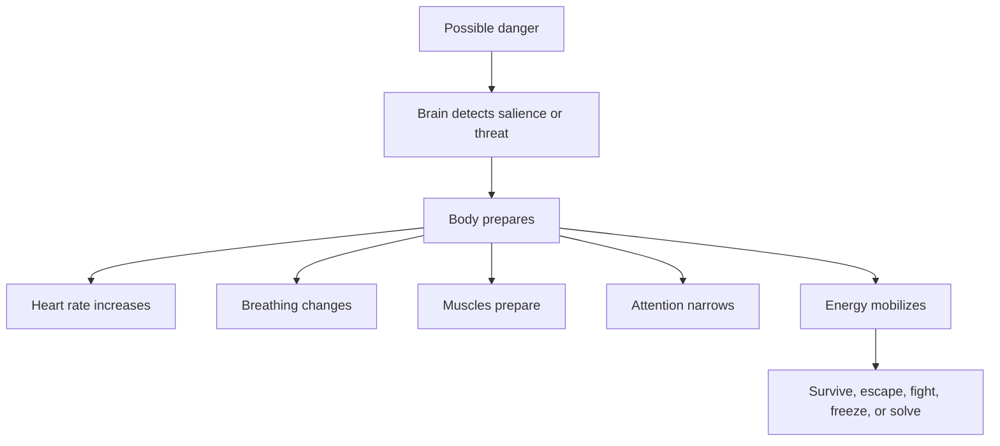

This system is useful when there is real danger.

The problem is that modern life triggers the same system for:

- emails,
- exams,
- evaluations,
- social uncertainty,
- financial uncertainty,
- deadlines,
- social pressure,
- uncertain situations,
- financial pressure,
- online comparison,
- future planning.

Your brain may react to unclear feedback as if it is a survival threat.

Not because you are stupid.

Because social belonging, status, uncertainty, and control matter deeply to the nervous system.

---

## 3. Acute stress vs chronic stress

Stress is not one thing.

The two biggest categories are:

| Type | Meaning | Example | Possible effect |
|---|---|---|---|
| Acute stress | Short-term stress | Exam, argument, sudden danger | Can sharpen focus or disrupt thinking |
| Chronic stress | Repeated or ongoing stress | toxic environment, long uncertainty, ongoing conflict | Can wear down sleep, mood, attention, immunity, and brain regulation |

Acute stress can be useful if it is manageable.

```text
Challenge → focus → action → recovery
```

Chronic stress becomes harmful when the body never fully returns to safety.

```text
Threat → alarm → poor sleep → more threat sensitivity → exhaustion
```

Visual:

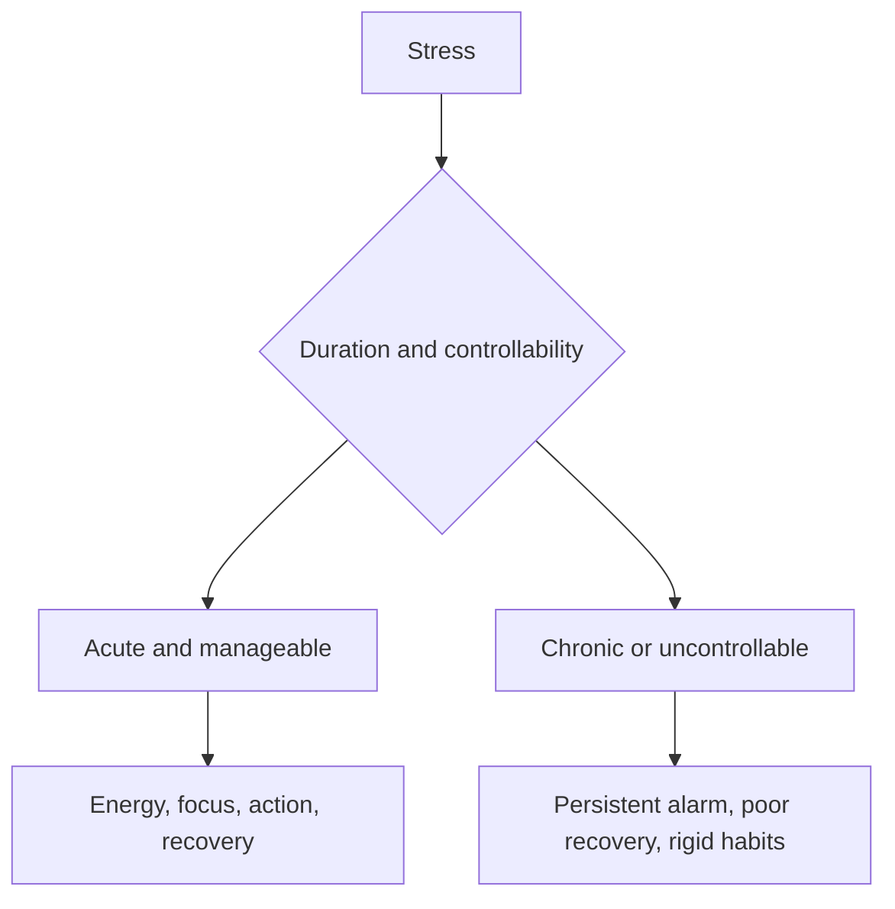

Stress is not only about intensity.

It is also about:

- duration,
- predictability,
- controllability,
- recovery,
- meaning,
- social support,
- previous trauma,
- sleep,
- physical health.

A hard workout can be good stress because it is limited and followed by recovery.

An environment that constantly feels unsafe can become harmful stress because the threat feels unpredictable and unresolved.

---

## 4. The three-layer model of stress

To understand stress clearly, use this model:

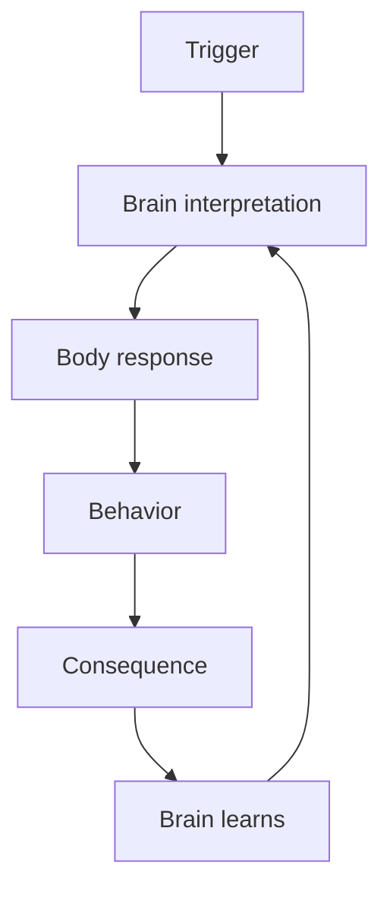

Example:

```text
Trigger: no reply from someone
Brain interpretation: this is unsafe / I am losing control
Body response: chest tight, heart fast
Behavior: react quickly or withdraw
Consequence: more anxiety or conflict
Brain learns: this situation is dangerous
```

Stress is not just the trigger.

Stress is the whole loop.

This is important because you cannot always control the trigger.

But you can often train:

- interpretation,
- body regulation,
- behavior,
- recovery,
- environment,
- meaning,
- future learning.

---

## 5. Meet the amygdala

The **amygdala** is a small almond-shaped structure deep in the temporal lobe.

You have one in each hemisphere.

It is often called the brain’s “fear center,” but that is incomplete.

The amygdala is better understood as a system involved in:

- threat detection,
- emotional salience,
- fear learning,
- emotional memory,
- attention to important stimuli,
- assigning meaning to cues,
- coordinating defensive responses,
- interacting with stress hormones.

The amygdala is not only about fear.

It responds to emotionally important things.

That can include danger, anger, reward, novelty, uncertainty, social signals, and emotionally meaningful memories.

Simple version:

> The amygdala helps the brain answer: “Is this important for survival, safety, or emotion?”

---

### The amygdala is not one thing

The word “amygdala” sounds like one structure, but it contains different nuclei with different roles.

A simplified map:

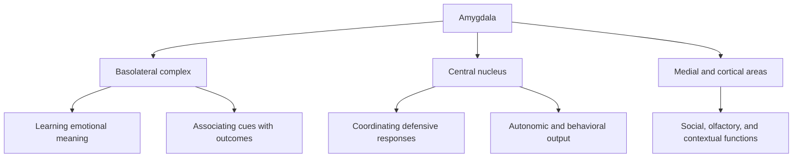

Do not worry about memorizing all of this.

The practical idea is:

> The amygdala helps detect and learn what matters, then communicates with body and brain systems to prepare a response.

---

## 6. Meet the prefrontal cortex

The **prefrontal cortex**, or **PFC**, is the front part of the frontal lobe, behind the forehead.

It is heavily involved in executive functions:

- planning,
- inhibition,
- working memory,
- flexible thinking,
- decision-making,
- attention control,
- impulse control,
- goal-directed behavior,
- emotion regulation,
- social judgment,
- long-term consequence thinking.

Simple version:

> The prefrontal cortex helps you choose instead of merely react.

A useful metaphor:

```text
Amygdala: "Something important is happening. Act now."
Prefrontal cortex: "Pause. What exactly is happening? What response fits our values and long-term goals?"
```

Again, this is simplified.

The PFC is not a single “rational brain button.” It has multiple subregions.

---

### Major prefrontal regions

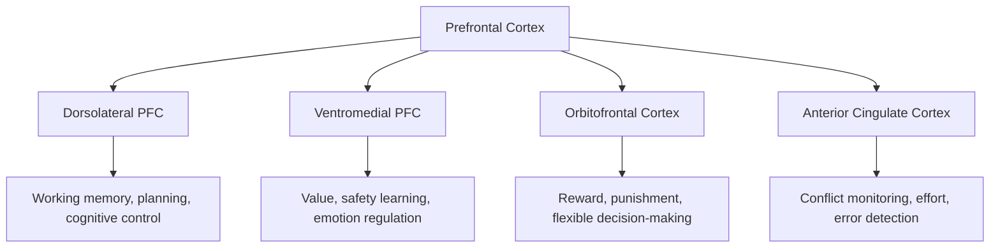

Simplified:

| Region | Real-life role |
|---|---|
| Dorsolateral PFC | Holding goals in mind, planning, resisting distraction |
| Ventromedial PFC | Regulating emotional meaning and safety signals |
| Orbitofrontal cortex | Updating choices based on reward/punishment |
| Anterior cingulate cortex | Detecting conflict, errors, effort, and uncertainty |

When stress rises, these systems can become less effective, especially for complex thinking and self-control.

---

## 7. The fast stress pathway: SAM axis

The stress response has a fast pathway.

This is often called the **sympathetic-adreno-medullary system**, or **SAM axis**.

It activates within seconds.

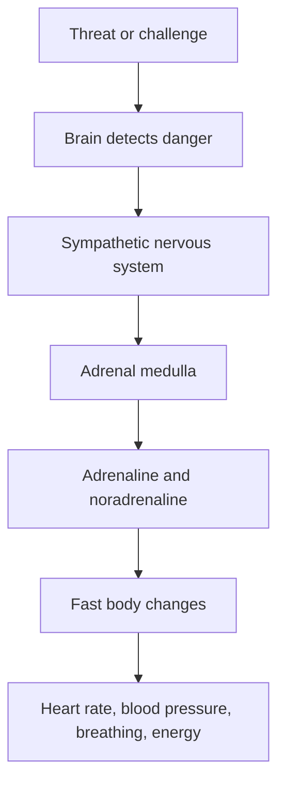

This is the “fight-or-flight” part.

It prepares the body quickly.

You may feel:

- heart pounding,
- fast breathing,
- sweating,
- shaky hands,
- tight jaw,
- tunnel vision,
- urge to move,
- urge to attack,
- urge to escape.

This response can be useful if you need quick action.

But in modern life, it can also make you react in the wrong moment, panic before an exam, snap at someone, or avoid an opportunity.

---

## 8. The slower stress pathway: HPA axis

The second major stress pathway is slower.

It is called the **hypothalamic-pituitary-adrenal axis**, or **HPA axis**.

This pathway involves hormones, especially cortisol.

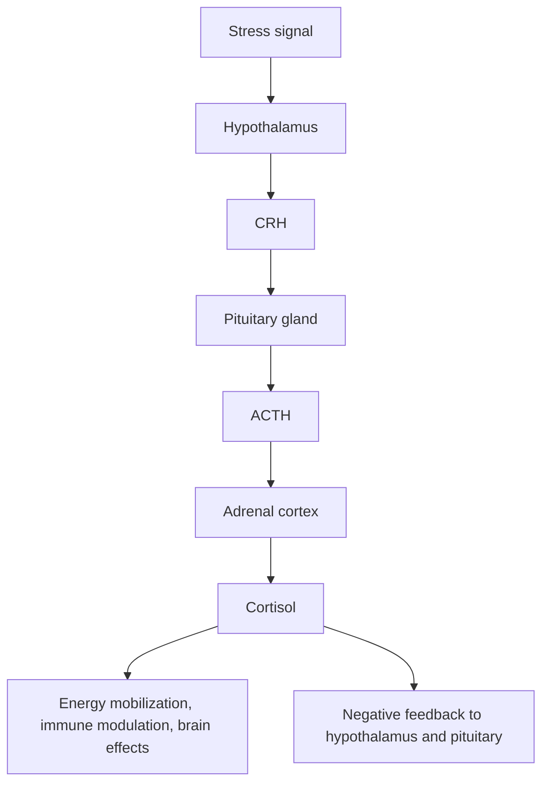

In words:

1. The brain detects stress.
2. The hypothalamus releases CRH.
3. The pituitary releases ACTH.
4. The adrenal cortex releases cortisol.
5. Cortisol helps mobilize energy and regulate many body systems.
6. Cortisol also feeds back to the brain to help shut the response down when appropriate.

The HPA axis is one of the body’s main stress-response systems. Medical and physiology sources describe stress as involving nervous, endocrine, and immune mechanisms, including fast SAM activation and slower HPA activation.[^1]

---

## 9. Cortisol is not simply “bad”

Cortisol is often called the “stress hormone.”

People talk about it like poison.

That is wrong.

Cortisol is necessary.

It helps regulate:

- energy availability,
- glucose metabolism,
- inflammation,
- blood pressure,
- immune response,
- waking rhythm,
- adaptation to stress.

Cortisol normally follows a daily rhythm: higher in the morning, lower at night. This rhythm helps your body wake up and coordinate energy across the day.[^2]

The problem is not cortisol itself.

The problem is dysregulation.

Examples:

```text
Too much for too long
Wrong timing
Poor shutdown
Repeated activation
Flattened rhythm
Stress without recovery
```

A healthy stress response is flexible:

```text
Activate when needed.
Recover when safe.
```

An unhealthy stress response gets stuck:

```text
Activate often.
Recover poorly.
Remain vigilant.
```

---

## 10. The amygdala-PFC balance

The amygdala and prefrontal cortex communicate.

When threat is low and the body is regulated, the PFC can help guide attention, interpret meaning, and inhibit impulsive responses.

When stress is high, fast threat systems can dominate.

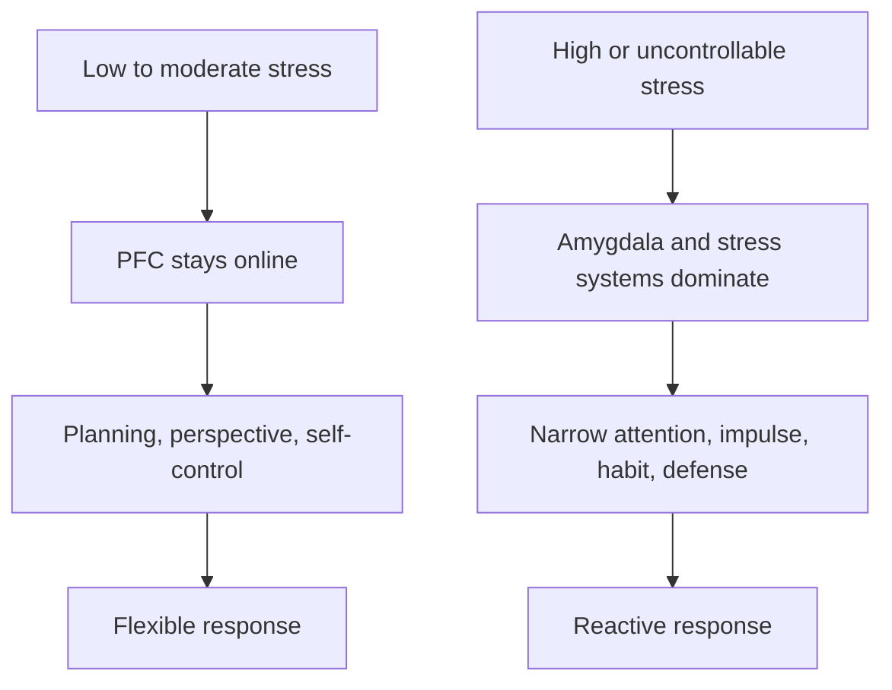

This is why you can be wise when calm and foolish when triggered.

It is not because you forgot your values.

It is because stress changed which brain systems had priority.

---

## 11. “Amygdala hijack” is useful but incomplete

You may have heard the phrase **amygdala hijack**.

It means a strong emotional reaction takes over before the thinking brain can regulate it.

This phrase is useful for beginners.

But scientifically, it is too simple.

The amygdala does not literally hijack the whole brain like a criminal taking over a plane.

A better explanation:

> Under high stress, brain networks shift toward rapid defensive responding, while prefrontal networks that support working memory, inhibition, and flexible thinking may become less effective.

Reviews by Amy Arnsten and others show that stress-related catecholamine signaling can rapidly impair prefrontal cortex network function, especially under uncontrollable stress.[^3]

So instead of saying:

```text
My amygdala hijacked me.
```

Say:

```text
My threat system became dominant and my prefrontal control weakened.
```

That is less dramatic.

But more accurate.

---

## 12. Why stress makes you stupid — temporarily

Stress does not always make you stupid.

In some situations, it sharpens you.

But high stress can impair the exact abilities you need for complex life:

- working memory,
- flexible thinking,
- response inhibition,
- long-term planning,
- perspective-taking,
- emotional regulation.

A meta-analysis found that acute stress tends to impair working memory and cognitive flexibility, while effects on inhibition are more nuanced.[^4]

This explains real life.

Under stress, you may:

```text
forget what you studied,
misread unclear feedback,
overreact,
say something you regret,
check your phone compulsively,
struggle to plan,
make black-and-white conclusions,
avoid the task,
seek immediate relief.
```

This is not because you suddenly lost intelligence.

It is because stress changes access to intelligence.

Your brain may still have the knowledge.

But the state makes it harder to use.

---

## 13. The stress shift: from goal mode to survival mode

When calm, the brain can operate in **goal-directed mode**.

```text
What matters long-term?
What is the wise response?
What are the consequences?
```

When stressed, the brain may shift toward **survival mode**.

```text
What stops the pain now?
What removes the threat now?
What gives relief now?
```

Visual:

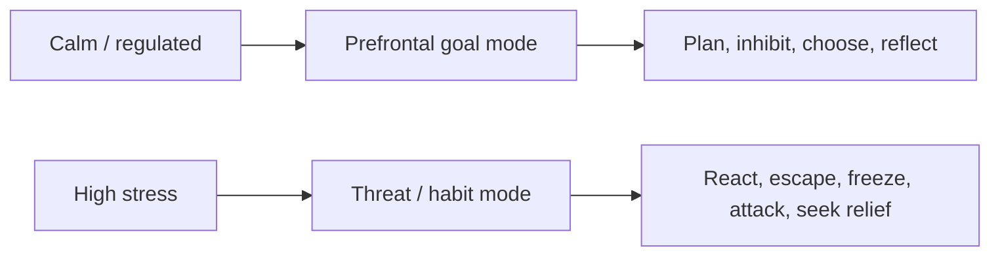

This is why stress increases short-term behavior.

Examples:

| Stress state | Likely behavior |
|---|---|
| Exam panic | blank mind, rushed answers |
| Social uncertainty | checking, reassurance seeking, withdrawing |
| Work uncertainty | overthinking, procrastination, doom scrolling |
| Public speaking fear | avoidance or freezing |
| Social stress | rumination, self-criticism, impulsive reaction |
| Sleep-deprived stress | irritability, cravings, poor impulse control |

The brain chooses relief when it cannot access regulation.

---

## 14. The amygdala and emotional memory

The amygdala helps emotionally important experiences get remembered.

This is why emotionally intense moments stick.

You may forget normal days.

But you remember:

- humiliation,
- betrayal,
- fear,
- praise,
- failure,
- danger,
- criticism,
- success,
- first major emotional event,
- public embarrassment.

The amygdala interacts with memory systems, including the hippocampus.

Simple map:

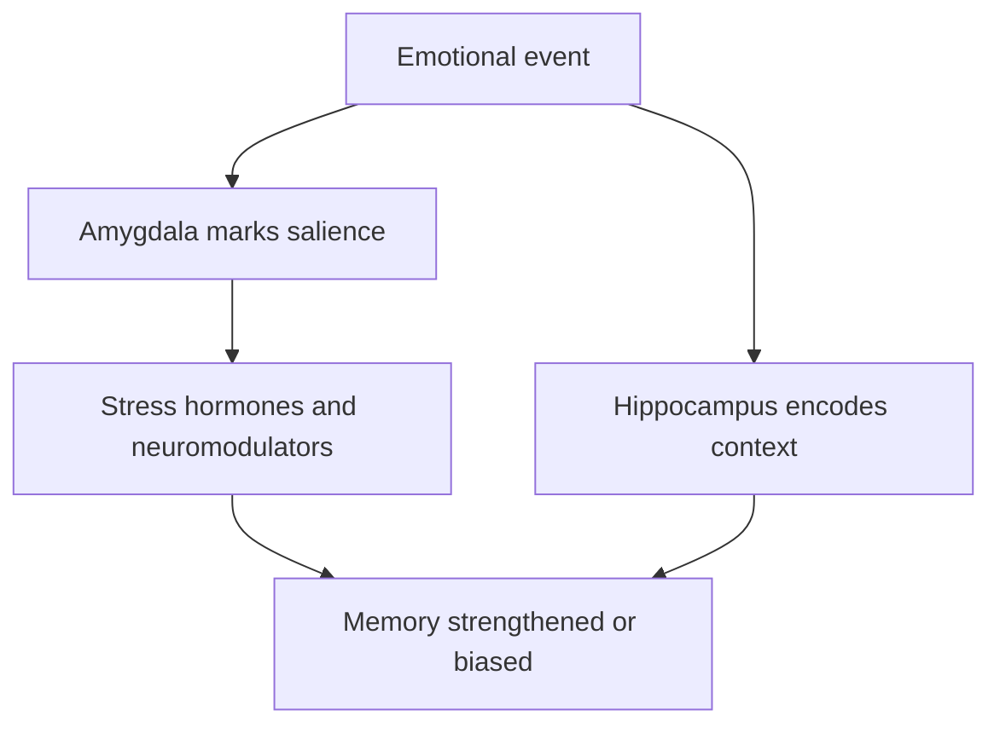

The amygdala helps answer:

```text
How emotionally important was this?
```

The hippocampus helps answer:

```text
Where and when did this happen?
What was the context?
```

Under stress, memory can become biased.

You may strongly remember the emotional meaning but poorly remember context.

Example:

```text
Emotional memory: "That was painful."
Context detail: "Actually, the situation was complicated."
```

This is why stress can make the past feel simpler and more absolute than it was.

---

## 15. Fear conditioning: how the brain learns danger

Fear conditioning is a basic learning process.

If a neutral cue repeatedly appears with danger, the brain learns the cue predicts danger.

Classic example:

```text
Neutral sound + shock → fear
Later: sound alone → fear
```

Real-life examples:

```text
A certain tone of voice → memory of conflict → body alarm
A classroom → past humiliation → anxiety
An unexpected notification → stress → heart racing
An unexpected update → threat prediction
A hospital smell → medical trauma memory
```

Visual:

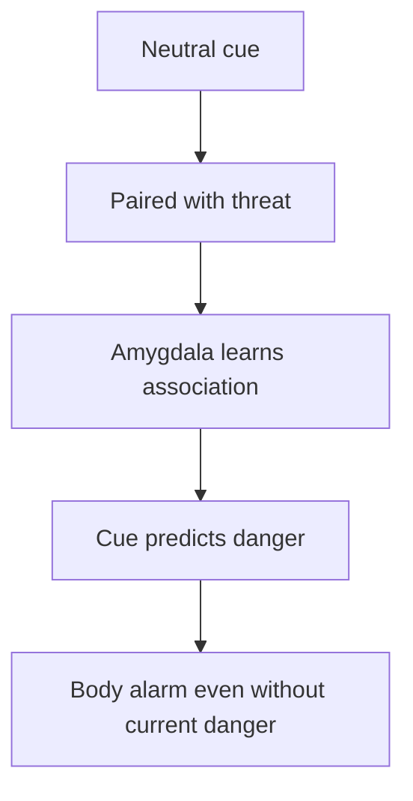

This is why your body can react before your conscious mind understands.

The nervous system learns patterns.

---

## 16. Extinction: learning safety

Extinction does not simply erase fear.

It creates new learning.

```text
Old learning: cue = danger
New learning: cue = safe in this context
```

The prefrontal cortex, especially medial and ventromedial regions, is involved in regulating threat responses and supporting safety learning. Modern exposure therapy models often focus on inhibitory learning: building new safety associations that compete with old fear associations.[^5]

Visual:

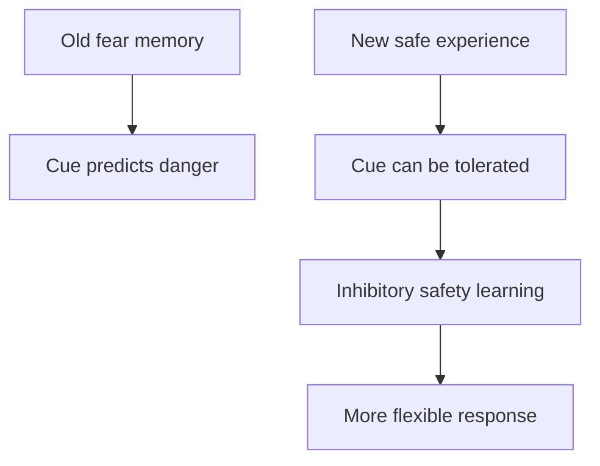

Example:

You fear public speaking because of a past embarrassing event.

Avoidance teaches:

```text
Speaking is dangerous. Escape keeps me safe.
```

Gradual exposure teaches:

```text
Speaking is uncomfortable, but I can survive it.
```

You do not delete the past.

You build a stronger present.

---

## 17. Chronic stress changes the brain differently

Acute stress is a temporary shift.

Chronic stress can reshape the system.

Research reviews describe chronic stress as affecting the structure and function of the prefrontal cortex, amygdala, and hippocampus.[^6]

A simplified pattern often described in stress research:

| Brain region | Chronic stress tendency |
|---|---|
| Amygdala | can become more reactive or show stress-related growth in some circuits |
| Prefrontal cortex | can show weakened regulation, dendritic changes, impaired executive function |
| Hippocampus | can be affected in memory/context regulation and stress feedback |

Simple diagram:

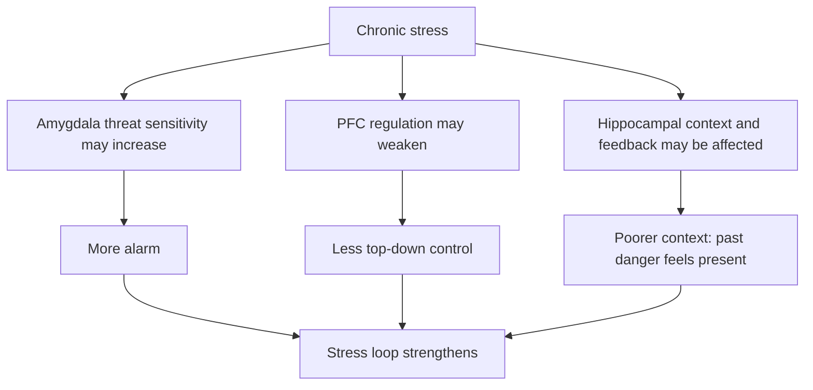

This is why chronic stress can make a person feel like they are becoming a different version of themselves:

- more reactive,
- less patient,
- more forgetful,
- less motivated,
- more avoidant,
- more suspicious,
- more tired,
- more emotionally sensitive.

It is not “just mindset.”

It is a repeated brain-body state.

---

## 18. The hippocampus: the missing third player

This article focuses on the amygdala and PFC, but we need the **hippocampus** too.

The hippocampus helps with:

- memory,
- context,
- time and place,
- distinguishing past from present,
- regulating HPA feedback.

Why does this matter?

Because stress often makes the brain lose context.

Example:

```text
Current event:
Someone replies late.

Old memory:
Someone used to ignore you before hurting you.

Stress interpretation:
This is happening again.
```

Your hippocampus helps say:

```text
Wait. This is a different person, different time, different context.
```

When stress is high, context processing can weaken.

The past feels present.

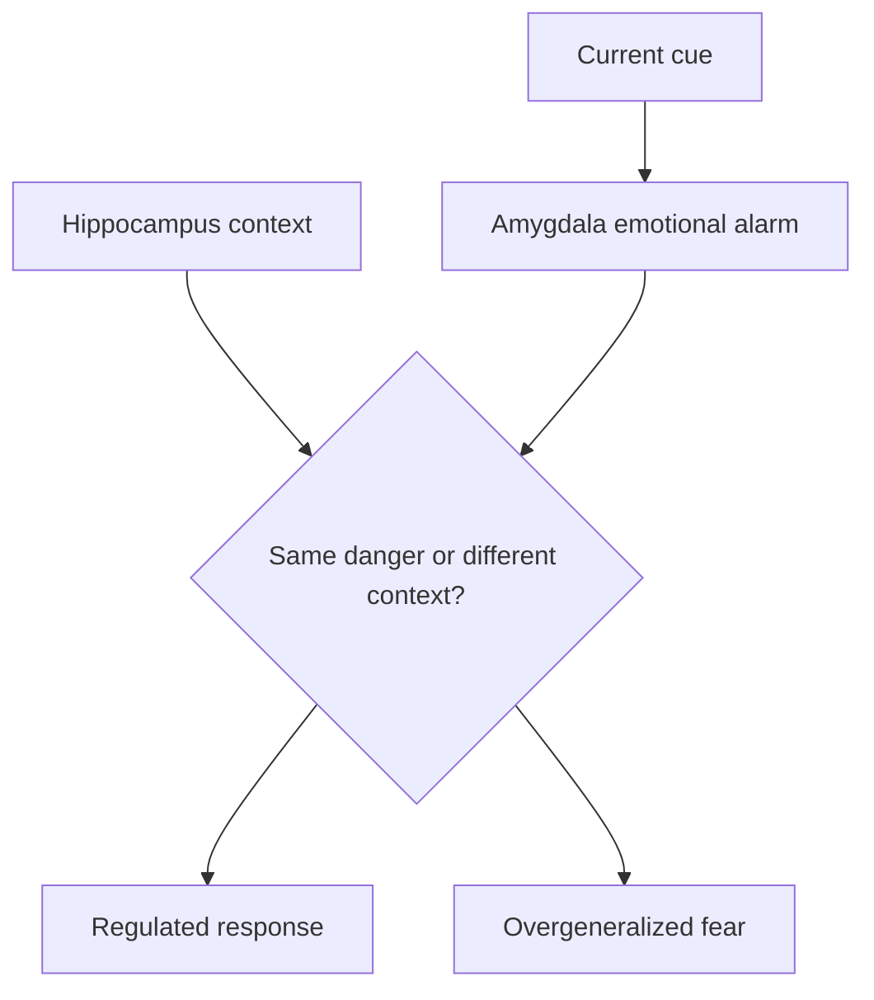

A lot of emotional healing is learning:

> This reminds me of danger, but it is not the same danger.

---

## 19. Top-down and bottom-up regulation

There are two broad ways to regulate stress.

### Top-down regulation

This uses thinking, language, meaning, planning, and attention.

Examples:

- cognitive reappraisal,
- labeling emotions,
- planning,
- self-talk,
- perspective-taking,
- values,
- problem-solving.

```text
Mind influences body.
```

### Bottom-up regulation

This uses the body to influence the brain.

Examples:

- breathing,
- movement,
- sleep,
- posture,
- cold water,
- relaxation,
- grounding,
- social safety,
- rhythm,
- sunlight.

```text
Body influences mind.
```

Visual:

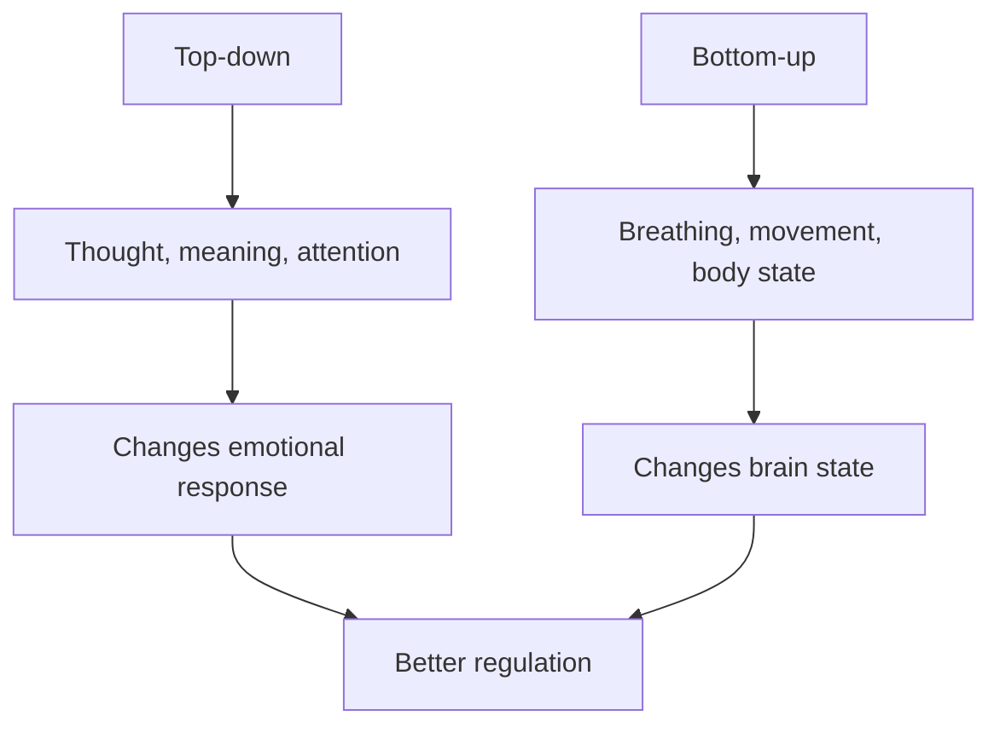

Many people try only top-down regulation.

They try to think their way out of stress.

But if the body is highly activated, the prefrontal cortex may not have enough control.

So first you may need bottom-up regulation.

Then thinking works better.

---

## 20. Why “just think positive” fails

When someone is highly stressed, telling them:

```text
Just think positive.
```

is often useless.

Why?

Because the brain state does not support flexible thinking.

Better sequence:

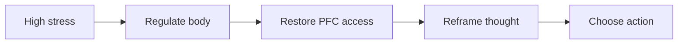

Do not start with philosophy if the body is in alarm.

Start with state.

Then meaning.

Then action.

---

## 21. Emotional labeling: naming reduces chaos

One practical tool is **affect labeling**.

That means naming what you feel.

Examples:

```text
This is anger.
This is fear.
This is shame.
This is grief.
This is uncertainty.
This is social pain.
```

Why does this help?

Because labeling recruits language and prefrontal systems, turning vague alarm into organized information.

Instead of:

```text
Everything is wrong.
```

you say:

```text
I am feeling fear because I do not know what will happen.
```

That is more workable.

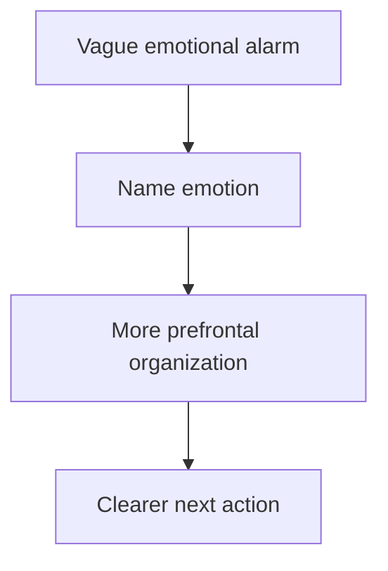

Practical formula:

```text
I am feeling _______
because my brain is interpreting _______
as _______.
The next useful action is _______.
```

Example:

```text
I am feeling panic
because my brain is interpreting this exam
as proof of my worth.
The next useful action is one timed practice test.
```

---

## 22. Cognitive reappraisal: changing meaning

**Cognitive reappraisal** means changing the interpretation of a situation.

Not lying.

Not fake positivity.

Changing meaning accurately.

Example:

```text
Old interpretation:
I am nervous, so I will fail.

New interpretation:
I am activated because this matters. I can use this energy and slow down.
```

Example:

```text
Old interpretation:
They did not reply. I am worthless.

New interpretation:
A delayed reply is uncertain. I do not need to fill uncertainty with self-attack.
```

Example:

```text
Old interpretation:
This setback means everything is over.

New interpretation:
This is serious, but it is also a forced transition. My next proof is one application/project hour today.
```

Reappraisal is powerful because stress depends heavily on meaning.

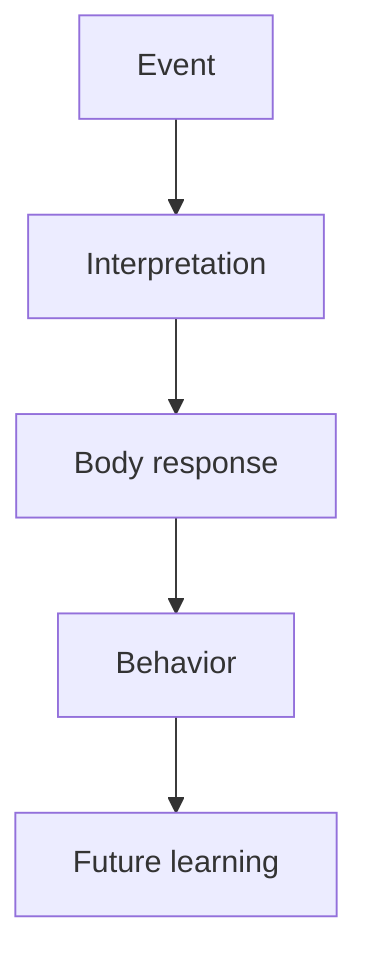

Change interpretation, and the whole loop can change.

---

## 23. But reappraisal has a timing problem

Reappraisal works best when the prefrontal cortex is available.

If you are at 9/10 stress, reappraisal may fail.

Use this sequence:

```text
1. Breathe/move/ground.
2. Name the emotion.
3. Reduce intensity from 9/10 to 5/10.
4. Then reappraise.
5. Then act.
```

Do not try to debate your amygdala during full alarm.

First lower the alarm.

Then reason.

---

## 24. Slow breathing: a direct handle on stress physiology

Breathing is special because it is both automatic and controllable.

You breathe without thinking.

But you can also choose to slow it down.

Slow breathing can influence autonomic balance, vagal pathways, heart rate variability, and stress-related arousal. Reviews of slow breathing describe effects on autonomic and central nervous system activity, with reductions in anxiety, anger, and arousal symptoms.[^7]

Simple practical rule:

> Longer exhale tells the body: “We are not sprinting from a tiger.”

Try:

```text
Inhale 4 seconds.
Exhale 6–8 seconds.
Repeat for 2–5 minutes.
```

Visual:

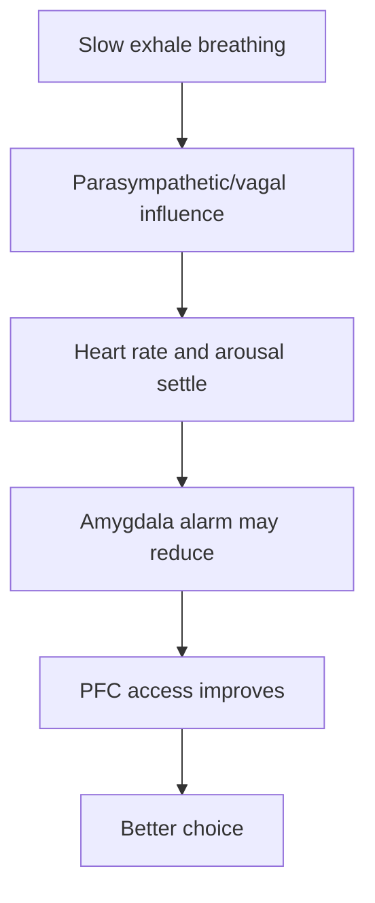

This does not solve your life.

It changes your state so you can solve better.

---

## 25. The 90-second stress reset

Use this when you feel triggered.

### Step 1: Name

```text
This is stress.
My threat system is active.
```

### Step 2: Exhale

Do 6 slow exhales.

```text
Inhale normally.
Exhale slowly.
```

### Step 3: Locate

Ask:

```text
Where is it in my body?
Chest? Jaw? Stomach? Hands?
```

### Step 4: Ground

Look around and name:

```text
5 things I see.
4 things I feel.
3 sounds I hear.
```

### Step 5: Choose one action

Ask:

```text
What is the next useful action, not the most emotional action?
```

Diagram:

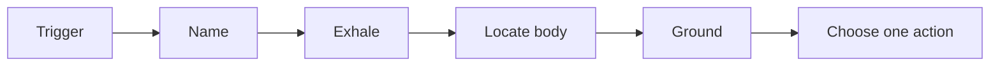

This trains the pathway:

```text
Stress → pause → regulate → choose
```

Not:

```text
Stress → react → regret
```

---

## 26. Sleep: the emotional regulation multiplier

Poor sleep makes stress regulation much harder.

Sleep loss is associated with increased emotional reactivity and reduced prefrontal-amygdala functional connectivity, meaning the brain may have less top-down modulation of emotional responses after poor sleep.[^8]

This is why after bad sleep:

- small problems feel huge,
- cravings increase,
- anger comes faster,
- discipline drops,
- old habits return,
- social stress feels worse,
- concentration suffers.

Sleep is not just recovery.

Sleep is emotional regulation infrastructure.

```mermaid
flowchart TD
    A[Poor sleep] --> B[Higher emotional reactivity]
    A --> C[Weaker PFC control]
    B --> D[More stress]
    C --> D
    D --> E[Worse sleep]
    E --> A
```

Break the loop:

```text
Protect sleep before you demand perfect self-control.
```

Practical sleep rules:

- fixed wake time,
- morning sunlight,
- no intense emotional texting late at night,
- reduce caffeine after midday,
- dim lights before bed,
- keep phone away from bed,
- write worries down before sleep,
- do not solve your whole life at midnight.

Midnight brain is not your best advisor.

---

## 27. Exercise: stress discharge and resilience training

Exercise is one of the strongest real-life tools for stress.

It works through many pathways:

- energy discharge,
- mood improvement,
- better sleep,
- improved metabolic health,
- increased stress resilience,
- improved executive function,
- neuroplasticity support,
- social connection if done with others.

Reviews suggest physical activity and fitness can support self-regulation and resilience through top-down control systems.[^9]

Exercise is not only body training.

It is nervous system training.

```mermaid
flowchart TD
    A[Exercise] --> B[Body uses stress energy]
    A --> C[Sleep improves]
    A --> D[Mood improves]
    A --> E[Executive control support]
    B --> F[Lower baseline stress]
    C --> F
    D --> F
    E --> F
```

Practical minimum:

```text
Walk 20–30 minutes daily.
Strength train 2–4 times weekly.
Use movement after emotional triggers.
```

If activation is high, move.

If you are anxious, walk.

If you are stuck in rumination, change your body state.

The body is an exit door from mental loops.

---

## 28. Stress and habits: why you regress under pressure

Under stress, the brain tends to rely more on familiar patterns.

This makes sense.

When danger is high, the brain does not want to calculate from scratch.

It uses what is automatic.

That means stress reveals your training.

If your trained pattern is:

```text
stress → phone
```

you will scroll.

If your trained pattern is:

```text
stress → reactive response
```

you will type.

If your trained pattern is:

```text
stress → walk and breathe
```

you will regulate.

If your trained pattern is:

```text
stress → study anyway for 25 minutes
```

you will build discipline.

Stress does not only break you.

It exposes what you practiced.

```mermaid
flowchart TD
    A[Stress] --> B[Reduced flexible control]
    B --> C[Automatic pathway activates]
    C --> D[Your habits appear]
```

This is why you must train regulation when calm.

Do not wait for crisis.

Practice the response before you need it.

---

## 29. The stress-performance curve

Stress and performance often follow an inverted-U shape.

Too little activation:

```text
bored, sleepy, unfocused
```

Moderate activation:

```text
alert, engaged, motivated
```

Too much activation:

```text
panic, freezing, impulsivity
```

```mermaid
flowchart LR
    A[Low stress] --> B[Under-aroused]
    B --> C[Low performance]

    D[Moderate stress] --> E[Focused challenge]
    E --> F[Best performance]

    G[High stress] --> H[Overwhelmed]
    H --> I[Poor performance]
```

Your goal is not zero stress.

Your goal is the **optimal zone**.

For studying:

```text
Too calm = sleepy
Optimal = alert and challenged
Too stressed = panic and avoidance
```

For conversations:

```text
Too calm = careless
Optimal = present and honest
Too stressed = defensive or desperate
```

For career:

```text
Too calm = no urgency
Optimal = structured action
Too stressed = doom, freeze, comparison
```

---

## 30. The window of tolerance

A useful practical concept is the **window of tolerance**.

It describes the range where you can feel emotion and still stay functional.

Inside the window:

```text
I feel stress, but I can think, choose, and act.
```

Above the window:

```text
Hyperarousal: panic, rage, racing thoughts, impulsivity.
```

Below the window:

```text
Hypoarousal: numbness, shutdown, freeze, hopelessness.
```

```mermaid
flowchart TD
    A[Hyperarousal] --> B[Panic, anger, impulsivity]
    C[Window of tolerance] --> D[Feel + think + choose]
    E[Hypoarousal] --> F[Numb, frozen, collapsed]

    B --> G[Need calming/regulation]
    F --> H[Need activation/movement/connection]
```

Different states need different tools.

If you are hyperaroused, use:

- slow exhale breathing,
- walking,
- grounding,
- cold water,
- delay rule,
- reduce stimulation.

If you are hypoaroused, use:

- movement,
- sunlight,
- music,
- social contact,
- small tasks,
- shower,
- food,
- structure.

Do not use the same tool for every state.

---

## 31. Stress in real life: uncertainty trigger

Example:

```text
Someone you care about replies late.
```

Old loop:

```mermaid
flowchart TD
    A[Unclear signal] --> B[Amygdala threat: danger]
    B --> C[Body alarm]
    C --> D[Prefrontal control weakens]
    D --> E[React quickly / check repeatedly]
    E --> F[Temporary relief]
    F --> G[Attachment anxiety strengthened]
```

New loop:

```mermaid
flowchart TD
    A[Unclear signal] --> B[Name: uncertainty trigger]
    B --> C[Exhale breathing]
    C --> D[Reappraise: late reply is not proof]
    D --> E[Choose action: wait, work, move]
    E --> F[Brain learns: uncertainty is tolerable]
```

Practical script:

```text
My brain is reading uncertainty as danger.
I do not need to solve this with panic.
I will wait 30 minutes and do one useful task.
```

The goal is not to never care.

The goal is to not let fear drive behavior.

---

## 32. Stress in real life: exam stress

Old loop:

```mermaid
flowchart TD
    A[Exam pressure] --> B[Meaning: this proves my worth]
    B --> C[High stress]
    C --> D[Working memory drops]
    D --> E[Poor performance]
    E --> F[Belief: I cannot handle exams]
```

New loop:

```mermaid
flowchart TD
    A[Exam pressure] --> B[Meaning: this is a trainable performance]
    B --> C[Moderate challenge]
    C --> D[Timed practice]
    D --> E[Feedback]
    E --> F[Better prediction: I can improve]
```

Practical script:

```text
This is not a worth test.
It is a performance skill.
My task is one timed repetition.
```

Before practice:

```text
2 minutes slow breathing.
Set timer.
Do one task.
Review errors.
Stop.
Repeat tomorrow.
```

This trains the brain to associate stress with structured action, not panic.

---

## 33. Stress in real life: job loss or career uncertainty

Old loop:

```mermaid
flowchart TD
    A[Uncertainty] --> B[Threat: my future is collapsing]
    B --> C[Anxiety]
    C --> D[Overthinking]
    D --> E[No output]
    E --> F[More threat]
```

New loop:

```mermaid
flowchart TD
    A[Uncertainty] --> B[Name: career threat state]
    B --> C[Break into next action]
    C --> D[90-minute deep work]
    D --> E[Visible output]
    E --> F[Self-efficacy]
    F --> G[Lower uncertainty]
```

Practical script:

```text
My brain wants certainty.
I will create evidence instead.
One project block. One application. One skill repetition.
```

Your nervous system calms not only from thinking.

It calms from proof that you can act.

---

## 34. Stress in real life: anger

Anger is often a protective emotion.

It says:

```text
A boundary was crossed.
Something feels unfair.
I need power.
```

But anger under stress can bypass long-term judgment.

Old loop:

```mermaid
flowchart TD
    A[Feeling disrespected] --> B[Amygdala threat + anger]
    B --> C[Impulse to attack]
    C --> D[Harsh reaction]
    D --> E[Short-term power]
    E --> F[Long-term regret or more attachment]
```

New loop:

```mermaid
flowchart TD
    A[Feeling disrespected] --> B[Name anger]
    B --> C[Delay response]
    C --> D[Move body]
    D --> E[Ask: what protects self-respect long-term?]
    E --> F[Boundary, not explosion]
```

Practical rule:

```text
Do not respond from peak anger.
Peak anger is not wisdom.
```

Use anger for standards:

```text
I do not accept this.
I will step back.
I will choose a clean boundary.
```

Not:

```text
I will destroy the other person verbally.
```

The first builds self-respect.

The second keeps you tied to the trigger.

---

## 35. The PFC protocol: restoring top-down control

When stressed, do this sequence:

```mermaid
flowchart TD
    A[Stress trigger] --> B[Stop input]
    B --> C[Body regulation]
    C --> D[Emotion label]
    D --> E[Reappraisal]
    E --> F[One chosen action]
    F --> G[Review and learn]
```

### Step 1: Stop input

If possible, stop feeding the trigger.

Examples:

```text
Put phone down.
Leave the argument for 10 minutes.
Close social media.
Pause before replying.
```

### Step 2: Regulate body

```text
Slow exhale breathing.
Walk.
Stretch.
Drink water.
Relax jaw and shoulders.
```

### Step 3: Label emotion

```text
This is fear.
This is anger.
This is shame.
This is uncertainty.
```

### Step 4: Reappraise

```text
What is another accurate interpretation?
What would I think if I were calm?
What does this situation require, not what does my impulse want?
```

### Step 5: Choose one action

```text
One response.
One task.
One boundary.
One study block.
One call.
One application.
```

### Step 6: Review

```text
What triggered me?
What worked?
What should I practice next time?
```

This is how the prefrontal cortex becomes a trained system, not just an idea.

---

## 36. The 5-second rule is not enough

Some self-help advice says:

```text
Just count 5-4-3-2-1 and act.
```

This can help for simple action.

But for high emotional stress, you often need more:

```text
pause + body regulation + labeling + reappraisal + action
```

Why?

Because the body state may be too activated for pure willpower.

A better version:

```text
5 seconds to interrupt.
90 seconds to regulate.
1 action to retrain.
```

---

## 37. How to train stress resilience before you need it

You do not build stress regulation only during crisis.

You build it daily.

```mermaid
flowchart TD
    A[Daily small stressor] --> B[Practice regulation]
    B --> C[Successful recovery]
    C --> D[Brain learns: stress is tolerable]
    D --> E[More resilience under bigger stress]
```

Examples:

- cold shower finish,
- hard workout,
- timed study block,
- public speaking practice,
- difficult conversation,
- phone away during work,
- waking on time,
- applying despite fear,
- practicing emotional delay.

The point is not suffering.

The point is controlled challenge plus recovery.

---

## 38. Controlled stress vs toxic stress

| Controlled stress | Toxic stress |
|---|---|
| Time-limited | Ongoing |
| Chosen or meaningful | Unwanted and meaningless |
| Recovery available | No recovery |
| Builds skill | Creates helplessness |
| Support exists | Isolation |
| You can act | You feel trapped |

Example of controlled stress:

```text
30-minute difficult workout
```

Example of toxic stress:

```text
months of unpredictable emotional conflict with poor sleep and no support
```

The same nervous system that grows from challenge can be damaged by constant threat.

---

## 39. Social safety: the underrated regulator

Humans are social mammals.

The nervous system regulates partly through other people.

A calm, safe person can help your system settle.

An unpredictable, rejecting, or aggressive person can keep your system activated.

```mermaid
flowchart TD
    A[Social signal] --> B{Safe or threatening?}

    B --> C[Safe connection]
    C --> D[Lower threat, more PFC access]

    B --> E[Conflict/unpredictability]
    E --> F[Higher amygdala vigilance, stress response]
```

This is why social support matters for stress biology.

Practical meaning:

- choose people who reduce chaos, not intensify it;
- do not use unstable people as emotional regulators;
- call a grounded friend when overwhelmed;
- do not isolate completely during stress;
- build routines around healthy social contact.

Sometimes the fastest way to restore the prefrontal cortex is to stop being alone with a threat loop.

---

## 40. Environment as stress architecture

Your environment can keep your amygdala activated or help your PFC.

Stressful environment:

```text
phone near bed
messy room
constant notifications
no schedule
poor sleep
doom scrolling
unresolved tasks everywhere
```

PFC-supportive environment:

```text
clear desk
phone away
written plan
morning light
water nearby
task timer
sleep routine
exercise clothes ready
```

```mermaid
flowchart TD
    A[Environment] --> B[Cues]
    B --> C[Brain state]
    C --> D[Behavior]
    D --> E[Repeated pattern]
    E --> F[Future brain response]
```

Your environment is not neutral.

It trains you.

---

## 41. The stress audit

Use this to diagnose your stress system.

### Triggers

```text
What situations activate me most?
What people activate me most?
What times of day are worst?
What apps increase stress?
```

### Body signs

```text
Where do I feel stress?
Chest?
Stomach?
Jaw?
Head?
Hands?
```

### Thoughts

```text
What does my brain predict?
Social threat?
Failure?
Loss?
Humiliation?
Uncertainty?
```

### Behaviors

```text
Do I attack?
Avoid?
Freeze?
Overthink?
Scroll?
Seek reassurance?
Work compulsively?
```

### Consequences

```text
What happens after?
Relief?
Regret?
More anxiety?
Less self-respect?
```

### Replacement

```text
What should I practice instead?
```

This turns stress from a mysterious monster into a trainable loop.

---

## 42. The 4 stress personalities

These are not clinical categories. They are practical patterns.

### 1. The fighter

Stress response:

```text
attack, argue, prove, dominate
```

Strength:

```text
protects boundaries
```

Risk:

```text
damages trust and self-respect
```

Practice:

```text
delay, breathe, convert anger into boundary
```

### 2. The runner

Stress response:

```text
avoid, disappear, procrastinate
```

Strength:

```text
escapes real danger
```

Risk:

```text
misses growth and reinforces fear
```

Practice:

```text
small exposure, one next action
```

### 3. The freezer

Stress response:

```text
numb, stuck, blank, passive
```

Strength:

```text
survives overwhelm
```

Risk:

```text
life stops moving
```

Practice:

```text
movement, sunlight, tiny action
```

### 4. The fixer

Stress response:

```text
overthink, control, seek certainty
```

Strength:

```text
problem-solving
```

Risk:

```text
rumination and exhaustion
```

Practice:

```text
limit thinking time, act before complete certainty
```

Most people are a mixture.

The point is not to label yourself forever.

The point is to know your default under stress.

---

## 43. Advanced: why uncontrollable stress is especially damaging

Stress is harder when it feels uncontrollable.

If you can act, stress may become challenge.

If you cannot act, stress becomes threat.

```mermaid
flowchart TD
    A[Stress] --> B{Can I influence the outcome?}

    B --> C[Yes]
    C --> D[Challenge mode]
    D --> E[Problem-solving]

    B --> F[No or feels impossible]
    F --> G[Threat/helplessness mode]
    G --> H[Anxiety, shutdown, rumination]
```

This is why small controllable actions are powerful.

They tell the brain:

```text
Action still matters.
```

If you are overwhelmed, do not try to solve the whole life problem.

Find one controllable unit.

```text
One email.
One walk.
One page.
One application.
One meal.
One reactive response paused.
One 25-minute block.
```

Agency is medicine for helplessness.

---

## 44. Advanced: stress and memory bias

Stress can bias attention and memory toward threat.

Under stress, the brain may:

- notice negative cues faster,
- remember failures more strongly,
- generalize danger,
- reduce context,
- interpret ambiguity negatively.

Example:

```text
Neutral face → "They are judging me."
Delayed reply → "They hate me."
Difficult task → "I will fail."
Body sensation → "Something is wrong."
```

This is not reality.

It is threat-biased prediction.

Practical question:

```text
What would this mean if I were calm?
```

Another:

```text
What are three non-catastrophic explanations?
```

This helps restore PFC interpretation.

---

## 45. Advanced: stress, dopamine, and relief seeking

Stress does not only create fear.

It can also increase craving for relief.

Under stress, the brain may seek:

- sugar,
- scrolling,
- porn,
- alcohol,
- nicotine,
- reactive replying,
- reassurance,
- gambling,
- overwork,
- distraction,
- emotional drama.

The common pattern:

```mermaid
flowchart TD
    A[Stress] --> B[Discomfort]
    B --> C[Relief behavior]
    C --> D[Temporary relief]
    D --> E[Brain learns: this removes stress]
    E --> F[Stronger craving next time]
```

The problem is not that you love the behavior.

Often, you love the relief.

To change it, build better relief pathways:

```text
stress → walk
stress → breathe
stress → call grounded friend
stress → write plan
stress → shower
stress → 25-minute task
stress → gym
```

Your brain needs replacement relief.

Not just removal.

---

## 46. Advanced: stress and inflammation

Stress interacts with the immune system.

The stress response is not only brain and hormones; it also involves immune signaling. Physiology sources describe stress as involving nervous, endocrine, and immune mechanisms.[^1]

Chronic stress can contribute to inflammatory dysregulation, and inflammation can influence mood, energy, and brain function.

This is one reason stress management is not only “mental health.”

It is whole-body health.

Practical foundations:

- sleep,
- exercise,
- nutrition,
- sunlight,
- social support,
- medical care when needed,
- reducing chronic threat exposure.

Your brain lives inside your body.

Treat the body as part of the mind.

---

## 47. What to do when you are at 10/10 stress

At 10/10 stress, do not try to solve life.

Do not make major decisions.

Do not respond while highly activated.

Do not diagnose your whole personality.

Use a crisis-state protocol.

```text
1. Remove immediate danger if present.
2. Stop adding stimulation.
3. Put phone down.
4. Exhale slowly.
5. Move body.
6. Contact safe person if needed.
7. Eat/drink/sleep if basic needs are broken.
8. Decide later.
```

Mermaid version:

```mermaid
flowchart TD
    A[10/10 stress] --> B[Safety first]
    B --> C[Reduce input]
    C --> D[Body regulation]
    D --> E[Support person]
    E --> F[Basic needs]
    F --> G[Delay major decisions]
```

A dysregulated brain wants immediate resolution.

But immediate resolution is often exactly what creates regret.

---

## 48. What to do at 6/10 stress

At 6/10, you can still train.

Use:

```text
Name emotion.
Breathe 2 minutes.
Break task into one step.
Act for 10 minutes.
Review.
```

This is where growth happens.

```mermaid
flowchart LR
    A[Moderate stress] --> B[Regulate slightly]
    B --> C[Take useful action]
    C --> D[Brain learns capability]
```

Do not avoid all stress.

Train with moderate stress.

That is how resilience grows.

---

## 49. What to do at 2/10 stress

At low stress, prepare.

This is the best time to build systems.

```text
Plan routines.
Set environment.
Practice breathing.
Exercise.
Prepare scripts.
Study.
Build skills.
Sleep.
```

Calm time is training time.

You cannot install a parachute while falling.

---

## 50. The 7-day stress-brain reset

This is a practical mini-program.

### Day 1: Map your stress loop

Write:

```text
My top 3 triggers:
My body signs:
My default reaction:
The cost of that reaction:
```

### Day 2: Build the pause

Practice 5 times:

```text
Trigger or thought → one slow exhale → label emotion
```

Even with small triggers.

### Day 3: Remove one stress cue

Choose one:

```text
phone outside bedroom
notifications off
clear desk
block one app
stop late-night emotional conversations
```

### Day 4: Add movement

```text
20–30 minutes walk or workout
```

Afterward write:

```text
How did my body state change?
```

### Day 5: Practice reappraisal

Take one stress thought.

Write:

```text
Old interpretation:
More accurate interpretation:
Next useful action:
```

### Day 6: Train controlled challenge

Do one difficult but manageable thing:

```text
timed study block
hard workout
one honest conversation
one application
one public speaking repetition
```

### Day 7: Review

Write:

```text
What triggers me most?
Which tool helped fastest?
What behavior must I stop reinforcing?
What replacement loop will I train next week?
```

---

## 51. The daily 10-minute PFC workout

This is not meditation only.

It is executive control training.

### Minute 1–2: Breathing

```text
Inhale 4.
Exhale 6.
```

### Minute 3–4: Label state

```text
What am I feeling?
Where is it in the body?
What is my brain predicting?
```

### Minute 5–6: Reappraise

```text
What is another accurate interpretation?
What would I advise a friend?
```

### Minute 7–8: Choose priority

```text
What is the one action that matters today?
```

### Minute 9–10: Implementation intention

Write:

```text
If ______ happens,
then I will ______.
```

Example:

```text
If I feel the urge to react sharply,
then I will write it in notes, walk for 10 minutes, and wait 24 hours.
```

This trains the PFC before stress hits.

---

## 52. The stress response in one complete diagram

```mermaid
flowchart TD
    A[Trigger] --> B[Brain appraisal]
    B --> C{Threat or challenge?}

    C --> D[Amygdala salience/threat processing]
    C --> E[PFC interpretation and control]
    C --> F[Hippocampus context]

    D --> G[SAM axis: fast adrenaline response]
    D --> H[HPA axis: cortisol response]

    G --> I[Body activation]
    H --> I

    I --> J{Regulated or overwhelmed?}

    J --> K[Regulated]
    K --> L[PFC guides behavior]
    L --> M[Useful action]
    M --> N[Recovery and learning]

    J --> O[Overwhelmed]
    O --> P[Habit, avoidance, attack, freeze, rumination]
    P --> Q[Short-term relief]
    Q --> R[Loop reinforced]

    N --> B
    R --> B
```

This is the full system.

Stress is not only an emotion.

It is perception, body, hormones, memory, behavior, and learning.

---

## 53. The most important practical lessons

### Lesson 1: Stress changes access to your intelligence

You are not equally wise in every state.

So design rules for stressed states.

Example:

```text
No important replies while highly activated.
No life decisions after midnight.
No self-diagnosis during panic.
```

### Lesson 2: Body regulation comes before deep thinking

If your body is in alarm, regulate first.

Then reason.

### Lesson 3: Avoidance teaches danger

If you escape every feared but safe situation, the brain learns it was dangerous.

Approach gradually.

### Lesson 4: Recovery is not optional

Sleep, movement, food, and social support are not soft advice.

They support the brain systems that regulate stress.

### Lesson 5: Environment trains your nervous system

Your room, phone, people, schedule, and sleep routine are stress architecture.

### Lesson 6: The goal is not zero stress

The goal is flexible stress:

```text
activate when needed
act wisely
recover afterward
```

### Lesson 7: Regulation is trained by repetition

You cannot read this once and become calm forever.

You must practice the loop:

```text
trigger → pause → regulate → choose → review
```

---

## 54. Final summary

The amygdala is not your enemy.

It helps detect emotional importance and threat.

The prefrontal cortex is not a magical rational superhero.

It helps regulate attention, planning, inhibition, and meaning.

Stress changes the balance.

Under manageable stress, you can become focused and strong.

Under overwhelming stress, your brain may shift toward survival patterns: fight, flight, freeze, fawn, habit, avoidance, rumination, or relief seeking.

The solution is not to shame yourself.

The solution is to train the system.

```mermaid
flowchart LR
    A[Stress] --> B[Awareness]
    B --> C[Body regulation]
    C --> D[Prefrontal access]
    D --> E[Wise action]
    E --> F[New learning]
    F --> G[Resilience]
```

The deepest lesson is this:

> You cannot always control when stress appears.  
> But you can train what stress turns into.

Stress can become panic.

Stress can become anger.

Stress can become avoidance.

Stress can become growth.

The difference is not one motivational quote.

The difference is repeated regulation, recovery, action, and learning.

Your nervous system is not fixed.

It is trainable.

---

## Practical worksheet

Copy this into your notes.

### 1. My stress signature

```text
My top 3 triggers:
1.
2.
3.

My body signs:
- 
- 
-

My default response:
fight / flight / freeze / fawn / fix / overthink / scroll / avoid
```

### 2. My stress interpretation

```text
When triggered, my brain usually predicts:
I am afraid that:
The old story is:
A more accurate story is:
```

### 3. My regulation plan

```text
When I notice stress, I will:
1. Stop input:
2. Breathe:
3. Label:
4. Move:
5. Choose one action:
```

### 4. My environment change

```text
One stress cue I will remove:
One PFC-supportive cue I will add:
One sleep boundary I will protect:
```

### 5. My implementation intention

```text
If __________________ happens,
then I will __________________.
```

Examples:

```text
If I feel the urge to react sharply,
then I will wait 24 hours and walk first.

If I feel exam panic,
then I will do 6 slow exhales and start with one question.

If I start doom-scrolling,
then I will put the phone outside the room and work for 10 minutes.

If I feel socially threatened,
then I will label it as social stress and not turn uncertainty into proof.
```

---

## References

[^1]: Chu, B., Marwaha, K., & Sanvictores, T. *Physiology, Stress Reaction*. StatPearls, NCBI Bookshelf. Updated 2024. https://www.ncbi.nlm.nih.gov/books/NBK541120/

[^2]: Thau, L., Gandhi, J., & Sharma, S. *Physiology, Cortisol*. StatPearls, NCBI Bookshelf. https://www.ncbi.nlm.nih.gov/books/NBK538239/

[^3]: Arnsten, A. F. T. *Stress signalling pathways that impair prefrontal cortex structure and function*. Nature Reviews Neuroscience, 2009. https://pmc.ncbi.nlm.nih.gov/articles/PMC2907136/

[^4]: Shields, G. S., Sazma, M. A., & Yonelinas, A. P. *The Effects of Acute Stress on Core Executive Functions: A Meta-Analysis and Comparison with Cortisol*. Neuroscience & Biobehavioral Reviews, 2016. https://pmc.ncbi.nlm.nih.gov/articles/PMC5003767/

[^5]: Craske, M. G., Treanor, M., Conway, C. C., Zbozinek, T., & Vervliet, B. *Maximizing exposure therapy: an inhibitory learning approach*. Behaviour Research and Therapy, 2014. https://pmc.ncbi.nlm.nih.gov/articles/PMC4114726/

[^6]: McEwen, B. S., Nasca, C., & Gray, J. D. *Stress Effects on Neuronal Structure: Hippocampus, Amygdala, and Prefrontal Cortex*. Neuropsychopharmacology, 2016. https://pmc.ncbi.nlm.nih.gov/articles/PMC4677120/

[^7]: Zaccaro, A., Piarulli, A., Laurino, M., et al. *How Breath-Control Can Change Your Life: A Systematic Review on Psycho-Physiological Correlates of Slow Breathing*. Frontiers in Human Neuroscience, 2018. https://pmc.ncbi.nlm.nih.gov/articles/PMC6137615/

[^8]: Killgore, W. D. S. *Self-Reported Sleep Correlates with Prefrontal-Amygdala Functional Connectivity and Emotional Functioning*. Sleep, 2013. https://pmc.ncbi.nlm.nih.gov/articles/PMC3792375/

[^9]: Belcher, B. R., Zink, J., Azad, A., et al. *The roles of physical activity, exercise, and fitness in promoting resilience during adolescence*. Translational Behavioral Medicine, 2021. https://pmc.ncbi.nlm.nih.gov/articles/PMC7878276/

[^10]: Kredlow, M. A., Fenster, R. J., Laurent, E. S., Ressler, K. J., & Phelps, E. A. *Prefrontal cortex, amygdala, and threat processing: implications for PTSD*. Neuropsychopharmacology, 2021. https://pmc.ncbi.nlm.nih.gov/articles/PMC8617299/

[^11]: Herman, J. P., McKlveen, J. M., Ghosal, S., et al. *Regulation of the Hypothalamic-Pituitary-Adrenocortical Stress Response*. Comprehensive Physiology, 2016. https://pmc.ncbi.nlm.nih.gov/articles/PMC4867107/

[^12]: Girotti, M., Adler, S. M., Bulin, S. E., et al. *Prefrontal cortex executive processes affected by stress in health and disease*. Progress in Neuro-Psychopharmacology and Biological Psychiatry, 2018. https://pmc.ncbi.nlm.nih.gov/articles/PMC5756532/
