Most people think dopamine is the brain chemical of pleasure.

That is partly true.

But it is also misleading.

Dopamine is not simply the chemical that makes you feel good. It is deeply involved in **wanting**, **seeking**, **learning**, **movement**, **attention**, **effort**, **reward prediction**, and **motivation**.

A better beginner definition is this:

> Dopamine helps the brain decide what is worth pursuing, what is worth repeating, and how much effort to spend to get it.

That sentence explains a lot of modern life.

Why do you open your device without thinking?

Why is starting hard but scrolling easy?

Why does anticipation sometimes feel better than the reward?

Why do goals feel exciting at first and boring later?

Why can you want something you do not even enjoy anymore?

Why can a person know what is good for them and still chase what harms them?

Why does progress create energy?

Why does uncertainty become addictive?

Why does procrastination feel like relief?

Why does motivation disappear when the goal feels too far away?

The answer is not only dopamine.

But dopamine is one of the main doors into understanding motivation.

This article will take you from basics to advanced ideas, then turn the science into practical systems for real life.

---

## 1. Dopamine is not motivation itself

Let us begin by removing the biggest myth.

Dopamine is not motivation itself.

It is one chemical messenger inside a huge system.

Motivation also involves:

- goals,
- emotions,
- habits,
- stress,
- sleep,
- identity,
- environment,
- energy,
- meaning,
- social pressure,
- memory,
- prefrontal control,
- body state,
- reward history.

So if someone says:

```text
I have no dopamine.
```

that is usually not scientifically accurate.

A better sentence is:

```text
My reward, effort, attention, and action systems are not aligning well right now.
```

Dopamine is important.

But it is not the whole story.

---

## 2. What dopamine actually is

Dopamine is a **neurotransmitter**.

A neurotransmitter is a chemical messenger that neurons use to communicate.

Very simple picture:

```text
Neuron A  --->  dopamine signal  --->  Neuron B
```

Dopamine is also a **neuromodulator**, meaning it does not only pass one simple message. It can change how circuits behave, how strongly they respond, and how future learning happens.

Medical sources describe dopamine as involved in many body and brain functions including movement, memory, motivation, attention, mood, sleep/arousal, learning, and lactation.[^1]

So dopamine is not only about pleasure.

It is involved in a wide range of functions.

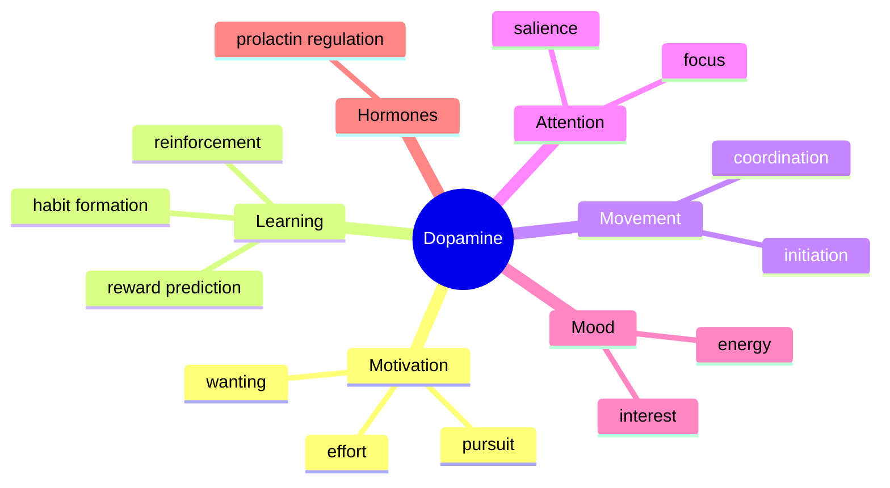

The dopamine system asks questions like:

```text
What matters?
What should I approach?
What should I repeat?
Is the reward better or worse than expected?
Is this worth effort?
Should I move, wait, search, or stop?
```

---

## 3. Why dopamine evolved

The brain did not evolve to make you happy all day.

It evolved to help organisms survive, learn, move, find food, avoid danger, connect socially, reproduce, and adapt.

Motivation is expensive.

Effort costs energy.

So the brain needs a system for deciding:

```text
Is this worth doing?
```

Dopamine helps with that calculation.

Imagine an animal in the wild.

It must decide:

```text
Should I explore?
Should I chase food?
Should I save energy?
Should I approach this cue?
Should I avoid this cue?
Should I repeat the behavior that worked yesterday?
```

Dopamine helps connect cues, actions, outcomes, and future effort.

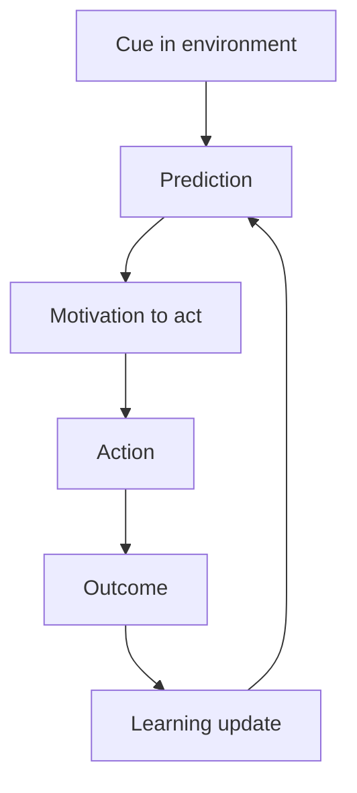

Dopamine is not only about getting the reward.

It is about learning what predicts reward, what predicts danger, and what action is worth taking.

---

## 4. The four major dopamine pathways

Dopamine does not live in one place.

There are multiple dopamine pathways.

The four commonly discussed major pathways are:

| Pathway | Main route | Simplified role |
|---|---|---|
| Mesolimbic | VTA → nucleus accumbens / ventral striatum | reward, wanting, incentive salience, reinforcement |
| Mesocortical | VTA → prefrontal cortex | cognition, motivation, executive control |
| Nigrostriatal | substantia nigra → dorsal striatum | movement, habit, action selection |
| Tuberoinfundibular | hypothalamus → pituitary | hormone regulation, especially prolactin |

Reviews of dopamine function describe these pathways as supporting reward, motivation, movement, cognition, and neuroendocrine control.[^2]

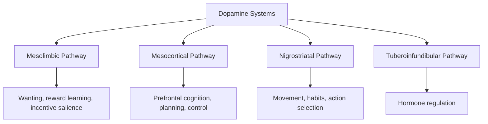

For motivation, the mesolimbic and mesocortical systems are especially important.

But do not reduce everything to the “reward pathway.”

Dopamine systems interact with movement, attention, habit, memory, emotion, and executive control.

That is why motivation feels like a whole-body mental state, not just one chemical rush.

---

## 5. The reward system is not one system

The word “reward” sounds simple.

But reward has multiple parts.

A reward can involve:

| Component | Meaning | Example |
|---|---|---|
| Liking | pleasure or enjoyment | enjoying the taste of food |
| Wanting | desire or pull toward it | craving the food before eating |
| Learning | remembering what predicted it | seeing the restaurant sign and wanting to go in |

Kent Berridge and colleagues have strongly emphasized the distinction between **liking** and **wanting**. Their work argues that wanting and liking can be separated in the brain, and that dopamine is more strongly tied to wanting and incentive motivation than to pleasure itself.[^3]

This is one of the most important ideas in this article.

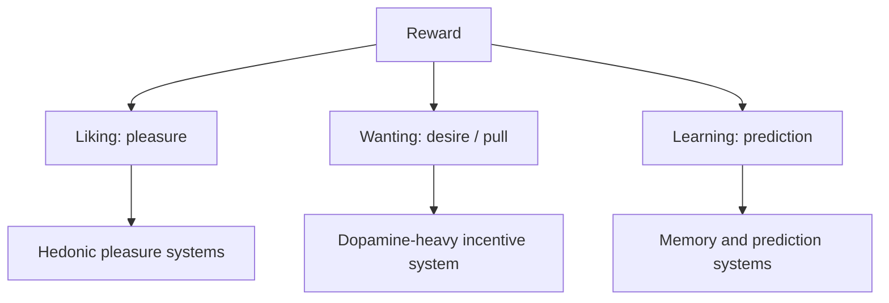

This explains why you can:

```text
want something you do not enjoy anymore.
```

Examples:

- scrolling even when bored,
- checking updates even when it hurts,
- eating junk food without real pleasure,
- chasing someone who makes you anxious,
- refreshing notifications even when nothing good happens,
- continuing a game long after it stopped being fun.

That is not pure pleasure.

That is wanting.

And wanting can become stronger than liking.

---

## 6. Wanting vs liking in real life

Let us make this concrete.

### Example: social media

Before opening the app:

```text
Maybe something interesting happened.
Maybe someone liked my post.
Maybe there is an update.
```

That is wanting.

After 40 minutes of scrolling:

```text
I do not even feel good.
Why am I still here?
```

Liking is low.

Wanting is still active.

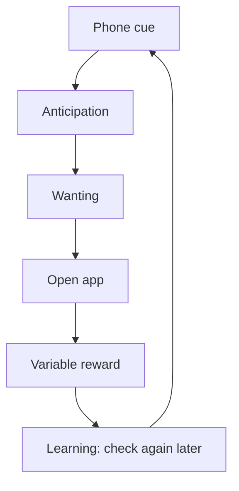

### Example: uncertainty checking

You may not enjoy checking whether an update arrived.

But uncertainty creates wanting.

```text
Maybe there is an update.
Maybe the outcome changed.
Maybe the uncertainty will end.
Maybe I will finally feel relief.
```

The reward is not pleasure.

The reward is relief from uncertainty.

### Example: procrastination

You do not love procrastinating.

But avoiding a hard task gives relief.

```text
Hard task → discomfort → video app → relief
```

The brain learns:

```text
The video app removes discomfort.
```

That relief becomes reinforcing.

---

## 7. Dopamine and reward prediction error

Now we go deeper.

One of the most important dopamine theories is **reward prediction error**.

Reward prediction error means:

```text
actual reward - expected reward
```

If something is better than expected, the brain updates upward.

If something is worse than expected, the brain updates downward.

If something is exactly as expected, there is little new information.

Dopamine neurons have been shown to signal reward prediction errors: differences between received and predicted rewards.[^4]

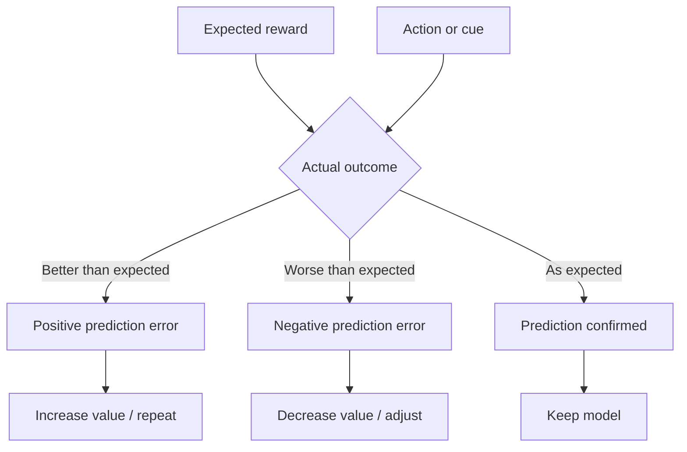

This is not just theory.

It explains why novelty is motivating.

It explains why progress feels good.

It explains why unpredictable rewards are powerful.

It explains why repeated rewards become boring.

It explains why disappointment hurts motivation.

---

## 8. Why anticipation can feel stronger than reward

Dopamine often rises with cues that predict reward.

That means the brain can become activated before the reward arrives.

Example:

```text
You order food.
The anticipation feels amazing.
The food arrives.
It is good, but not as magical as expected.
```

Or:

```text
You imagine buying a new phone.
The fantasy feels exciting.
After buying it, excitement fades quickly.
```

The brain is not only responding to the object.

It is responding to prediction.

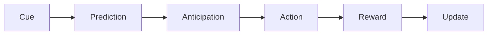

This is why the chase can feel better than the achievement.

The wanting system loves pursuit.

The liking system may be brief.

---

## 9. Why novelty is so motivating

Novelty means the outcome is not fully predicted.

The brain pays attention to uncertainty because uncertainty may contain reward, danger, or information.

This is why new things feel motivating:

- new opportunity,
- new app,
- new goal,
- new productivity system,
- new course,
- new book,
- new city,
- new plan.

At first:

```text
This could change everything.
```

Then the novelty fades.

Now the brain says:

```text
I know what this is.
Where is the next new thing?
```

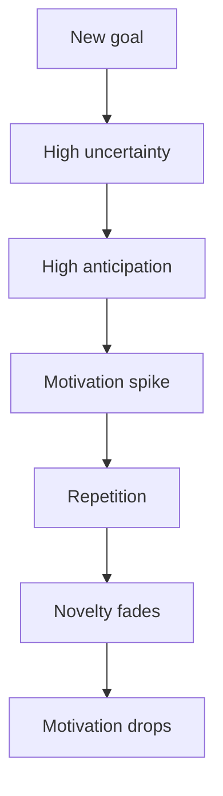

This is why relying on motivation is unstable.

Motivation spikes when the brain predicts new reward.

Discipline is what carries you when novelty disappears.

---

## 10. Motivation is not one feeling

People say:

```text
I am not motivated.
```

But that can mean many different things.

| Problem | What it feels like | Possible mechanism |
|---|---|---|
| No energy | tired, heavy | sleep, stress, health, depression, overwork |
| No clarity | confused | weak goal representation |
| No reward | boring | low perceived value |
| Too much fear | anxious | threat system blocking action |
| Too big task | overwhelmed | high effort cost |
| Too delayed reward | “why bother?” | temporal discounting |
| Too many cheap rewards | distracted | competing reward cues |
| No progress feedback | hopeless | weak reward prediction updates |
| No identity link | meaningless | low personal relevance |

Motivation is not simply:

```text
high dopamine = motivated
low dopamine = lazy
```

A better model:

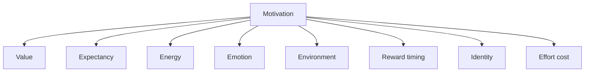

To fix motivation, you must diagnose which part is broken.

---

## 11. The motivation equation

A practical formula:

```text
Motivation = value × expectancy × energy ÷ friction
```

Where:

- **value** = how much the goal matters,
- **expectancy** = how much you believe action will work,
- **energy** = physical and mental readiness,
- **friction** = difficulty, confusion, stress, resistance, environment.

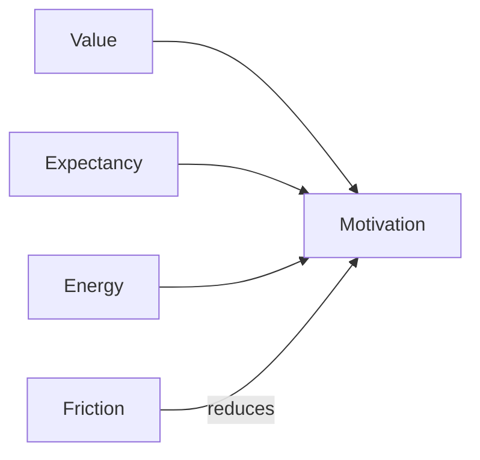

If motivation is low, ask:

```text
Is the value unclear?
Do I not believe effort will work?
Am I exhausted?
Is there too much friction?
```

Different problems need different solutions.

---

## 12. Dopamine and effort

Dopamine is strongly involved in effort-based decision-making.

It helps determine whether a reward is worth the work.

Research by John Salamone and others has emphasized that dopamine is not simply about pleasure, but about activating effortful behavior, especially when organisms must work to obtain outcomes.[^5]

Simple example:

```text
Reward: meaningful progress
Effort: study, projects, applications, setbacks, time
Decision: is it worth it?
```

Dopamine helps energize pursuit when the reward is represented as valuable and reachable.

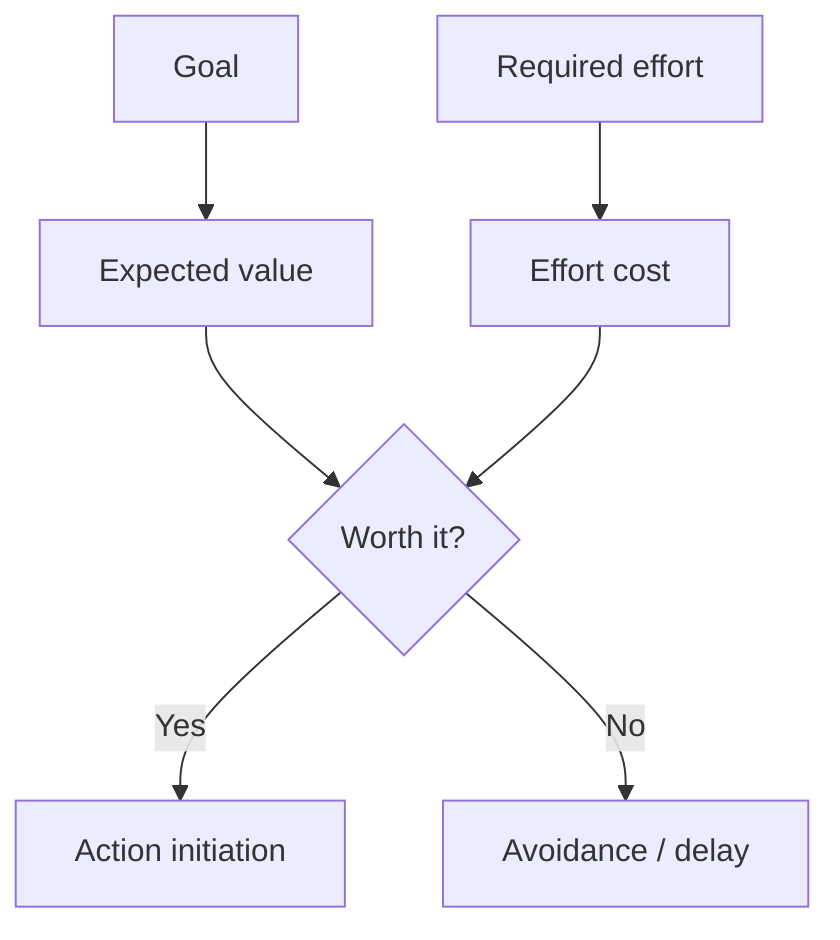

This is why progress matters.

If your brain sees no progress, effort feels expensive.

If your brain sees evidence, effort feels more worth it.

---

## 13. The “effort wall”

Many people think they lack motivation.

Actually, they are hitting an effort wall.

```text
The goal is valuable.
But the first step feels too costly.
```

Examples:

```text
Open laptop → decide what to do → find notes → remember where you stopped → face confusion
```

That is high friction.

The brain avoids it.

To reduce the effort wall, you pre-design the next action.

Bad:

```text
Tomorrow I will study.
```

Better:

```text
Tomorrow at 9:00, I will open the presentation practice file, answer prompt #3, record for 2 minutes, and mark 3 mistakes.
```

Bad:

```text
I will code tomorrow.
```

Better:

```text
Tomorrow I will implement user authentication middleware in the project for 45 minutes.
```

The clearer the first step, the lower the friction.

---

## 14. Motivation loves visible progress

Dopamine systems are sensitive to learning and prediction.

Visible progress gives the brain evidence that effort works.

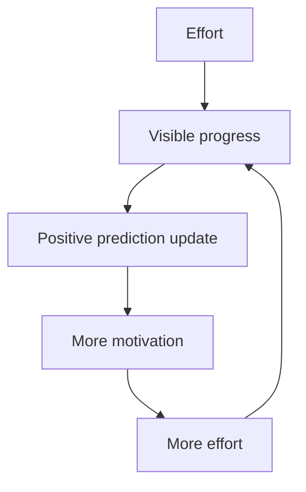

This is why progress bars work.

This is why streaks work.

This is why checklists work.

This is why games are addictive.

They show progress quickly.

Real life often does not.

So you must create progress signals.

Examples:

```text
Pages written
Problems solved
Minutes practiced
Applications sent
Workouts completed
Days no contact
Money saved
Speaking recordings made
Project commits
```

Do not wait for big success.

Track small proof.

---

## 15. Dopamine and the prefrontal cortex

The prefrontal cortex helps hold goals in mind.

It says:

```text
This matters even though the reward is not immediate.
```

The dopamine system helps energize pursuit.

Together:

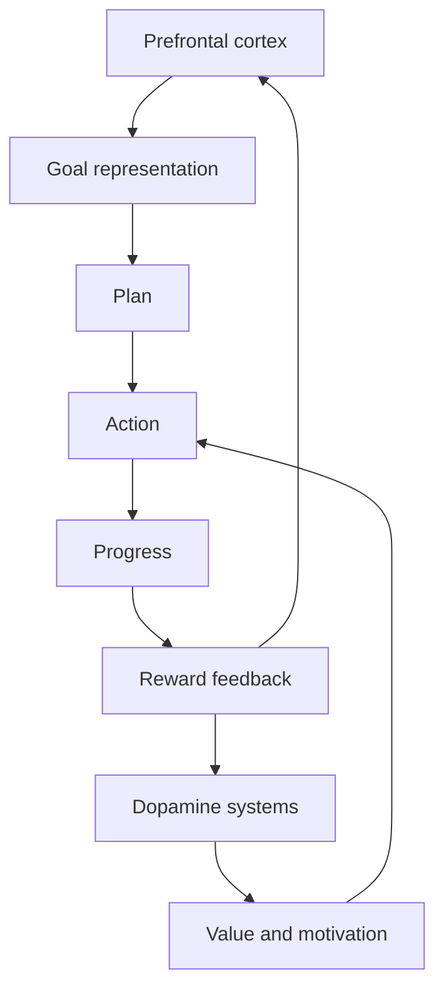

When PFC control is weak, immediate rewards dominate.

When goal representation is strong, delayed rewards become more motivating.

This is why writing goals down helps.

Not because paper is magic.

Because it externalizes the goal so the PFC does not have to hold everything internally.

---

## 16. Dopamine and habits

A habit is a learned cue-action-reward loop.

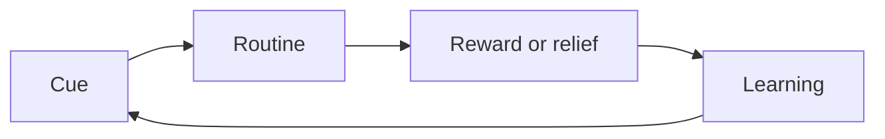

Dopamine is involved in learning which cues predict reward and which actions produce outcomes.

At first, reward may come after the behavior.

Later, the cue itself becomes motivating.

Example:

```text
Notification sound → anticipation → check the device
```

The sound becomes a trigger.

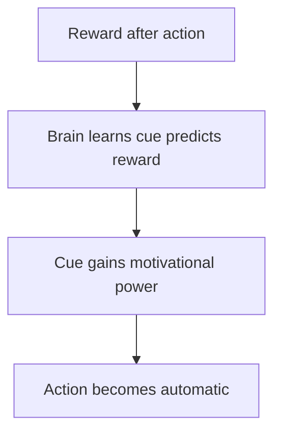

This is how habits become automatic.

The brain does not wait for pleasure.

The cue starts the wanting.

---

## 17. Variable rewards: why apps are sticky

A predictable reward becomes boring.

An unpredictable reward creates repeated checking.

Social media, games, and messaging apps often use variable reward dynamics:

```text
Maybe there is an update.
Maybe there is a like.
Maybe there is something funny.
Maybe there is nothing.
Maybe the next swipe is better.
```

The uncertainty itself becomes motivating.

Recent reviews on social media addiction discuss variable reward systems and reward-based engagement as part of why social platforms can become compulsive for some users.[^6]

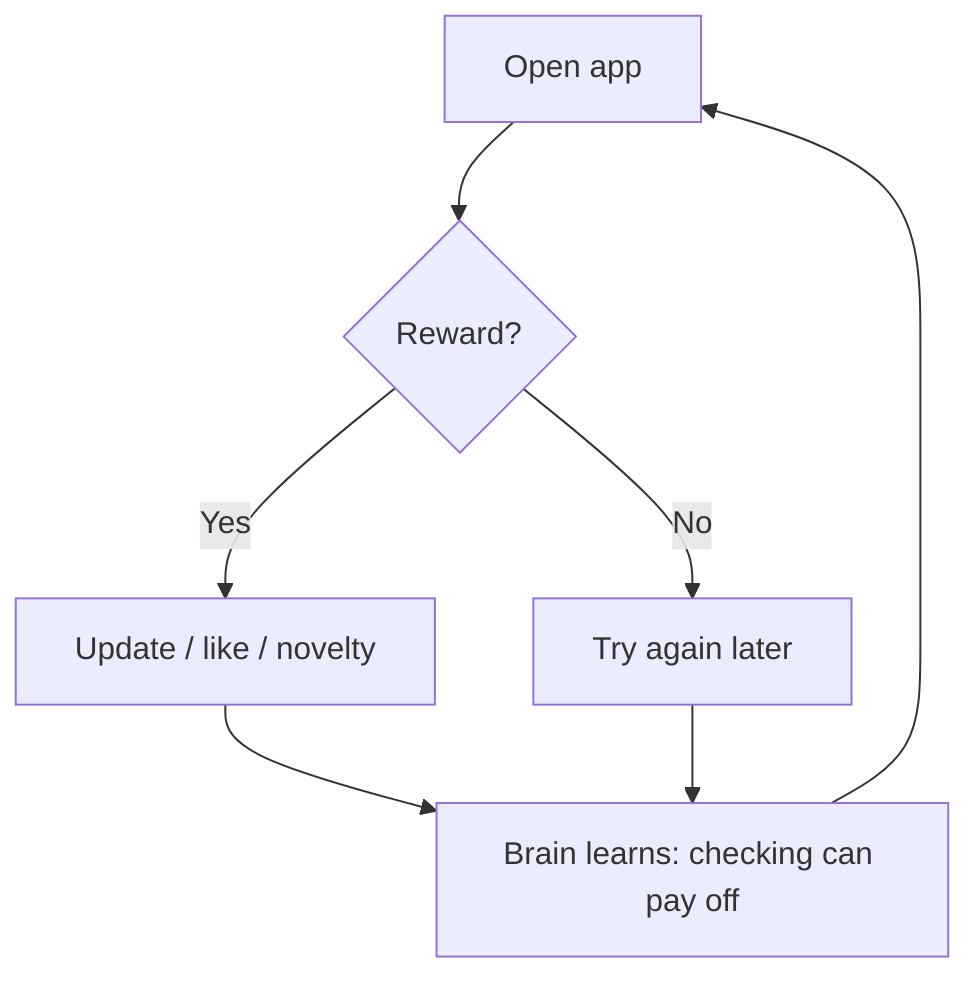

The most addictive loop is not:

```text
reward every time
```

It is:

```text
reward sometimes
```

Because “maybe” keeps the seeking system alive.

---

## 18. Dopamine and procrastination

Procrastination is not always laziness.

Often, it is emotion regulation.

A hard task creates discomfort.

The brain searches for relief.

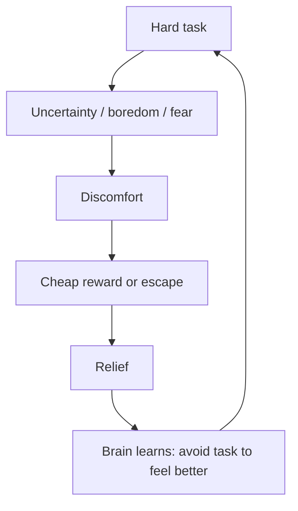

The reward is relief.

That is why procrastination can feel good even while ruining your life.

It solves the short-term emotional problem.

It worsens the long-term life problem.

The practical solution is not only discipline.

It is to reduce the task’s emotional threat and create fast progress feedback.

---

## 19. The anti-procrastination dopamine design

To beat procrastination, design the first 10 minutes.

```text
Do not ask: How do I finish this whole thing?
Ask: How do I make the first 10 minutes obvious and winnable?
```

Protocol:

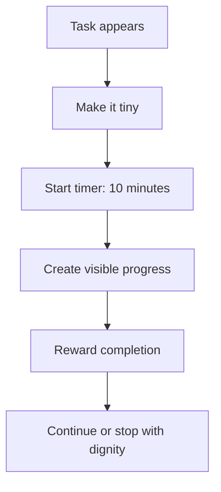

Examples:

| Big task | First 10-minute version |
|---|---|
| Write blog | write ugly outline only |
| Study speaking practice | record one answer only |
| Code project | open repo and fix one small bug |
| Apply to university | collect one requirement link |
| Clean room | clear desk only |
| Exercise | put on shoes and walk 10 minutes |

The goal is not to feel motivated first.

The goal is to create a tiny reward prediction:

```text
When I start, progress happens.
```

---

## 20. Dopamine and addiction

Addiction is not simply “too much pleasure.”

It involves learning, cues, craving, stress, habit, reward, memory, and self-control systems.

The incentive-sensitization theory of addiction argues that addictive processes can sensitize wanting systems, making cues trigger intense desire even when liking decreases.[^3]

In simple words:

```text
You may want it more than you like it.
```

Addiction loop:

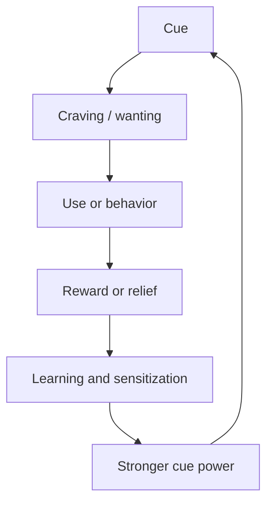

Examples are not limited to substances.

Some behavioral loops can also become compulsive:

- variable-reward games,
- gaming,
- highly stimulating content,
- social media,
- shopping,
- emotional drama,
- checking updates,
- binge eating.

Important: serious addiction deserves professional help. Neurobiology explains the loop; it does not mean people should handle severe addiction alone.

---

## 21. Why “wanting” can become dangerous

Wanting is useful.

Without wanting, you would not seek food, friendship, learning, achievement, connection, or growth.

But wanting becomes dangerous when:

```text
wanting disconnects from liking,
wanting disconnects from values,
wanting disconnects from long-term cost,
wanting is triggered by cues you did not choose.
```

Examples:

```text
I want to check, but it hurts me.
I want to scroll, but I do not enjoy it.
I want to check again, but it keeps the loop alive.
I want junk food, but my body feels worse.
I want novelty, but it destroys deep work.
```

Practical question:

```text
Do I actually like this, or am I only wanting it?
```

That one question can break many loops.

---

## 22. Dopamine detox: what is true and what is false

The phrase “dopamine detox” is popular.

But it is often scientifically wrong.

You cannot literally fast from dopamine.

Your brain produces dopamine all the time because dopamine is needed for movement, cognition, hormone regulation, motivation, and learning.

Harvard Health has criticized the phrase “dopamine fasting” as misleading, explaining that the practice has little to do with literally fasting from dopamine.[^7]

Medical News Today similarly notes that a true dopamine detox is impossible because the brain continues producing dopamine, though reducing compulsive behaviors may be useful.[^8]

So what is useful?

Not this:

```text
I will reset dopamine by avoiding all pleasure.
```

Better:

```text
I will reduce compulsive high-stimulation cues so normal effort can become rewarding again.
```

The useful version is not dopamine detox.

It is **reward environment redesign**.

---

## 23. Reward environment redesign

Your motivation depends partly on the reward options around you.

If your environment offers cheap rewards all day, hard rewards feel less attractive.

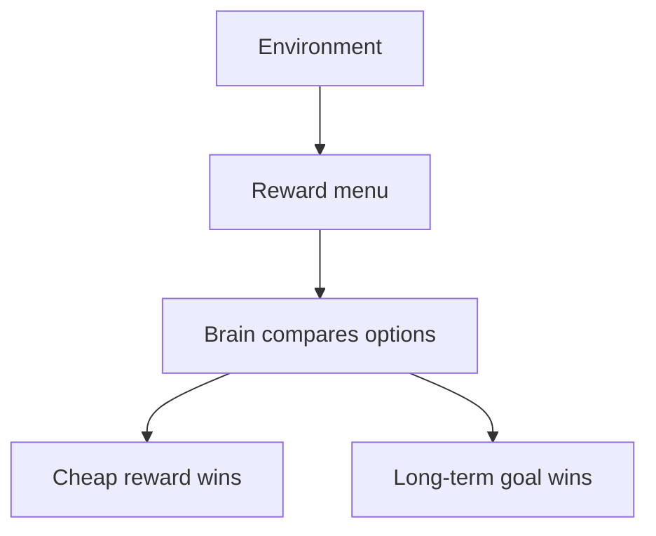

Cheap rewards:

```text
scrolling
short videos
junk food
notifications
highly stimulating content
random browsing
online drama
instant shopping
```

Deep rewards:

```text
skill mastery
fitness
writing
skill growth
social connection
creative work
spiritual life
long-term health
```

Cheap rewards are not evil.

But if they are constantly available, they train the brain to expect fast stimulation.

Then deep work feels boring.

The solution is to change availability.

```text
Do not rely on willpower against infinite reward machines.
Change the room.
```

---

## 24. The dopamine economy of your day

Every day has a reward economy.

Ask:

```text
What does my brain get rewarded for today?
```

If the rewards are:

```text
checking updates, scrolling, avoiding, snacking, complaining, fantasizing
```

your brain will repeat those.

If the rewards are:

```text
finishing, moving, practicing, building, connecting, sleeping well
```

your brain will slowly value those more.

```mermaid
flowchart TD
    A[Daily rewards] --> B[Repeated behavior]
    B --> C[Brain value system]
    C --> D[Future motivation]
    D --> A
```

You do not become disciplined by hating pleasure.

You become disciplined by making useful behavior rewarding enough to repeat.

---

## 25. Dopamine and delayed rewards

Humans struggle with delayed rewards.

A reward today often feels more powerful than a bigger reward later.

```text
Now: video app, comfort, food, scrolling
Later: degree, body, career, skill, freedom
```

The brain discounts the future.

To make delayed rewards motivating, bring them closer.

How?

### 1. Break them into milestones

```text
Long-term goal → shortlist options → practice → materials → project → applications
```

### 2. Make progress visible

```text
calendar streak, commits, recordings, checklist, score tracker
```

### 3. Add immediate reward to the right behavior

```text
after deep work: walk, coffee, music, rest, checkmark, social time
```

### 4. Connect action to identity

```text
I am becoming the kind of person who keeps promises.
```

```mermaid
flowchart TD
    A[Distant goal] --> B[Break into near milestones]
    B --> C[Visible progress]
    C --> D[Immediate reward]
    D --> E[Motivation maintained]
```

The future must become emotionally present.

---

## 26. Dopamine and identity

Dopamine does not only respond to external rewards.

It also responds to meaning, progress, and self-relevant goals.

A behavior becomes easier when it matches identity.

```text
I am not forcing myself to study.
I am becoming a person who can perform under pressure.
```

```text
I am not forcing myself to work out.
I am becoming someone who respects my body.
```

```text
I am not forcing myself to code.
I am becoming an engineer who builds real systems.
```

Identity gives the brain a reason to value the action.

```mermaid
flowchart TD
    A[Action] --> B[Evidence]
    B --> C[Identity]
    C --> D[Higher value for similar action]
    D --> E[More action]
    E --> B
```

The brain believes repeated evidence.

So build evidence.

---

## 27. Intrinsic vs extrinsic motivation

Motivation can come from outside or inside.

| Type | Meaning | Example |
|---|---|---|
| Extrinsic motivation | doing it for external reward or pressure | grades, money, praise, status |
| Intrinsic motivation | doing it because it is interesting or meaningful | curiosity, mastery, enjoyment |

Self-determination theory argues that motivation and well-being are supported by three basic psychological needs:

- autonomy,
- competence,
- relatedness.[^9]

```mermaid
flowchart TD
    A[Intrinsic motivation] --> B[Autonomy]
    A --> C[Competence]
    A --> D[Relatedness]

    B --> E[I choose this]
    C --> F[I am getting better]
    D --> G[This connects me to people / purpose]
```

This matters because external rewards can help start behavior, but long-term motivation usually needs meaning and competence.

A reward can start the engine.

Identity and mastery keep it running.

---

## 28. When rewards backfire

External rewards can be useful.

But they can also backfire if they make an already meaningful activity feel controlled or transactional.

Example:

```text
A child loves drawing.
Adults constantly reward drawing only for prizes.
The child starts drawing for approval, not joy.
```

The activity changes meaning.

This does not mean rewards are bad.

It means rewards must be designed carefully.

Good rewards:

```text
support competence
acknowledge effort
celebrate progress
increase autonomy
```

Risky rewards:

```text
control behavior
replace meaning
create dependency
reward only outcome
make failure feel worthless
```

Practical rule:

> Use rewards as bridges, not chains.

---

## 29. Dopamine and depression/anhedonia

When motivation is very low, it may not be a productivity issue.

It may be a mental health issue.

Depression can involve **anhedonia**, reduced ability to experience pleasure or interest.

Reward motivation and responsiveness can be disrupted in depression and related conditions. Behavioral activation therapy is one approach that increases engagement with meaningful and rewarding activities; reviews describe it as a common mechanism of change across disorders and a structured way to reverse avoidance patterns.[^10]

A simplified depression-avoidance loop:

```mermaid
flowchart TD
    A[Low mood] --> B[Low energy]
    B --> C[Avoid activity]
    C --> D[Fewer rewards]
    D --> E[Lower mood]
    E --> A
```

Behavioral activation reverses the loop:

```mermaid
flowchart TD
    A[Small planned activity] --> B[Completion]
    B --> C[Possible reward or mastery]
    C --> D[More energy / evidence]
    D --> E[More activity]
    E --> C
```

Important: if someone has persistent low mood, loss of interest, hopelessness, or thoughts of self-harm, they should seek professional support. This article is education, not diagnosis or treatment.

---

## 30. ADHD, dopamine, and motivation

ADHD is often described casually as a dopamine problem.

That is oversimplified.

But dopamine reward pathways are relevant.

Brain imaging work has reported disrupted dopamine neurotransmission in ADHD and has linked dopamine reward pathway differences with inattention and motivation deficits in adults with ADHD.[^11]

A practical way to understand ADHD-like motivation difficulties:

```text
The problem is not always knowing what matters.
The problem is activating effort reliably when reward is delayed, boring, abstract, or unstructured.
```

Useful supports:

- external structure,
- body doubling,
- timers,
- immediate feedback,
- clear next action,
- novelty used strategically,
- smaller deadlines,
- visible progress,
- professional assessment when needed.

```mermaid
flowchart TD
    A[Delayed abstract goal] --> B[Weak activation]
    B --> C[Delay / distraction]

    D[Immediate structure + feedback] --> E[Stronger activation]
    E --> F[Action]
```

Again: this is not self-diagnosis.

But the principle helps everyone.

Make delayed goals more immediate and structured.

---

## 31. Dopamine, stress, and motivation collapse

Stress changes motivation.

Mild stress can energize.

High stress can shut down long-term motivation and push the brain toward immediate relief.

```mermaid
flowchart TD
    A[Stress] --> B{Level}
    B -->|Manageable| C[Focus and action]
    B -->|Overwhelming| D[Threat mode]
    D --> E[Relief seeking]
    D --> F[Avoidance]
    D --> G[Impulsive behavior]
```

This is why under stress people often do the opposite of their goals.

They do not need more shame.

They need state regulation and smaller actions.

Practical sequence:

```text
regulate body → reduce task size → create one win → continue
```

Not:

```text
panic → self-hate → huge plan → fail → more panic
```

---

## 32. The motivation ladder

When motivation is low, do not jump straight to the hardest task.

Use a ladder.

```mermaid
flowchart TD
    A[Level 1: show up] --> B[Level 2: start tiny]
    B --> C[Level 3: complete one unit]
    C --> D[Level 4: repeat tomorrow]
    D --> E[Level 5: increase difficulty]
    E --> F[Level 6: build identity]
```

Example: fitness

```text
Level 1: wear shoes
Level 2: walk 5 minutes
Level 3: walk 20 minutes
Level 4: repeat 5 days
Level 5: add strength training
Level 6: become someone who trains
```

Example: coding

```text
Level 1: open laptop
Level 2: open repo
Level 3: fix one function
Level 4: push commit
Level 5: build feature
Level 6: become a builder
```

Motivation often appears after level 2, not before level 1.

---

## 33. The “motivation before action” trap

Most people think:

```text
motivation → action → progress
```

But often the real order is:

```text
small action → progress → motivation
```

```mermaid
flowchart LR
    A[Small action] --> B[Progress signal]
    B --> C[Reward prediction update]
    C --> D[Motivation]
    D --> E[More action]
```

This is one of the most practical lessons in the entire article:

> Do not wait for motivation. Create conditions where motivation can appear.

Starting is not the result of motivation.

Starting is often the cause of motivation.

---

## 34. How to make hard work rewarding

Hard work becomes more motivating when the brain receives the right signals.

### 1. Make the goal specific

Bad:

```text
Study more.
```

Good:

```text
Record one speaking practice answer and improve it once.
```

### 2. Make progress visible

```text
Track repetitions, not only outcomes.
```

### 3. Add immediate completion reward

```text
Checkmark, short walk, tea, music, rest.
```

### 4. Connect to identity

```text
This is evidence that I keep promises.
```

### 5. Reduce cheap competing rewards

```text
Device outside room.
```

```mermaid
flowchart TD
    A[Hard work] --> B[Specific target]
    B --> C[Visible progress]
    C --> D[Small reward]
    D --> E[Identity evidence]
    E --> F[Higher future motivation]
```

---

## 35. Dopamine anchoring: useful but be careful

A popular idea is to pair an enjoyable stimulus with a difficult task.

Example:

```text
Only listen to a favorite playlist while cleaning.
Only drink special coffee while writing.
Only use a pleasant candle while studying.
```

This can work as a bridge because the brain starts associating the task with reward.

But there are risks:

- relying too much on external rewards,
- using unhealthy rewards,
- making the task impossible without the reward,
- choosing rewards that distract from the work.

Good anchors:

```text
music without lyrics
tea or coffee
pleasant workspace
timer ritual
walking after work
checkmark streak
```

Bad anchors:

```text
short-form feeds between every paragraph
junk food for every task
video app while trying to do deep work
```

Rule:

> Use dopamine anchoring as a starter motor, not the whole engine.

---

## 36. The reward menu method

Design your reward menu before cravings hit.

Divide rewards into three categories.

### Cheap rewards

Fast, easy, often low long-term value.

```text
scrolling, junk food, gossip, random videos
```

### Healthy quick rewards

Fast but not destructive.

```text
walk, shower, tea, music, sunlight, stretching, short call
```

### Deep rewards

Harder but more fulfilling.

```text
skill, fitness, skill progress, writing, mastery
```

```mermaid
flowchart TD
    A[Reward menu] --> B[Cheap rewards]
    A --> C[Healthy quick rewards]
    A --> D[Deep rewards]
```

When stressed, your brain will choose what is available.

So make healthy quick rewards easy.

Make cheap rewards harder.

Make deep rewards visible.

---

## 37. The 10 dopamine laws for real life

### Law 1: Wanting is not the same as liking

Before acting, ask:

```text
Do I actually enjoy this, or am I being pulled by wanting?
```

### Law 2: Cues create cravings

Change cues, not only willpower.

### Law 3: Variable rewards are powerful

Apps, notifications, updates, and variable-reward loops are sticky because of uncertainty.

### Law 4: Progress is fuel

Track visible progress.

### Law 5: Motivation follows action

Start tiny.

### Law 6: Cheap rewards compete with deep rewards

Protect your attention environment.

### Law 7: Delayed rewards need immediate markers

Use milestones, streaks, and identity proof.

### Law 8: Stress makes relief more attractive

Regulate before demanding discipline.

### Law 9: Identity changes reward value

A behavior becomes easier when it becomes “who I am.”

### Law 10: Dopamine is not a moral system

Your brain can want what harms you.

You need design, not shame.

---

## 38. Practical protocol: the 30-day motivation rebuild

Use this if you feel low drive, stuck, distracted, or inconsistent.

Pick one domain only.

Examples:

```text
speaking practice
fitness
coding
writing
application tasks
university applications
sleep
emotional recovery
```

### Week 1: Clean the reward environment

Remove or reduce one major cheap reward cue.

Examples:

```text
device outside room during work
no short videos before noon
block distracting sites
remove junk food from desk
no checking updates during study blocks
```

Add one healthy quick reward.

```text
walk after work block
tea during reading
music after workout
```

### Week 2: Build tiny progress loops

Every day, create one visible proof.

```text
one recording
one commit
one page
one workout
one application step
one solved problem
```

Track it.

### Week 3: Add difficulty slowly

Increase challenge by 10–20%.

```text
25 min → 35 min
one problem → two problems
one paragraph → one section
walking → strength training
```

Do not suddenly go extreme.

### Week 4: Attach identity

Write daily:

```text
Today I proved that I am someone who ______.
```

Example:

```text
Today I proved that I am someone who studies even when mood is low.
```

At the end of 30 days, review:

```text
What became easier?
What cues still beat me?
What rewards helped?
What identity evidence did I build?
```

---

## 39. Practical protocol: dopamine-aware deep work

Use this before studying, coding, writing, or doing focused work.

```mermaid
flowchart TD
    A[Before work] --> B[Remove cheap rewards]
    B --> C[Define one target]
    C --> D[Set short timer]
    D --> E[Work]
    E --> F[Mark progress]
    F --> G[Small healthy reward]
    G --> H[Repeat]
```

### Step 1: Remove cheap rewards

```text
Device outside room.
Only required tabs open.
No music with distracting lyrics if doing language-heavy work.
```

### Step 2: Define target

```text
One clear output.
```

Bad:

```text
Study AI.
```

Good:

```text
Implement vector search evaluation for 45 minutes.
```

### Step 3: Timer

```text
25–50 minutes.
```

### Step 4: Mark progress

```text
Write what you completed.
```

### Step 5: Reward

```text
Walk, stretch, tea, checkmark, connect with someone after the block.
```

Reward completion, not perfection.

---

## 40. Practical protocol: reducing compulsive phone use

Old loop:

```mermaid
flowchart TD
    A[Boredom / stress] --> B[Phone cue]
    B --> C[Open app]
    C --> D[Variable reward]
    D --> E[Relief / novelty]
    E --> F[Loop stronger]
    F --> A
```

New loop:

```mermaid
flowchart TD
    A[Boredom / stress] --> B[Notice urge]
    B --> C[Phone physically away]
    C --> D[Healthy quick reward]
    D --> E[Return to task]
    E --> F[New loop stronger]
```

Rules:

```text
1. Device outside room during deep work.
2. Disable non-human notifications.
3. No device for first 30 minutes after waking.
4. Replace urge with movement.
5. Check the device at scheduled times.
```

Do not fight a cue while holding the cue.

That is like trying to quit sugar while keeping cake in your hand.

---

## 41. Practical protocol: motivation when life feels heavy

Some days you will not feel inspired.

Do the minimum viable action.

```text
Minimum viable action = the smallest action that preserves identity.
```

Examples:

| Domain | Minimum viable action |
|---|---|
| Fitness | 10 pushups or 10-minute walk |
| speaking practice | one 2-minute recording |
| Coding | one commit or one solved bug |
| Writing | 100 ugly words |
| Application task | one application step |
| Emotional regulation | one urge resisted |
| Sleep | device outside bed |

```mermaid
flowchart TD
    A[Low motivation] --> B[Minimum viable action]
    B --> C[Identity preserved]
    C --> D[No shame spiral]
    D --> E[Return tomorrow]
```

The goal is not heroic performance every day.

The goal is to not break the identity chain.

---

## 42. Dopamine and learning

Dopamine helps learning by marking important outcomes.

When your brain sees that effort leads to improvement, learning becomes more motivating.

```mermaid
flowchart TD
    A[Attempt] --> B[Feedback]
    B --> C[Prediction error]
    C --> D[Learning update]
    D --> E[Improved performance]
    E --> F[Motivation]
    F --> A
```

This means learning systems should include feedback.

Bad learning:

```text
read passively for hours
```

Better learning:

```text
attempt → get feedback → correct → repeat
```

Examples:

```text
speaking practice: record, listen, correct, repeat.
Coding: solve, test, debug, explain.
Writing: draft, edit, publish, receive response.
Fitness: perform, track, increase load.
```

No feedback means weak reward prediction updates.

The brain needs to know whether effort is working.

---

## 43. Dopamine and social motivation

Humans are social animals.

Social rewards are powerful:

- approval,
- belonging,
- respect,
- attraction,
- status,
- recognition,
- being chosen,
- being missed,
- being understood.

This is why social media is powerful.

It turns social reward into a variable reward machine.

```text
Maybe someone liked it.
Maybe someone replied.
Maybe someone noticed me.
```

Social motivation is not shallow.

Belonging mattered for survival.

But modern platforms can overuse ancient systems.

Practical rule:

> Get social reward from real connection and meaningful contribution, not only from metrics.

Better rewards:

```text
deep conversation
helping someone
publishing useful work
training with friends
building community
```

We do not need less social reward.

We need better social reward.

---

## 44. Dopamine and uncertainty loops

Uncertainty can strongly activate wanting, anticipation, and checking systems.

This is why uncertain outcomes can feel strangely energizing.

It is also why unclear feedback can become sticky.

Clear information is calming.

Unclear information creates uncertainty.

Uncertainty can create checking.

```mermaid
flowchart TD
    A[Unclear cue] --> B[Maybe the outcome changed]
    B --> C[Anticipation]
    C --> D[Checking / refreshing / replaying]
    D --> E[Small reward or no reward]
    E --> F[Uncertainty continues]
    F --> A
```

If a system gives inconsistent feedback, the brain may become more hooked, not less.

Not because the loop is healthy.

Because intermittent reward is powerful.

Practical question:

```text
Is this useful motivation, or uncertainty-driven wanting?
```

A stable goal should not require constant dopamine panic.

---

## 45. Dopamine and goal fantasy

Fantasizing about success can feel rewarding.

This is useful in small amounts because it creates direction.

But it can become a substitute reward.

```mermaid
flowchart TD
    A[Imagine future success] --> B[Feel reward]
    B --> C[No action]
    C --> D[Need another fantasy]
    D --> A
```

Examples:

```text
imagining your future body instead of training
imagining US university life instead of preparing application
imagining startup success instead of building product
imagining revenge glow-up instead of doing the work
```

Use fantasy as a map, not as a meal.

Protocol:

```text
Visualize outcome for 2 minutes.
Then immediately do one action that makes it real.
```

Fantasy without action trains craving.

Fantasy plus action trains pursuit.

---

## 46. The dopamine trap of planning

Planning feels productive because it gives mental reward.

But planning can become avoidance.

Old loop:

```mermaid
flowchart TD
    A[Uncertainty] --> B[Make big plan]
    B --> C[Temporary control feeling]
    C --> D[No execution]
    D --> E[Uncertainty returns]
    E --> A
```

Better loop:

```mermaid
flowchart TD
    A[Uncertainty] --> B[Plan next step only]
    B --> C[Execute]
    C --> D[Feedback]
    D --> E[Update plan]
    E --> C
```

Rule:

> Planning should end in a calendar block or a concrete output.

If your plan does not change your next action, it is probably rumination in formal clothes.

---

## 47. The dopamine trap of self-improvement content

Learning about productivity can feel productive.

But the brain can become addicted to the feeling of “about to change.”

```text
New video → new insight → motivation spike → no implementation → next video
```

```mermaid
flowchart TD
    A[Self-improvement content] --> B[Insight reward]
    B --> C[Temporary identity boost]
    C --> D[No behavior change]
    D --> E[Need another insight]
    E --> A
```

Rule:

> For every one hour of self-improvement content, produce one hour of self-improvement behavior.

Better:

```text
Read one idea.
Apply it today.
Track result.
```

The brain changes from implementation.

Not endless insight.

---

## 48. A dopamine-aware day design

Here is a daily structure designed around motivation science.

### Morning: protect the first reward

Do not give your brain cheap rewards immediately.

Bad:

```text
wake → device → scroll → compare → anxiety → low motivation
```

Better:

```text
wake → water → light → movement → first work block
```

The first reward of the day trains the brain’s direction.

### Work block: make progress visible

```text
one clear task
device away
timer
checkmark
```

### Break: healthy reward

```text
walk, stretch, tea, sunlight, music
```

### Evening: reduce stimulation

```text
no infinite scroll in bed
plan tomorrow's first action
sleep
```

```mermaid
flowchart TD
    A[Morning] --> B[Low cheap stimulation]
    B --> C[First meaningful action]
    C --> D[Progress reward]
    D --> E[Healthy breaks]
    E --> F[Evening shutdown]
    F --> G[Sleep]
    G --> A
```

---

## 49. The motivation repair checklist

When you feel unmotivated, diagnose before judging.

### 1. Energy

```text
Did I sleep enough?
Have I eaten?
Have I moved?
Am I sick or burned out?
```

### 2. Clarity

```text
Do I know the next action?
Is it small enough?
```

### 3. Value

```text
Why does this matter?
What future does it serve?
```

### 4. Expectancy

```text
Do I believe this action will work?
Can I shrink it until success is believable?
```

### 5. Friction

```text
What is making this harder than necessary?
Device? Clutter? Ambiguity? Fear? Perfectionism?
```

### 6. Reward

```text
Where is the progress signal?
How will I mark completion?
```

### 7. Stress

```text
Am I in threat mode?
Do I need regulation before action?
```

Most motivation problems are system problems.

Fix the system.

---

## 50. The “one proof” method

When life feels chaotic, do not chase perfect motivation.

Create one proof.

```text
One proof = one visible action that tells your brain, “I am still moving.”
```

Examples:

```text
one solved problem
one application step
one speaking recording
one workout
one page written
one reactive response paused
one clean meal
one hour of deep work
one early sleep night
```

```mermaid
flowchart TD
    A[Low motivation / chaos] --> B[One proof]
    B --> C[Self-trust]
    C --> D[More action possible]
    D --> E[More proof]
```

Self-trust is dopamine-friendly because it increases expectancy.

The brain starts believing:

```text
My effort works.
```

That belief is fuel.

---

## 51. The final model of dopamine and motivation

Dopamine is not just pleasure.

It is part of a system that connects cues, predictions, effort, action, reward, and learning.

```mermaid
flowchart TD
    A[Cue] --> B[Prediction]
    B --> C[Wanting]
    C --> D[Effort decision]
    D --> E[Action]
    E --> F[Outcome]
    F --> G[Reward prediction error]
    G --> H[Learning update]
    H --> B
```

This system can build a meaningful life.

It can also trap you in cheap loops.

The difference is design.

What cues surround you?

What rewards do you repeat?

What progress do you track?

What identity do you reinforce?

What cheap rewards do you make unavailable?

What hard rewards do you make visible?

Your motivation is not just inside you.

It is built between your brain and your environment.

---

## 52. The main lessons

### Dopamine is about wanting, learning, and effort

Pleasure matters, but dopamine is more than pleasure.

### Wanting and liking can separate

You can crave what you do not enjoy.

### Variable rewards are powerful

Uncertainty keeps the seeking system active.

### Progress is motivational fuel

Make progress visible.

### Motivation often follows action

Start tiny.

### Cheap rewards compete with deep rewards

Design your environment.

### Stress makes relief attractive

Regulate before relying on willpower.

### Identity changes value

Repeated evidence makes good behavior more rewarding.

### Dopamine detox is a misleading phrase

You cannot fast from dopamine, but you can redesign your reward environment.

### The real goal is not more dopamine

The goal is a better-trained reward system.

---

## 53. Practical worksheet

Copy this into your notes.

### 1. My cheap reward loops

```text
The cheap reward I use most:
The cue that starts it:
The feeling I am escaping:
The reward or relief I get:
The long-term cost:
```

### 2. My deep reward goal

```text
One deep reward I want:
Why it matters:
The smallest daily action:
How I will track progress:
The identity it builds:
```

### 3. My reward environment redesign

```text
One cheap cue I will remove:
One healthy quick reward I will add:
One deep work cue I will create:
One time of day I will protect:
```

### 4. My first 10 minutes

```text
When it is time to work on ______,
I will start by ______ for 10 minutes.
After finishing, I will reward myself with ______.
```

### 5. My one-proof rule

```text
Even on a bad day, I will create one proof by doing:
```

---

## 54. Closing

Motivation is not a mysterious gift.

It is a trainable interaction between your brain, your goals, your body, and your environment.

Dopamine helps the brain pursue, learn, repeat, and assign value.

But dopamine does not know your future.

It only learns from the rewards you repeatedly give it.

So teach it carefully.

Do not reward avoidance all day and expect ambition at night.

Do not feed your brain cheap novelty all morning and expect deep work to feel exciting.

Do not wait for motivation before creating proof.

Build the loop:

```text
cue → small action → visible progress → healthy reward → identity evidence → repeat
```

That is how motivation becomes less random.

That is how discipline becomes less painful.

That is how the brain learns to want what is actually good for you.

---

## References

[^1]: Cleveland Clinic. *Dopamine: What It Is, Function & Symptoms*. https://my.clevelandclinic.org/health/articles/22581-dopamine

[^2]: Klein, M. O., et al. *Dopamine: Functions, Signaling, and Association with Neurological Diseases*. Cellular and Molecular Neurobiology, 2019. https://pmc.ncbi.nlm.nih.gov/articles/PMC11469830/

[^3]: Berridge, K. C., & Robinson, T. E. *Liking, Wanting and the Incentive-Sensitization Theory of Addiction*. American Psychologist, 2016. https://pmc.ncbi.nlm.nih.gov/articles/PMC5171207/

[^4]: Schultz, W. *Dopamine reward prediction error coding*. Dialogues in Clinical Neuroscience, 2016. https://pmc.ncbi.nlm.nih.gov/articles/PMC4826767/

[^5]: Bromberg-Martin, E. S., Matsumoto, M., & Hikosaka, O. *Dopamine in motivational control: rewarding, aversive, and alerting*. Neuron, 2010. https://pmc.ncbi.nlm.nih.gov/articles/PMC3032992/

[^6]: Amirthalingam, J., et al. *Understanding Social Media Addiction: A Deep Dive*. Cureus, 2024. https://pmc.ncbi.nlm.nih.gov/articles/PMC11594359/

[^7]: Harvard Health Publishing. *Dopamine fasting: Misunderstanding science spawns a maladaptive fad*. 2020. https://www.health.harvard.edu/blog/dopamine-fasting-misunderstanding-science-spawns-a-maladaptive-fad-2020022618917

[^8]: Medical News Today. *Dopamine detox: How does it work?* https://www.medicalnewstoday.com/articles/dopamine-detox

[^9]: Ryan, R. M., & Deci, E. L. *Self-determination theory and the facilitation of intrinsic motivation, social development, and well-being*. American Psychologist, 2000. https://selfdeterminationtheory.org/SDT/documents/2000_RyanDeci_SDT.pdf

[^10]: Wang, X., et al. *A Narrative Review of Empirical Literature of Behavioral Activation Treatment for Depression*. Frontiers in Psychiatry, 2022. https://pmc.ncbi.nlm.nih.gov/articles/PMC9082162/

[^11]: Volkow, N. D., et al. *Evaluating Dopamine Reward Pathway in ADHD*. JAMA, 2009. https://pmc.ncbi.nlm.nih.gov/articles/PMC2958516/
