There is a strange kind of thinking that feels useful while it is happening, but leaves you more tired, more emotional, and no closer to a solution.

You replay the same conversation.

You imagine what you should have said.

You analyze why someone acted a certain way.

You revisit an old mistake.

You predict future failure.

You try to solve your life at midnight.

You think:

> “If I think about this one more time, maybe I will finally understand it.”

But one more time becomes ten more times.

Ten becomes a whole evening.

The mind circles the same topic like a car stuck in mud: the wheels are moving, the engine is loud, but the vehicle is not going anywhere.

This is **rumination**.

And one of the most important brain networks involved in this kind of internal mental life is the **Default Mode Network**, or **DMN**.

This article is a complete guide to rumination and the DMN.

It starts from zero, goes into neuroscience, and then turns that knowledge into practical tools for daily life.

---

### What you will learn

By the end, you should understand:

- what rumination is;
- how rumination differs from reflection, problem-solving, and worry;
- what the Default Mode Network is;
- why the DMN is not bad;
- how self-referential thinking can become harmful;
- why the mind replays pain and uncertainty;
- how rumination relates to depression, anxiety, stress, sleep, and identity;
- how to interrupt rumination without fighting your thoughts all day;
- how to use attention, body movement, writing, mindfulness, action, and environment to escape mental loops.

---

## 1. Rumination in one sentence

**Rumination is repetitive, passive, self-focused thinking about distress, its causes, its meaning, or its consequences.**

Simpler:

> Rumination is when the mind keeps chewing the same emotional problem without digesting it.

The word comes from the way cows chew cud.

They eat, swallow, bring it back up, chew again, swallow again.

The ruminating mind does something similar with emotional content.

```text
Memory → replay → emotion → analysis → replay → emotion → analysis
```

Rumination often sounds like:

```text
Why did that happen?
What does it say about me?
Why did I act like that?
What if I had said something else?
What if this means I will fail?
Why do I always do this?
Why can't I stop thinking?
What if I never recover from this?
```

Some thinking solves problems.

Rumination usually preserves them.

---

## 2. Rumination is not the same as thinking

Thinking is broad.

Thinking can be useful, creative, strategic, playful, analytical, emotional, or destructive.

Rumination is a specific kind of thinking.

It has four features:

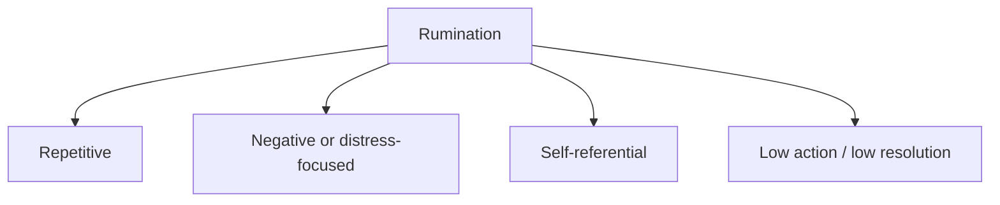
```mermaid
flowchart TD
    A[Rumination] --> B[Repetitive]
    A --> C[Negative or distress-focused]
    A --> D[Self-referential]
    A --> E[Low action / low resolution]
```

Let’s break that down.

### Repetitive

The same mental content keeps returning.

Not once.

Again and again.

### Negative or distress-focused

Rumination usually focuses on pain, failure, rejection, uncertainty, regret, shame, unfairness, or fear.

### Self-referential

It often becomes about the self:

```text
What does this say about me?
Am I weak?
Am I unlovable?
Am I behind?
Am I doomed?
```

### Low action

Rumination often feels like problem-solving, but it does not produce useful next steps.

It creates heat, not light.

---

## 3. Rumination vs reflection vs problem-solving vs worry

These words overlap, but they are not the same.

| Mode | Time focus | Tone | Outcome |
|---|---|---|---|
| Reflection | Past or present | Curious, balanced | Learning |
| Problem-solving | Present or future | Specific, active | Next steps |
| Worry | Future | Threat-focused | Preparation or anxiety |
| Rumination | Past/present/self | Repetitive, negative, stuck | Distress without resolution |

### Reflection

Reflection asks:

```text
What happened?
What can I learn?
What will I do differently?
```

Reflection ends with insight or action.

### Problem-solving

Problem-solving asks:

```text
What is the actual problem?
What can I control?
What is the next step?
```

Problem-solving ends with a plan.

### Worry

Worry is usually future-focused:

```text
What if something bad happens?
```

Sometimes worry helps you prepare.

Often it becomes repetitive anxiety.

### Rumination

Rumination asks:

```text
Why did this happen to me?
What does this mean about me?
Why do I feel like this?
Why can't I stop feeling like this?
```

Rumination usually ends where it started.

But with more emotional exhaustion.

---

## 4. The simplest test: is this thought moving?

A thought is not bad just because it is negative.

Some painful thinking is necessary.

The question is:

> Is this thinking moving?

Use this test.

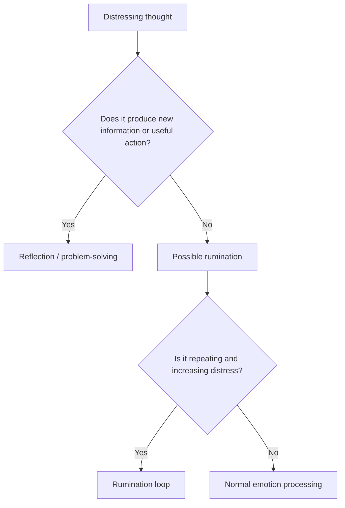
```mermaid
flowchart TD
    A[Distressing thought] --> B{Does it produce new information or useful action?}
    B -->|Yes| C[Reflection / problem-solving]
    B -->|No| D[Possible rumination]
    D --> E{Is it repeating and increasing distress?}
    E -->|Yes| F[Rumination loop]
    E -->|No| G[Normal emotion processing]
```

Ask:

```text
Did I learn something new?
Did I choose a next action?
Did my understanding become clearer?
Did my body settle?
```

If the answer is no, and the thought keeps repeating, it may be rumination.

---

## 5. Why rumination feels useful

Rumination is sticky because it gives the illusion of control.

When something hurts, the brain wants certainty.

It thinks:

```text
If I analyze this enough, I can prevent pain next time.
If I understand every detail, I will feel safe.
If I replay it enough, I will find the missing answer.
If I blame myself enough, I will regain control.
```

This is why rumination often appears after:

- rejection,
- failure,
- humiliation,
- conflict,
- breakup,
- job loss,
- exam pressure,
- social embarrassment,
- health fear,
- moral regret,
- uncertain future,
- family conflict.

Rumination is the mind trying to solve emotional threat with repeated simulation.

The intention is protection.

The effect is often suffering.

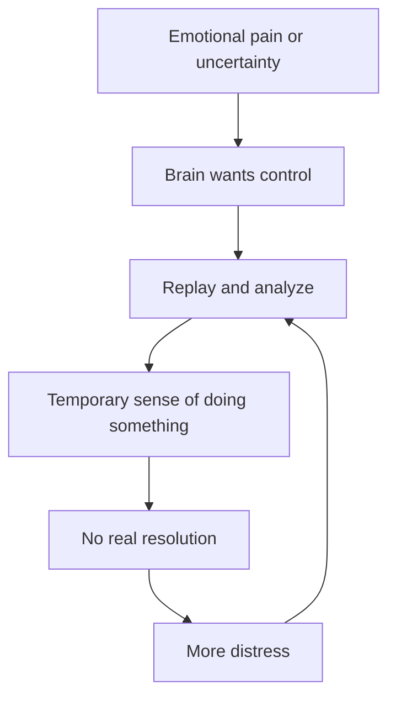
```mermaid
flowchart TD
    A[Emotional pain or uncertainty] --> B[Brain wants control]
    B --> C[Replay and analyze]
    C --> D[Temporary sense of doing something]
    D --> E[No real resolution]
    E --> F[More distress]
    F --> C
```

Rumination is not stupidity.

It is a protection strategy that became too repetitive.

---

## 6. What is the Default Mode Network?

The **Default Mode Network**, or **DMN**, is a large-scale brain network that tends to be active when the mind is not focused on an external task.

It was described in early neuroimaging research as a set of brain regions that showed decreased activity during many goal-directed tasks compared with a resting baseline.[^1]

The DMN is often active during:

- mind-wandering,
- daydreaming,
- remembering the past,
- imagining the future,
- thinking about yourself,
- thinking about other people,
- social imagination,
- autobiographical memory,
- moral reflection,
- meaning-making,
- mental simulation.

Simple definition:

> The DMN is a brain network involved in internally directed thought.

It is not a “bad network.”

It is part of how humans reflect, remember, imagine, plan, and understand themselves.

---

## 7. Main regions of the Default Mode Network

Different papers divide the DMN in different ways, but common regions include:

- medial prefrontal cortex,
- posterior cingulate cortex,
- precuneus,
- angular gyrus / inferior parietal lobule,
- lateral temporal cortex,
- hippocampal formation.

Simplified map:

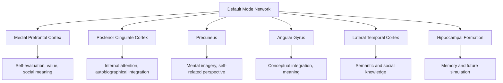
```mermaid
flowchart TD
    DMN[Default Mode Network] --> MPFC[Medial Prefrontal Cortex]
    DMN --> PCC[Posterior Cingulate Cortex]
    DMN --> PREC[Precuneus]
    DMN --> AG[Angular Gyrus]
    DMN --> LTC[Lateral Temporal Cortex]
    DMN --> HIP[Hippocampal Formation]

    MPFC --> A[Self-evaluation, value, social meaning]
    PCC --> B[Internal attention, autobiographical integration]
    PREC --> C[Mental imagery, self-related perspective]
    AG --> D[Conceptual integration, meaning]
    LTC --> E[Semantic and social knowledge]
    HIP --> F[Memory and future simulation]
```

Do not memorize this like an exam.

Understand the pattern:

> The DMN helps build the inner movie of the self across past, present, future, and social meaning.

That inner movie is powerful.

It is also where rumination can get trapped.

---

## 8. The DMN is not the enemy

Many internet explanations say:

> “The DMN is the overthinking network. Turn it off.”

That is too simple.

The DMN is also involved in good things:

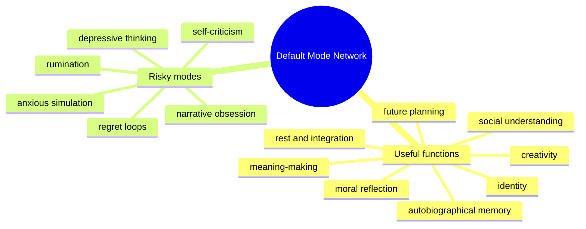
```mermaid
mindmap
  root((Default Mode Network))
    Useful functions
      autobiographical memory
      future planning
      creativity
      social understanding
      meaning-making
      identity
      moral reflection
      rest and integration
    Risky modes
      rumination
      self-criticism
      anxious simulation
      regret loops
      depressive thinking
      narrative obsession
```

Without the DMN, you would lose many human abilities.

You would struggle to:

- remember your life story,
- imagine your future,
- understand other people,
- reflect on values,
- create meaning,
- learn from experience,
- mentally simulate possibilities.

The goal is not to destroy the DMN.

The goal is to use it flexibly.

A healthy mind can move between:

```text
inner thought ↔ outer attention
self-reflection ↔ action
memory ↔ present moment
planning ↔ execution
```

The problem is not DMN activity.

The problem is getting stuck in one mode.

---

## 9. Default mode vs task-positive mode

When you focus on an external task, other networks become more active.

These are often called **task-positive networks**, including attention and executive-control networks.

Simplified:

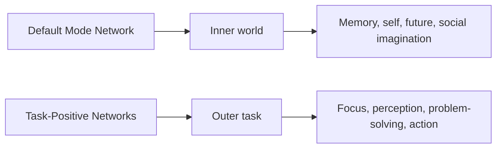
```mermaid
flowchart LR
    A[Default Mode Network] --> B[Inner world]
    B --> C[Memory, self, future, social imagination]

    D[Task-Positive Networks] --> E[Outer task]
    E --> F[Focus, perception, problem-solving, action]
```

In real life:

| Mode | Example |
|---|---|
| DMN | replaying a conversation, imagining future, thinking about identity |
| Task-positive | solving math, coding, writing, cooking, playing sport, driving carefully |

Healthy mental function requires switching.

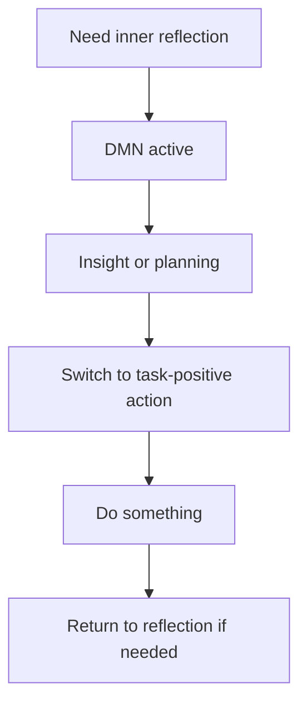
```mermaid
flowchart TD
    A[Need inner reflection] --> B[DMN active]
    B --> C[Insight or planning]
    C --> D[Switch to task-positive action]
    D --> E[Do something]
    E --> F[Return to reflection if needed]
```

Rumination happens when the switch fails.

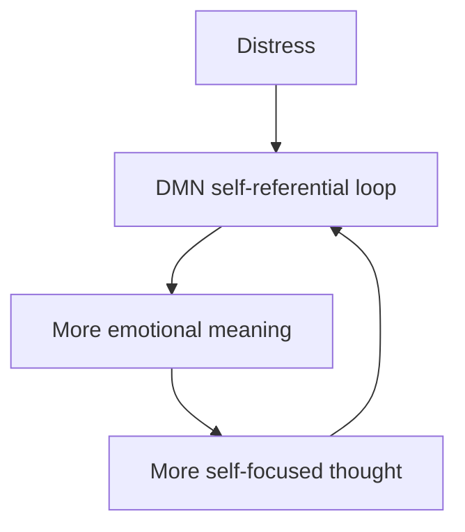
```mermaid
flowchart TD
    A[Distress] --> B[DMN self-referential loop]
    B --> C[More emotional meaning]
    C --> D[More self-focused thought]
    D --> B
```

---

## 10. The DMN and depression

Rumination is strongly connected to depression.

Research has linked major depression with altered activity and connectivity in DMN regions involved in self-referential processing.[^2]

A systematic review of DMN functional connectivity during rumination in depression reported widespread associations between depression, rumination, and functional connectivity within and between multiple brain regions.[^3]

Important nuance:

> The DMN does not “cause depression” by itself.

Depression is complex.

It involves mood, sleep, stress, inflammation, genetics, life events, cognition, behavior, social context, neurochemistry, and brain networks.

But DMN-related self-referential processing provides a useful framework for understanding why depression often feels like being trapped inside a negative self-story.

Common depressive rumination themes:

```text
I am not enough.
I always fail.
Nothing will change.
Why am I like this?
What is wrong with me?
I ruined everything.
Everyone is ahead.
There is no point.
```

This is not just sadness.

It is repeated negative self-modeling.

---

## 11. The DMN and anxiety

Rumination is usually past/present-focused.

Worry is usually future-focused.

But both can involve internally directed mental simulation.

Anxiety often asks:

```text
What if?
What if this goes wrong?
What if they judge me?
What if I fail?
What if I cannot handle it?
```

The mind runs simulations to prepare.

Preparation is useful.

But anxious simulation becomes harmful when:

- it repeats without new information,
- it exaggerates threat,
- it ignores coping ability,
- it prevents action,
- it disrupts sleep,
- it becomes reassurance-seeking,
- it turns uncertainty into catastrophe.

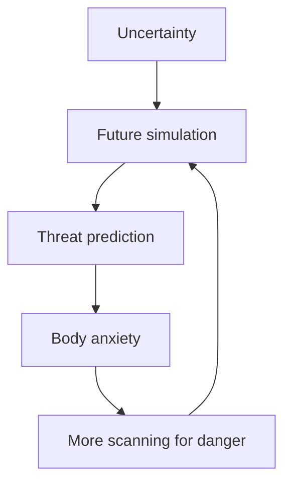
```mermaid
flowchart TD
    A[Uncertainty] --> B[Future simulation]
    B --> C[Threat prediction]
    C --> D[Body anxiety]
    D --> E[More scanning for danger]
    E --> B
```

The DMN may contribute to the internal simulation part.

The salience and threat systems add emotional urgency.

The prefrontal cortex tries to control or analyze.

The result can become a mental courtroom where the future is constantly on trial.

---

## 12. The neuroscience loop of rumination

A simplified rumination loop may involve several systems:

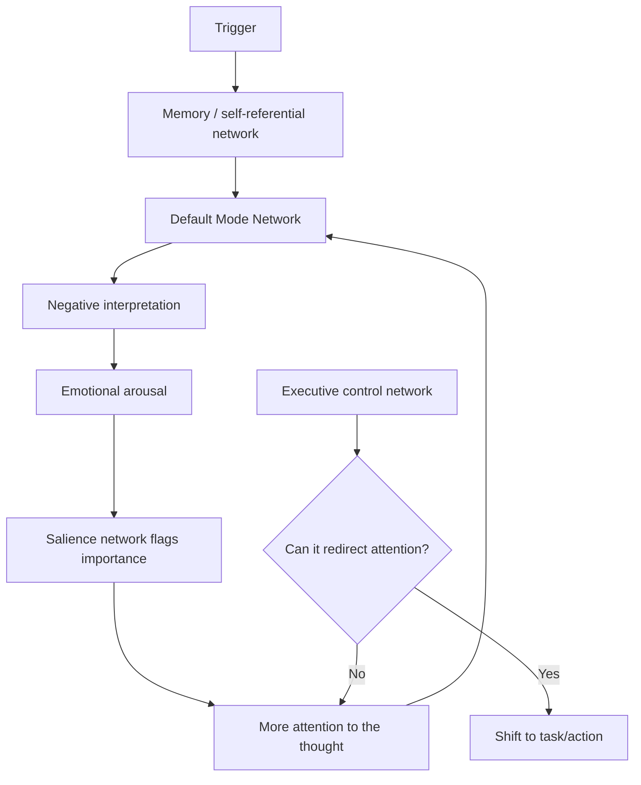
```mermaid
flowchart TD
    A[Trigger] --> B[Memory / self-referential network]
    B --> C[Default Mode Network]
    C --> D[Negative interpretation]
    D --> E[Emotional arousal]
    E --> F[Salience network flags importance]
    F --> G[More attention to the thought]
    G --> C

    H[Executive control network] --> I{Can it redirect attention?}
    I -->|Yes| J[Shift to task/action]
    I -->|No| G
```

Key players:

| System | Role |
|---|---|
| DMN | self-story, memory, future simulation |
| Salience network | detects emotional importance |
| Executive control network | redirects attention and supports action |
| Limbic systems | emotional intensity |
| Hippocampus | memory/context |
| Prefrontal cortex | regulation, meaning, inhibition |
| Body state | arousal, tension, fatigue |

Rumination is not one brain region misbehaving.

It is a network pattern.

---

## 13. The self-story machine

The DMN helps create continuity of self.

It connects:

```text
Who I was
What happened to me
What it means
Who I am now
What might happen next
What others think of me
Where my life is going
```

This is incredibly useful.

It lets you learn from the past and plan for the future.

But under emotional pain, the self-story machine can become harsh.

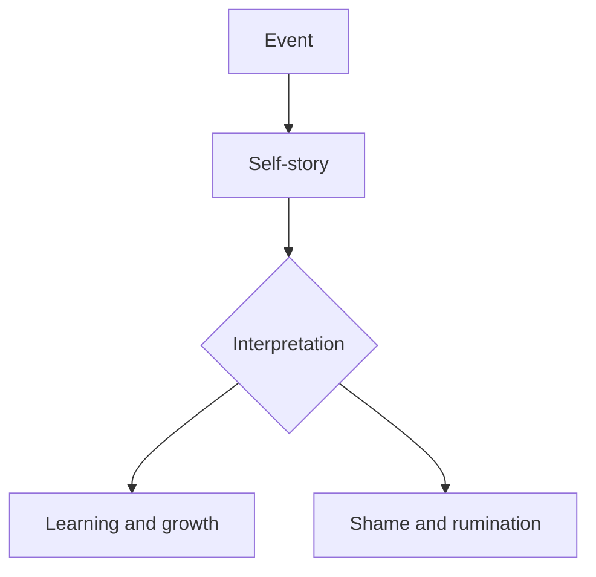
```mermaid
flowchart TD
    A[Event] --> B[Self-story]
    B --> C{Interpretation}
    C --> D[Learning and growth]
    C --> E[Shame and rumination]
```

Example:

```text
Event: failed exam
Growth story: I need better preparation and feedback.
Rumination story: I am stupid and behind in life.
```

Example:

```text
Event: conflict with friend
Growth story: I need clearer communication.
Rumination story: I ruin relationships.
```

Example:

```text
Event: job rejection
Growth story: I need to improve my profile and keep applying.
Rumination story: nobody will choose me.
```

The event matters.

But the self-story determines whether the mind learns or loops.

---

## 14. Why the brain replays social pain

Humans are social animals.

For most of human history, social rejection was not just emotionally painful. It could threaten survival.

So the brain takes social pain seriously.

It remembers:

- exclusion,
- humiliation,
- betrayal,
- abandonment,
- conflict,
- status loss,
- criticism,
- shame.

A relationship replay may sound like romance or drama, but underneath it often involves survival questions:

```text
Am I safe?
Am I valued?
Was I fooled?
Did I lose status?
Can I trust people?
What does this say about me?
How do I prevent this again?
```

So the brain replays.

Not because replay is useful forever.

Because the brain is trying to update its social prediction model.

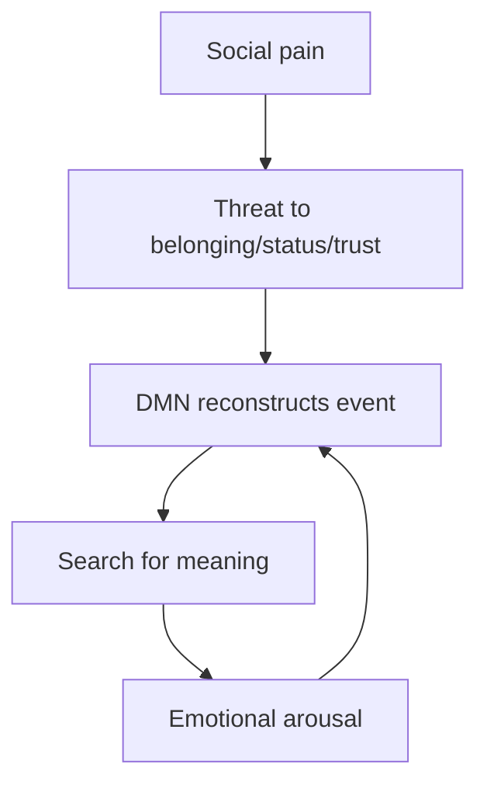
```mermaid
flowchart TD
    A[Social pain] --> B[Threat to belonging/status/trust]
    B --> C[DMN reconstructs event]
    C --> D[Search for meaning]
    D --> E[Emotional arousal]
    E --> C
```

The exit is not always “stop caring.”

The exit is:

```text
extract lesson → regulate emotion → choose boundary/action → stop replay
```

---

## 15. Rumination and the body

Rumination feels mental, but it is embodied.

When you ruminate, the body may respond as if the problem is happening now.

You may feel:

- tight chest,
- jaw tension,
- stomach heaviness,
- shallow breathing,
- restlessness,
- headache,
- fatigue,
- fast heartbeat,
- insomnia.

Rumination belongs to a broader category called **perseverative cognition**, which includes repeated negative thinking such as worry and rumination. Reviews have connected perseverative cognition with prolonged physiological activation, suggesting that repeated mental stress can keep the body activated even when the external stressor is absent.[^4]

In simple language:

> The body does not always know the difference between danger happening now and danger being replayed vividly.

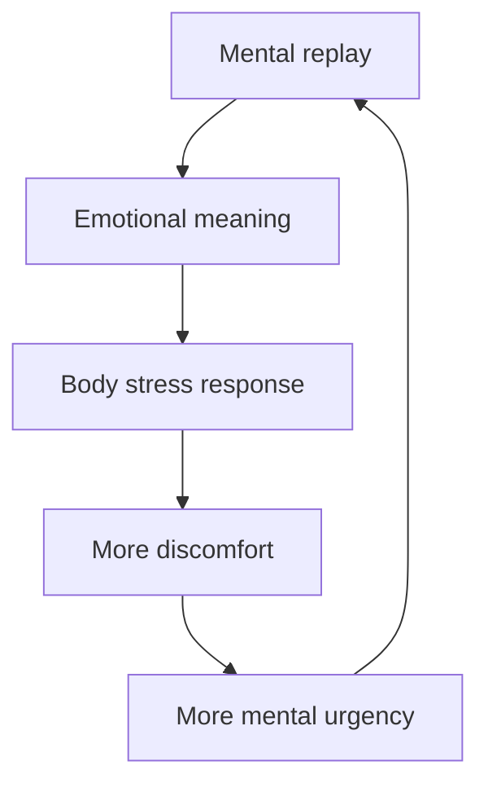
```mermaid
flowchart TD
    A[Mental replay] --> B[Emotional meaning]
    B --> C[Body stress response]
    C --> D[More discomfort]
    D --> E[More mental urgency]
    E --> A
```

This is why getting out of rumination often requires changing body state, not only arguing with thoughts.

---

## 16. Rumination and sleep

Rumination loves the night.

Why?

Because at night:

- there are fewer distractions,
- the body is tired,
- executive control is weaker,
- worries are quieter but louder internally,
- unresolved tasks return,
- phone use keeps the mind stimulated,
- the DMN has plenty of space to wander.

Night rumination often feels profound.

But a tired brain is not always a wise brain.

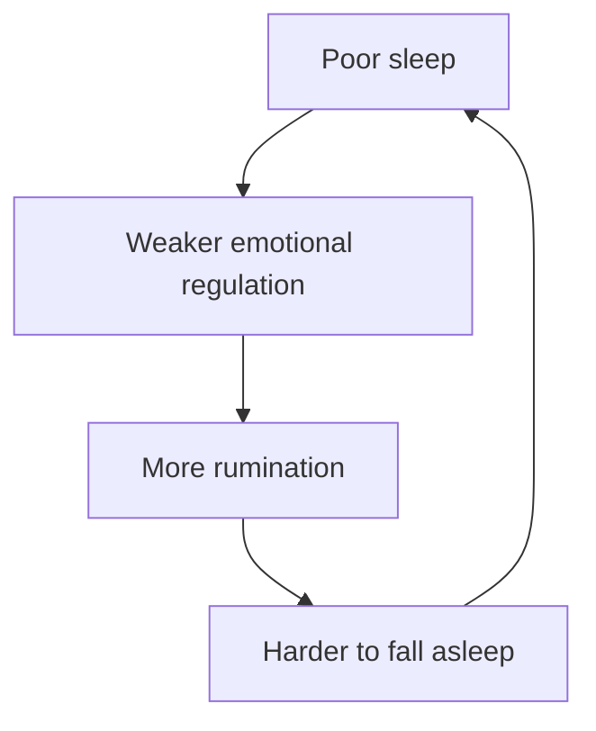
```mermaid
flowchart TD
    A[Poor sleep] --> B[Weaker emotional regulation]
    B --> C[More rumination]
    C --> D[Harder to fall asleep]
    D --> A
```

Practical rule:

> Do not treat midnight thoughts as final truth.

Write them down.

Do not solve them all.

Return to them in daylight.

---

## 17. Rumination and identity

Rumination becomes especially powerful when it attaches to identity.

There is a difference between:

```text
I made a mistake.
```

and:

```text
I am a mistake.
```

Difference:

```text
Behavior-level thought:
I did something wrong.

Identity-level thought:
Something is wrong with me.
```

Rumination often climbs the ladder from event to identity.

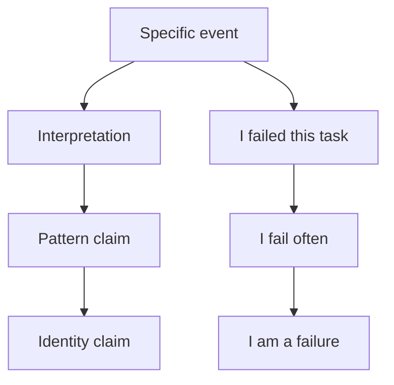
```mermaid
flowchart TD
    A[Specific event] --> B[Interpretation]
    B --> C[Pattern claim]
    C --> D[Identity claim]

    A --> E[I failed this task]
    E --> F[I fail often]
    F --> G[I am a failure]
```

The more abstract the thought becomes, the harder it is to solve.

You can fix:

```text
I need to prepare differently for this exam.
```

You cannot easily fix:

```text
I am doomed.
```

So one key anti-rumination skill is making thoughts more concrete.

---

## 18. Abstract vs concrete thinking

Rumination is often abstract.

It asks:

```text
Why am I like this?
Why does this always happen?
Why is life unfair?
What does this mean about me?
```

Helpful problem-solving is concrete.

It asks:

```text
What happened?
What part can I control?
What is the next action?
What information do I need?
What will I do in the next 20 minutes?
```

Visual:

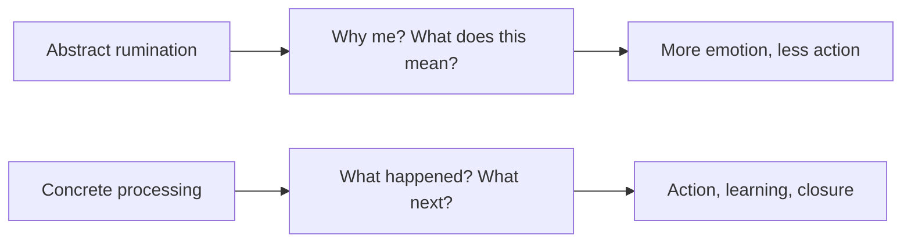
```mermaid
flowchart LR
    A[Abstract rumination] --> B[Why me? What does this mean?]
    B --> C[More emotion, less action]

    D[Concrete processing] --> E[What happened? What next?]
    E --> F[Action, learning, closure]
```

Rumination-focused CBT often targets this shift: moving from abstract, evaluative, repetitive thinking toward more concrete, process-focused, actionable thinking. Reviews of rumination-focused CBT report promising evidence for reducing rumination and depressive symptoms, though research quality and populations vary.[^5]

Practical translation:

> When stuck, make the thought smaller, more specific, and more actionable.

---

## 19. The three types of inner time travel

The DMN lets you mentally time travel.

That is useful.

But each form has a healthy and unhealthy version.

| Inner time travel | Healthy version | Unhealthy version |
|---|---|---|
| Past | learning, gratitude, memory | regret, shame replay |
| Future | planning, imagination | worry, catastrophe |
| Self | identity, values, meaning | self-attack, inadequacy |
| Others | empathy, theory of mind | mind-reading, imagined judgment |

Diagram:

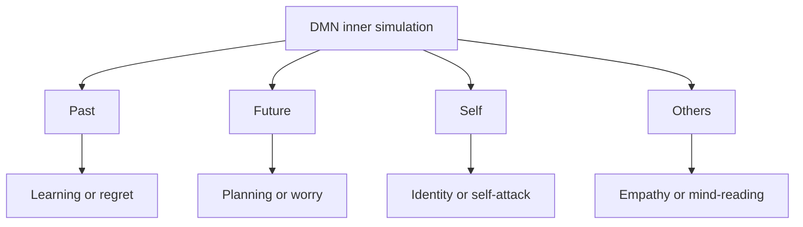
```mermaid
flowchart TD
    A[DMN inner simulation] --> B[Past]
    A --> C[Future]
    A --> D[Self]
    A --> E[Others]

    B --> F[Learning or regret]
    C --> G[Planning or worry]
    D --> H[Identity or self-attack]
    E --> I[Empathy or mind-reading]
```

The goal is not to stop inner time travel.

The goal is to travel intentionally.

---

## 20. The difference between useful and harmful mind-wandering

Mind-wandering is not always bad.

It can support:

- creativity,
- future planning,
- emotional integration,
- meaning-making,
- problem incubation,
- social imagination,
- autobiographical memory.

Research reviews describe the DMN as having adaptive roles in internal mentation, not merely as a source of dysfunction.[^6]

Useful mind-wandering tends to be:

```text
flexible
creative
non-compulsive
not too self-attacking
able to return to task
```

Harmful rumination tends to be:

```text
sticky
negative
self-focused
emotionally escalating
hard to stop
low in action
```

Use this distinction:

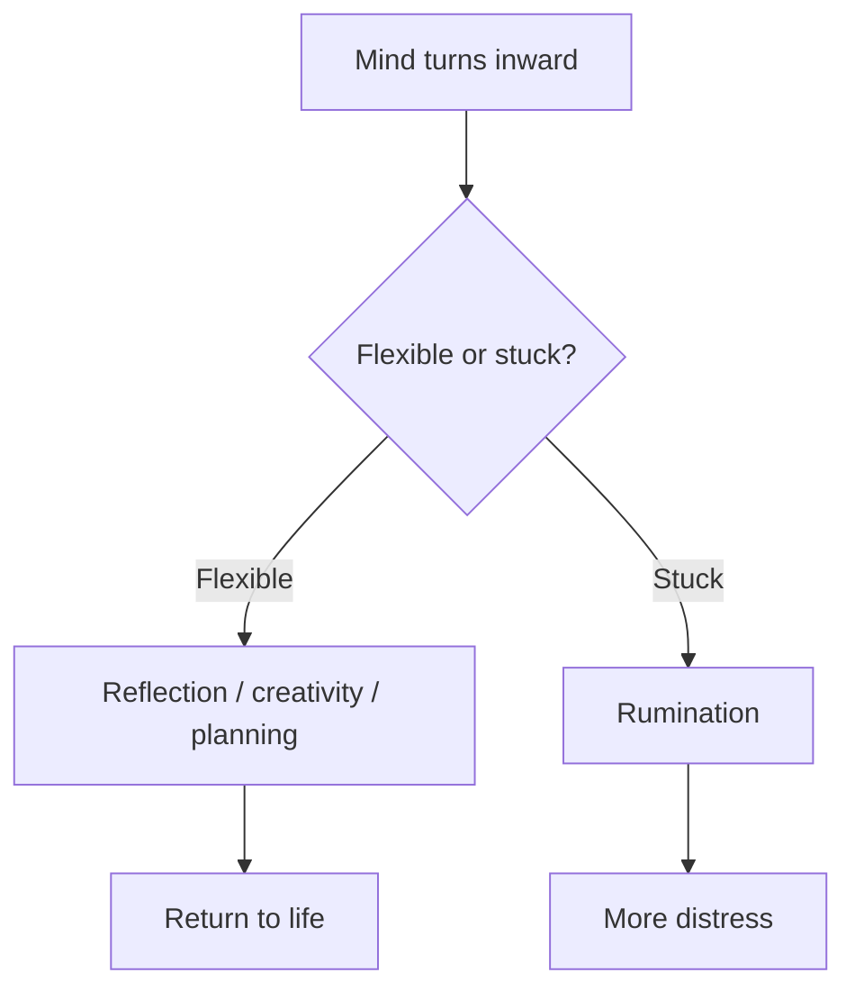
```mermaid
flowchart TD
    A[Mind turns inward] --> B{Flexible or stuck?}
    B -->|Flexible| C[Reflection / creativity / planning]
    B -->|Stuck| D[Rumination]
    C --> E[Return to life]
    D --> F[More distress]
```

A wandering mind is not the problem.

A trapped mind is.

---

## 21. Why “stop thinking” usually fails

Trying to force thoughts away often makes them louder.

If you say:

```text
Do not think about the red elephant.
```

the mind creates the red elephant.

Rumination becomes worse when the person relates to thoughts like enemies that must be defeated.

The better move is not always suppression.

It is changing your relationship to the thought.

Instead of:

```text
I must solve this thought.
```

Try:

```text
This is a thought pattern.
It is appearing.
I do not have to follow it.
```

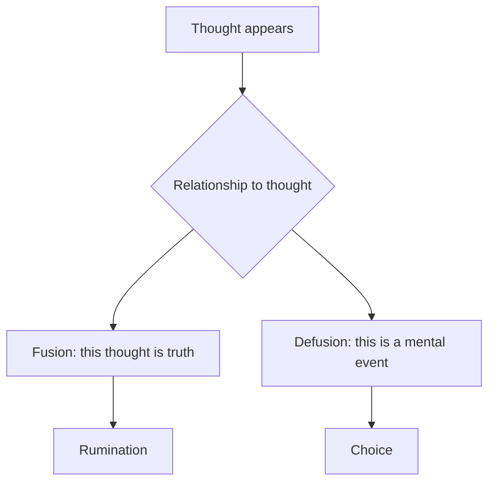
```mermaid
flowchart TD
    A[Thought appears] --> B{Relationship to thought}

    B --> C[Fusion: this thought is truth]
    C --> D[Rumination]

    B --> E[Defusion: this is a mental event]
    E --> F[Choice]
```

You are not the thought.

You are the system noticing the thought.

---

## 22. Metacognition: thinking about thinking

**Metacognition** means awareness of your own thinking.

Rumination is strengthened when you believe:

```text
I need to keep thinking about this.
This thought is important because it feels intense.
If I stop thinking, I am avoiding the truth.
If I do not analyze this, something bad will happen.
```

These are beliefs about thinking.

They keep the loop alive.

Metacognitive therapy focuses on changing unhelpful beliefs about worry and rumination, including the idea that repeated thinking is necessary or uncontrollable.[^7]

Practical question:

```text
Is this thought asking for action, or asking for more rumination?
```

Another:

```text
What do I believe will happen if I stop analyzing this for one hour?
```

Often the fear is:

```text
I will lose control.
I will miss the answer.
I will be irresponsible.
I will forget something important.
```

So the brain keeps thinking.

To escape, you must learn:

> I can stop thinking about this temporarily and still be safe.

---

## 23. Rumination is sometimes an avoidance strategy

This sounds strange.

Rumination feels painful.

How can it be avoidance?

Because rumination can avoid:

- taking action,
- accepting uncertainty,
- feeling grief directly,
- having a difficult conversation,
- making a decision,
- risking failure,
- letting go,
- resting,
- facing the body.

Example:

```text
Instead of applying for a job, someone ruminates about whether they are good enough.
```

Example:

```text
Instead of apologizing, someone ruminates about whether they are a terrible person.
```

Example:

```text
Instead of setting a boundary, someone ruminates about why the other person is like that.
```

Rumination can feel like work while replacing work.

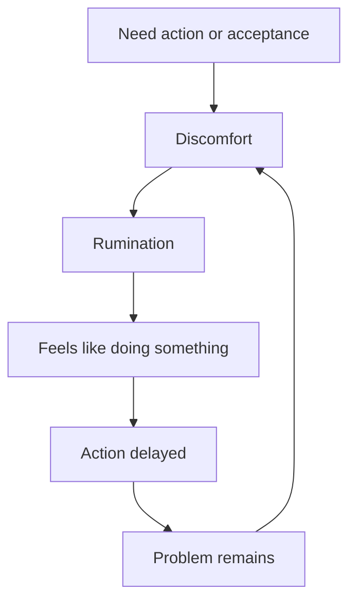
```mermaid
flowchart TD
    A[Need action or acceptance] --> B[Discomfort]
    B --> C[Rumination]
    C --> D[Feels like doing something]
    D --> E[Action delayed]
    E --> F[Problem remains]
    F --> B
```

This is one reason action is often the antidote.

Not because action solves everything immediately.

Because it exits the false-work loop.

---

## 24. The rumination loop in everyday examples

### Example 1: Relationship uncertainty

```text
They replied differently today.
Maybe something changed.
Did I say something wrong?
What if they lost interest?
Let me reread old messages.
```

Loop:

```mermaid
flowchart TD
    A[Ambiguous social cue] --> B[Threat interpretation]
    B --> C[Message checking]
    C --> D[Temporary relief or more doubt]
    D --> E[More attention to ambiguity]
    E --> B
```

Potential exit:

```text
Ambiguity is not proof.
I will not use checking as emotional regulation.
I will return to the present task.
If a conversation is needed, I will have it directly later.
```

### Example 2: Exam failure

```text
I failed.
Why am I like this?
Everyone is ahead.
Maybe I am not capable.
```

Potential exit:

```text
What exactly went wrong?
Preparation? Sleep? Method? Timing?
What is the next practice unit?
```

### Example 3: Career uncertainty

```text
What if I choose the wrong field?
What if I waste years?
What if I am already late?
```

Potential exit:

```text
Uncertainty cannot be solved by infinite thinking.
I will run a 30-day experiment in one direction.
Evidence beats endless simulation.
```

### Example 4: Social embarrassment

```text
Why did I say that?
They must think I am weird.
I should have said something else.
```

Potential exit:

```text
Was there actual evidence of rejection?
What would I tell a friend?
Do I need repair, or only self-forgiveness?
```

### Example 5: Health worry

```text
What if this sensation means something serious?
Let me search again.
Maybe I missed something.
```

Potential exit:

```text
If symptoms are medically concerning, consult a qualified clinician.
If this is repeated reassurance-seeking, checking may be feeding the loop.
```

---

## 25. The practical principle: switch networks

Rumination is often internally focused and self-referential.

So one practical goal is to **switch from inner simulation to external engagement**.

Not forever.

Just long enough to break the loop.

```mermaid
flowchart TD
    A[Rumination] --> B[DMN-heavy internal loop]
    B --> C[Shift attention outward]
    C --> D[Task-positive engagement]
    D --> E[Body and environment update]
    E --> F[Reduced loop intensity]
```

Examples of external engagement:

- walking outside,
- cooking,
- cleaning,
- coding,
- writing a concrete plan,
- exercising,
- calling a grounded friend,
- doing a timed task,
- reading with notes,
- playing music,
- practicing a skill,
- organizing your room.

The key is not distraction for avoidance.

The key is deliberate attentional switching.

---

## 26. The 90-second de-loop protocol

Use this when you notice rumination starting.

### Step 1: Label

```text
This is rumination.
This is a loop, not a solution.
```

### Step 2: Name the theme

Choose one:

```text
regret
rejection
failure
uncertainty
injustice
shame
fear
control
```

### Step 3: Locate it in the body

```text
Where do I feel it?
Chest?
Jaw?
Stomach?
Forehead?
Hands?
```

### Step 4: Exhale and orient

Take 5 slow exhales.

Look around the room.

Name 5 things you see.

### Step 5: Choose the next external action

```text
I will now do ______ for 10 minutes.
```

Diagram:

```mermaid
flowchart LR
    A[Notice loop] --> B[Label]
    B --> C[Name theme]
    C --> D[Locate body]
    D --> E[Exhale + orient]
    E --> F[External action]
```

The goal is not to feel perfect.

The goal is to interrupt repetition.

---

## 27. The rumination triage question

When a thought repeats, ask:

```text
Is this a problem to solve, a feeling to feel, or uncertainty to tolerate?
```

```mermaid
flowchart TD
    A[Repeated thought] --> B{What is this?}

    B --> C[Problem to solve]
    C --> D[Define next action]

    B --> E[Feeling to feel]
    E --> F[Name emotion + body regulation]

    B --> G[Uncertainty to tolerate]
    G --> H[Stop checking + return to values]
```

Most people treat all rumination as a problem to solve.

But sometimes there is no solvable problem.

Sometimes there is grief.

Sometimes there is uncertainty.

Sometimes there is shame.

Sometimes there is a need for action.

Different states need different responses.

---

## 28. Problem-solving mode

Use this when there is a real problem you can influence.

Write:

```text
Problem:
What I can control:
What I cannot control:
Next 15-minute action:
When I will do it:
```

Example:

```text
Problem: I am unprepared for the exam.
Can control: practice schedule, weak topics, sleep.
Cannot control: past mistakes, exact questions.
Next action: solve one timed section.
When: 7 PM.
```

Then stop analyzing and do the action.

```mermaid
flowchart TD
    A[Problem] --> B[Control / no control]
    B --> C[One action]
    C --> D[Do it]
    D --> E[Review]
```

If thinking does not produce an action, it is probably not problem-solving.

---

## 29. Feeling mode

Use this when there is no immediate solution, but there is emotional pain.

Write:

```text
The emotion is:
The body sensation is:
The story my mind tells is:
What I need right now is:
```

Example:

```text
The emotion is grief.
The body sensation is heaviness in the chest.
The story is: I will never feel okay.
What I need is warmth, rest, and a walk.
```

Feeling mode does not mean drowning in emotion.

It means letting the feeling exist without converting it into endless analysis.

```mermaid
flowchart TD
    A[Emotion] --> B[Name]
    B --> C[Body awareness]
    C --> D[Compassionate support]
    D --> E[Emotion moves through]
```

Emotions move better when felt clearly than when converted into mental loops.

---

## 30. Uncertainty mode

Use this when the mind wants certainty that is not currently available.

Examples:

```text
Do they like me?
Will I succeed?
What if I choose wrong?
Will everything work out?
What do people think of me?
```

Some questions cannot be answered now.

The practice is not more analysis.

The practice is uncertainty tolerance.

Write:

```text
The uncertainty is:
The checking behavior is:
What checking costs me:
The value-based action I choose:
```

Example:

```text
The uncertainty is: I do not know how they feel.
The checking behavior is: rereading messages.
Cost: anxiety and wasted time.
Value-based action: continue my work and communicate directly later if needed.
```

```mermaid
flowchart TD
    A[Uncertainty] --> B[Urge to check/analyze]
    B --> C{Will this produce real information?}
    C -->|Yes| D[Get information once]
    C -->|No| E[Practice uncertainty tolerance]
    E --> F[Return to chosen action]
```

Freedom often means not getting the answer immediately.

---

## 31. The “one page, one action” journaling method

Journaling can help.

But journaling can also become written rumination.

To prevent that, use structure.

### Page 1: Dump

Write freely for 5 minutes.

No editing.

### Page 2: Sort

Label each thought:

```text
problem
feeling
uncertainty
memory
self-attack
```

### Page 3: Act

Choose one action.

Only one.

```text
The action I will take is:
I will do it at:
```

Diagram:

```mermaid
flowchart LR
    A[Dump] --> B[Sort]
    B --> C[One action]
```

Rule:

> Journaling must end with either action, acceptance, or emotional clarity.

If it ends with more chaos, change the method.

---

## 32. Mindfulness: training non-fusion

Mindfulness is often misunderstood as “empty your mind.”

That is not the point.

Mindfulness means paying attention to present-moment experience with openness and less automatic judgment. Clinical and public-health sources define mindfulness as awareness of internal and external experience moment by moment.[^8]

For rumination, mindfulness trains a crucial skill:

> noticing thoughts without automatically entering them.

Instead of:

```text
I am a failure.
```

Mindfulness says:

```text
I am having the thought that I am a failure.
```

That tiny change matters.

```mermaid
flowchart TD
    A[Thought] --> B[Fusion]
    B --> C[I am this thought]
    A --> D[Mindful noticing]
    D --> E[I am observing this thought]
    E --> F[More choice]
```

You do not need to win an argument against every thought.

You need to stop treating every thought as a command.

---

## 33. A simple mindfulness practice for rumination

Set a timer for 5 minutes.

### Step 1: Anchor

Focus on breathing or body contact.

```text
feet on floor
hands on lap
breath at nostrils
chest rising
```

### Step 2: Notice thought

When the mind wanders, say:

```text
thinking
remembering
planning
judging
worrying
replaying
```

### Step 3: Return

Gently return to the anchor.

No drama.

No self-attack.

### Step 4: Repeat

The repetition is the training.

```mermaid
flowchart TD
    A[Anchor] --> B[Mind wanders]
    B --> C[Notice]
    C --> D[Label]
    D --> E[Return]
    E --> A
```

The goal is not a blank mind.

The goal is attention flexibility.

---

## 34. Attention training: strengthening the switch

Rumination is partly an attention problem.

The mind gets stuck on one internal object.

Attention training means practicing switching attention deliberately.

Try this:

```text
30 seconds: sounds
30 seconds: body sensations
30 seconds: visual details
30 seconds: breath
30 seconds: task in front of you
```

Diagram:

```mermaid
flowchart LR
    A[Sound] --> B[Body]
    B --> C[Vision]
    C --> D[Breath]
    D --> E[Task]
```

This trains:

```text
I can move attention.
Attention is not trapped.
```

The skill is small but powerful.

---

## 35. Behavioral activation: action before mood

Rumination says:

```text
Think until you feel ready.
```

Behavioral activation says:

```text
Act in a small meaningful way, then mood may follow.
```

This approach is used in depression treatment and focuses on increasing engagement with rewarding or meaningful activities.

Practical version:

```text
Choose a small action that matches your values.
Do it even if motivation is low.
Let the action create new evidence.
```

```mermaid
flowchart TD
    A[Low mood / rumination] --> B[Small planned action]
    B --> C[Contact with life]
    C --> D[New feedback]
    D --> E[Mood and self-belief may shift]
    E --> B
```

Examples:

- shower,
- clean desk,
- walk outside,
- apply to one job,
- cook one meal,
- practice 20 minutes,
- reply to one important email,
- meet one friend,
- write one paragraph.

The action must be small enough to start.

---

## 36. The anti-rumination action menu

When stuck, do not ask:

```text
What do I feel like doing?
```

Ask:

```text
Which category of action would interrupt this loop?
```

| State | Useful action |
|---|---|
| Angry rumination | walk fast, delay response, write unsent message |
| Shame rumination | self-compassion note, repair if needed, concrete lesson |
| Anxiety rumination | define next step, reduce checking, breathe |
| Sad rumination | contact safe person, move body, do gentle routine |
| Career rumination | 30-minute work block, one application, one project commit |
| Relationship rumination | stop checking, direct communication later, return to values |
| Night rumination | write down, no solving, sleep routine |

Use the body.

Use the environment.

Use action.

Do not stay alone inside the story forever.

---

## 37. The “two chairs” method

This is a simple way to separate rumination from wise reflection.

Use two physical chairs or two positions.

### Chair 1: The ruminator

Say everything the loop says.

```text
Why did this happen?
What if everything is ruined?
I should have done better.
```

### Chair 2: The wise observer

Respond with clarity.

```text
I hear the fear.
Repeating this is not helping.
The lesson is ___.
The next action is ___.
The rest is uncertainty.
```

Diagram:

```mermaid
flowchart LR
    A[Ruminating self] --> B[Wise observer]
    B --> C[Lesson]
    B --> D[Action]
    B --> E[Let go of unsolvable part]
```

The point is not to shame the ruminator.

The ruminator is trying to protect you.

But it should not drive forever.

---

## 38. The “scheduled rumination” paradox

For some people, setting a specific worry/rumination time helps.

Example:

```text
7:00–7:20 PM: thinking time
```

When rumination appears earlier:

```text
Not now. I will think about this at 7 PM.
```

At 7 PM, write:

```text
What is the problem?
Is there action?
If yes, schedule it.
If no, practice acceptance.
```

This trains the mind that thoughts do not have to be obeyed immediately.

```mermaid
flowchart TD
    A[Intrusive rumination] --> B[Postpone to scheduled time]
    B --> C[Return to current task]
    C --> D[Scheduled review]
    D --> E[Action or acceptance]
```

This is especially useful for people who feel irresponsible if they stop thinking.

The scheduled time reassures the brain:

```text
We are not ignoring this. We are containing it.
```

---

## 39. Rumination and social media

Social media can feed rumination because it provides:

- comparison,
- ambiguous social signals,
- reminders of people,
- endless checking,
- status cues,
- emotional triggers,
- algorithmic repetition,
- no natural stopping point.

Loop:

```mermaid
flowchart TD
    A[Emotional discomfort] --> B[Open app]
    B --> C[See trigger/comparison]
    C --> D[Self-referential thought]
    D --> E[More emotion]
    E --> F[Keep scrolling/checking]
    F --> C
```

Practical tools:

```text
Remove trigger accounts.
Use app limits.
No checking during emotional spikes.
No phone in bed.
Replace with external action.
Do not use social media as a mood regulator.
```

The issue is not that social media is evil.

The issue is that it can keep the DMN fed with emotionally loaded self-comparison.

---

## 40. Rumination and creativity

There is a fine line between deep creative thought and rumination.

Creative incubation:

```text
open, playful, flexible, curious, generative
```

Rumination:

```text
closed, repetitive, self-punishing, urgent, draining
```

Creative mind-wandering often produces new associations.

Rumination repeats old associations.

```mermaid
flowchart TD
    A[Mind-wandering] --> B{Tone and flexibility}
    B --> C[Curious and open]
    C --> D[Creativity]
    B --> E[Threatened and repetitive]
    E --> F[Rumination]
```

If you want creative DMN use, change the input:

- walk without phone,
- read widely,
- write ideas,
- expose yourself to beauty,
- ask open questions,
- stop forcing answers,
- let the mind wander without self-attack.

A relaxed wandering mind can create.

A threatened wandering mind often ruminates.

---

## 41. Rumination and trauma

After traumatic or highly stressful experiences, the mind may replay events as part of trying to understand danger.

This can include:

- intrusive memories,
- “what if” loops,
- guilt,
- shame,
- anger,
- body alarm,
- avoidance,
- dreams,
- hypervigilance.

Important:

> Trauma-related rumination is not simply overthinking.

It may involve threat systems, memory networks, body state, and survival responses.

The advice “just stop thinking” is not enough.

Helpful support may include:

- trauma-informed therapy,
- grounding,
- body-based regulation,
- safe relationships,
- gradual exposure,
- meaning-making,
- sleep support,
- reducing avoidance,
- professional care when symptoms are severe.

If rumination includes suicidal thoughts, self-harm urges, severe functional impairment, panic, or trauma symptoms, it is important to seek professional help or urgent support.

---

## 42. When rumination needs professional help

Self-help tools are useful, but they are not always enough.

Consider professional support if rumination:

- lasts for hours daily,
- disrupts sleep regularly,
- causes panic or depression,
- leads to self-harm thoughts,
- prevents work/study/basic functioning,
- is tied to trauma,
- is tied to compulsions or OCD-like checking,
- causes substance use or other harmful coping,
- feels uncontrollable despite repeated effort.

Therapies that may help include:

- Cognitive Behavioral Therapy,
- Rumination-Focused CBT,
- Metacognitive Therapy,
- Acceptance and Commitment Therapy,
- Mindfulness-Based Cognitive Therapy,
- trauma-focused therapies when relevant.

This is not a weakness.

It is using trained support for a trained loop.

---

## 43. The 7-day rumination reset

This is a practical experiment.

Do it for one week.

### Day 1: Map the loop

Write:

```text
My common rumination theme:
My trigger:
My body signs:
My usual behavior:
The cost:
```

### Day 2: Label the loop

Every time it appears, say:

```text
This is rumination.
This is not problem-solving yet.
```

Do not try to fix it.

Just label.

### Day 3: Body exit

When the loop starts:

```text
5 slow exhales
stand up
walk for 5 minutes
```

### Day 4: Sort the thought

Ask:

```text
Problem, feeling, or uncertainty?
```

Respond accordingly.

### Day 5: External action

Use a 10-minute task.

```text
clean
walk
study
write
cook
send one email
practice one skill
```

### Day 6: Mindfulness repetition

Practice 5 minutes:

```text
anchor → thought → label → return
```

### Day 7: Review

Write:

```text
Which trigger was strongest?
Which tool worked fastest?
What behavior fed the loop?
What action helped me exit?
What is my plan for next week?
```

---

## 44. The 30-day DMN flexibility protocol

The goal is not less thinking.

The goal is better switching.

### Daily: 5 minutes attention training

```text
breath → sound → body → vision → task
```

### Daily: one external action after rumination

```text
When I notice a loop, I do one physical or task-based action.
```

### 3 times/week: structured reflection

Use:

```text
What happened?
What did I feel?
What did I learn?
What is the next action?
What must I stop replaying?
```

### Weekly: digital trigger cleanup

Remove one cue that feeds repetitive self-comparison or checking.

### Weekly: long walk without phone

Let the mind wander, but if it becomes rumination, label and return to sensory experience.

### Monthly: identity review

Ask:

```text
What story about myself am I repeating?
Is it accurate?
What evidence would create a better story?
```

Diagram:

```mermaid
flowchart TD
    A[Attention training] --> B[Better switching]
    C[External action] --> B
    D[Structured reflection] --> E[Less chaotic self-story]
    F[Trigger cleanup] --> G[Less loop feeding]
    H[Walks and sensory grounding] --> I[Healthy DMN use]
    B --> J[More flexible mind]
    E --> J
    G --> J
    I --> J
```

---

## 45. The ultimate anti-rumination framework: L.E.A.V.E.

When a thought starts looping, use **L.E.A.V.E.**

| Letter | Meaning |
|---|---|
| L | Label the loop |
| E | Embody: feel where it is in the body |
| A | Ask: problem, feeling, or uncertainty? |
| V | Values: choose what kind of person/action matters |
| E | Engage externally |

```mermaid
flowchart LR
    L[Label] --> E1[Embody]
    E1 --> A[Ask]
    A --> V[Values]
    V --> E2[Engage]
```

Example:

```text
L: This is rumination.
E: I feel it in my chest and jaw.
A: This is uncertainty, not a solvable problem right now.
V: I value self-respect and focus.
E: I will walk for 10 minutes and then work on one task.
```

This is not denial.

It is leadership.

---

## 46. Common myths about rumination and the DMN

### Myth 1: Rumination means you are deep

Depth produces insight.

Rumination produces repetition.

A thought is not deep because it is painful.

### Myth 2: The DMN is bad

The DMN supports memory, identity, future planning, social imagination, and meaning.

The problem is rigidity, not the network itself.

### Myth 3: You must solve every thought

Some thoughts need action.

Some need emotional processing.

Some need to be left unanswered.

### Myth 4: Distraction is always avoidance

Mindless distraction can be avoidance.

Deliberate attention switching can be regulation.

### Myth 5: If a thought feels urgent, it must be important

Emotional intensity is not the same as truth.

The brain can mark a thought as urgent because it is threatening, not because it is useful.

### Myth 6: Mindfulness means no thoughts

Mindfulness means noticing thoughts without automatically becoming them.

### Myth 7: Rumination can be beaten by one insight

Rumination is a habit loop.

It changes through repeated interruption, regulation, action, and new learning.

---

## 47. Final model: rumination as a stuck self-simulation loop

Here is the complete model.

```mermaid
flowchart TD
    A[Trigger] --> B[Self-referential meaning]
    B --> C[Default Mode Network simulation]
    C --> D[Memory, future, identity, social meaning]
    D --> E[Negative interpretation]
    E --> F[Emotional arousal]
    F --> G[Salience: this matters]
    G --> H[More attention to the thought]
    H --> C

    I[Executive control] --> J{Can attention shift?}
    J -->|Yes| K[Task, body, values, action]
    J -->|No| H

    K --> L[New evidence]
    L --> M[Updated self-story]
    M --> N[Less loop power over time]
```

Rumination is not merely a bad habit.

It is the mind trying to process threat, pain, uncertainty, identity, and meaning.

But when it becomes repetitive and passive, it stops helping.

The exit is not to destroy thought.

The exit is to restore flexibility:

```text
think → feel → act → rest → return
```

Not:

```text
think → think → think → collapse
```

---

## 48. Final summary

The Default Mode Network helps create your inner world.

It lets you remember, imagine, reflect, plan, and understand yourself.

That is beautiful.

But when pain, uncertainty, or shame enters the system, the same network can become part of a repetitive self-focused loop.

That loop is rumination.

Rumination feels like problem-solving, but often becomes emotional rehearsal.

It keeps the mind in the past, the future, or the self-story without producing movement.

The practical solution is not to hate your mind.

The solution is to train flexibility.

```mermaid
flowchart LR
    A[Notice] --> B[Label]
    B --> C[Regulate body]
    C --> D[Sort the thought]
    D --> E[Choose action or acceptance]
    E --> F[Return to life]
```

A healthy mind can go inward.

A healthy mind can also come back.

That is the real goal:

> Not a silent mind.  
> A flexible mind.

---

## Practical worksheet

Copy this into your notes.

### 1. My rumination map

```text
The topic I repeat most:
The trigger:
The emotion:
The body sensation:
The behavior that keeps it going:
The cost:
```

### 2. Is it solving or looping?

```text
Did this thought produce new information?
Did it produce a next action?
Did it reduce confusion?
Did it increase distress?
Have I thought this same thing before?
```

### 3. Problem, feeling, or uncertainty?

```text
This is mainly:
[ ] A problem to solve
[ ] A feeling to feel
[ ] Uncertainty to tolerate
```

### 4. My replacement loop

```text
When I notice rumination,
I will label it as:
I will regulate my body by:
I will do this external action:
I will return to the issue at this scheduled time if needed:
```

### 5. My DMN flexibility practice

```text
Daily attention practice:
Digital trigger I will reduce:
External activity I will use:
Person I can talk to without co-ruminating:
One value-based action:
```

## References

[^1]: Raichle, M. E., MacLeod, A. M., Snyder, A. Z., et al. *A default mode of brain function*. Proceedings of the National Academy of Sciences, 2001. https://pmc.ncbi.nlm.nih.gov/articles/PMC14647/

[^2]: Sheline, Y. I., Barch, D. M., Price, J. L., et al. *The default mode network and self-referential processes in depression*. Proceedings of the National Academy of Sciences, 2009. https://pmc.ncbi.nlm.nih.gov/articles/PMC2631078/

[^3]: Riaz, S., et al. *Functional Connectivity in the Default Mode Network During Rumination in Depression: A Systematic Review*. 2025. https://pmc.ncbi.nlm.nih.gov/articles/PMC12241886/

[^4]: Sansone, R. A., & Sansone, L. A. *Rumination: Relationships with Physical Health*. Innovations in Clinical Neuroscience, 2012. https://pmc.ncbi.nlm.nih.gov/articles/PMC3312901/

[^5]: Li, Y., et al. *A systematic review of the effects of rumination-focused cognitive behavioral therapy*. 2024. https://pmc.ncbi.nlm.nih.gov/articles/PMC11649405/

[^6]: Andrews-Hanna, J. R. *The Brain's Default Network and its Adaptive Role in Internal Mentation*. Neuroscientist, 2012. https://pmc.ncbi.nlm.nih.gov/articles/PMC3553600/

[^7]: Wells, A. *Metacognitive Therapy for Anxiety and Depression*. The Guilford Press, 2009. Overview: https://en.wikipedia.org/wiki/Metacognitive_therapy

[^8]: NHS. *Mindfulness*. https://www.nhs.uk/mental-health/self-help/tips-and-support/mindfulness/

[^9]: American Psychiatric Association. *Rumination: A Cycle of Negative Thinking*. 2020. https://www.psychiatry.org/news-room/apa-blogs/rumination-a-cycle-of-negative-thinking

[^10]: Hamilton, J. P., Farmer, M., Fogelman, P., & Gotlib, I. H. *Depressive Rumination, the Default-Mode Network, and the Dark Matter of Clinical Neuroscience*. Biological Psychiatry, 2015. https://snaplab.stanford.edu/sites/g/files/sbiybj31146/files/media/file/depressive_rumination_the_default-mode_network_and_the_dark_matter_of_clinical_neuroscience_0.pdf
