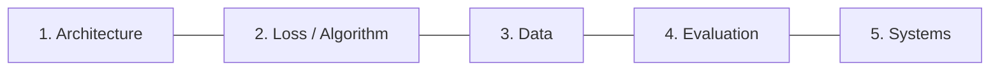
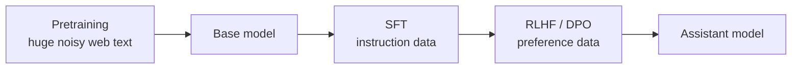
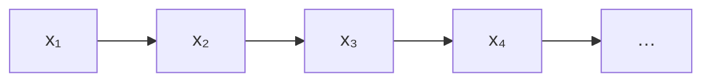
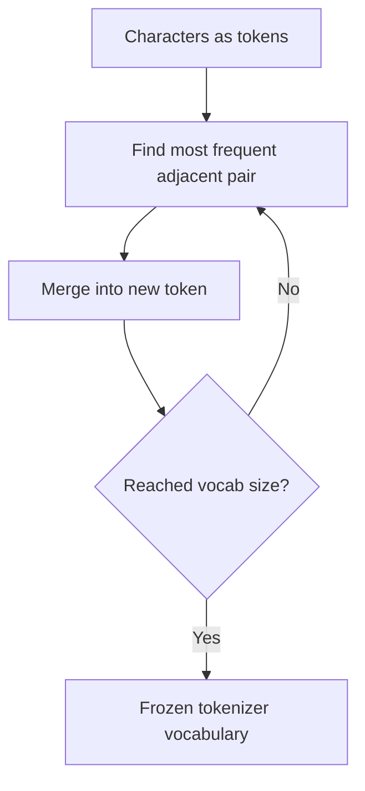
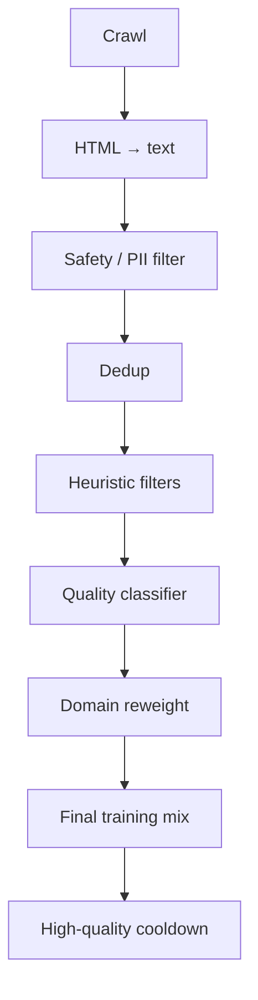
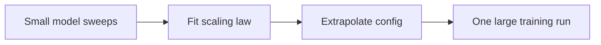
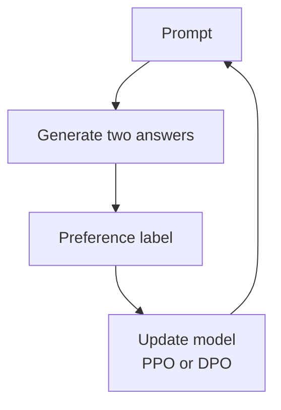
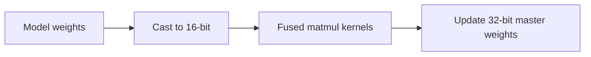

> **The five pillars of training an LLM**
>
> 1. **Architecture** — the neural net design (transformers — not covered here)
> 2. **Training loss / algorithm** — how you optimize the model
> 3. **Data** — what you train on
> 4. **Evaluation** — how you know you are improving
> 5. **Systems** — how you make it run efficiently on real hardware
>
> Academia historically over-indexes on (1) and (2) because they make for clean papers. In industry, **(3), (4), and (5) dominate practical progress** — a recurring "bitter lesson" theme.

---

## 1. Two eras: pretraining vs post-training

| | Pretraining | Post-training |
|---|---|---|
| **Goal** | Model "all of the internet" — a general model of language | Turn that raw model into a helpful **assistant** |
| **Era** | GPT-2 / GPT-3 | ChatGPT onward (since ~2022) |
| **Data** | Huge, low-average-quality, scraped | Small, high-quality, curated / human-labeled |
| **Analogy** | Learning to speak/write like *any* internet author | Learning to speak like a *helpful assistant* |

A useful mental model: **pretraining is a very good weight initialization**; post-training is "just" fine-tuning from that initialization. There is nothing mathematically special separating the two in the SFT case — same underlying loss, different data, hyperparameters (much higher learning rate), and dataset size.

---

## 2. Language modeling fundamentals

A language model defines a probability distribution over token sequences:

$$P(x_1, x_2, \dots, x_L)$$

For example, `P("The mouse ate the cheese")` should be high (grammatical and sensible), `P("The the mouse ate cheese")` should be lower (bad grammar), and `P("The cheese ate the mouse")` should be lower than the first (bad *semantics*, even though grammatical).

### Autoregressive factorization

Nearly all current LLMs use the **chain rule of probability** to decompose this joint distribution — an exact identity, not an approximation:

$$P(x_1, \dots, x_L) = \prod_{t=1}^{L} P(x_t \mid x_1, \dots, x_{t-1})$$

That is: predict each token given everything before it. This is *one* choice of factorization. Its main downside is that **generation is inherently sequential** (one token at a time). To generate word 5 you need words 1–4 already generated. That is why long generations are slow, and why systems research cares about speculative decoding and related tricks.

### Training objective — cross-entropy loss

At each position, the model outputs a distribution over the vocabulary (final linear layer + softmax). Training compares this to the **true next token**, represented as a one-hot vector:

$$\mathcal{L} = -\log P(x_t \mid x_1, \dots, x_{t-1})$$

summed or averaged over positions. This is standard **cross-entropy** for classification, where the "classes" are vocabulary tokens.

Minimizing this loss over a corpus is mathematically identical to **maximizing log-likelihood** of the training text:

$$\max_\theta \sum_t \log P_\theta(x_t \mid x_{<t}) \equiv \min_\theta \sum_t -\log P_\theta(x_t \mid x_{<t})$$

Notes:

- The output layer size equals vocabulary size, so tokenizer design also affects architecture cost.
- At inference, you **sample** a token then **detokenize**. During training you skip sampling — you compare the predicted distribution to the real next token.

---

## 3. Tokenization

### Why not just words or characters?

- **Whole words**: break on typos; fail for languages without spaces (e.g., Thai).
- **Characters**: works, but sequences become very long. Transformer self-attention cost scales **quadratically with length**, so this is expensive.
- Compromise: **subword tokenization**, where common chunks (~3–4 characters on average) become tokens.

### Byte Pair Encoding (BPE)

Training (done once on a large corpus, *before* LLM training):

1. Start with every character as its own token.
2. Find the **most frequent adjacent pair**.
3. Merge that pair into a new token.
4. Repeat until you hit the target vocabulary size.

Important details:

- **Older tokens are never deleted** — rare or misspelled words can still be spelled out character-by-character.
- At application time, greedily use the **longest matching token** available.
- **Pre-tokenization** (split on spaces/punctuation first) is mostly a computational shortcut; it makes tokenizers somewhat English/Latin-script-centric.
- The same surface form gets the same token ID regardless of sense ("bank" finance vs. river). Disambiguation is left to the model.

### Why tokenization quietly matters

- **Math**: numbers are often not digit-by-digit tokens, so place-value composition is harder to learn — a known contributor to weak arithmetic.
- **Code**: early tokenizers handled indentation poorly; later models improved code tokenization.
- Pure byte/character models are attractive, but quadratic attention cost remains a blocker until architectures change.

---

## 4. Evaluating pretrained models

### Perplexity

Perplexity is 2 raised to the average per-token log-loss:

$$\text{Perplexity} = 2^{\frac{1}{L}\sum_{t=1}^{L} -\log_2 P(x_t \mid x_{<t})}$$

Exponentiating moves from log-space into roughly "vocabulary-size units." Averaging per token makes it length-independent.

- **Range**: 1 (perfectly certain and correct) to **vocabulary size** (uniform / maximally uncertain).
- **Intuition**: about how many tokens the model is effectively hesitating between.
- Historically dropped from ~70 (2017) to under 10 (2023) on standard setups.
- **Limitation**: not comparable across different tokenizers/vocab sizes, and depends on the eval set. Still useful internally, less so for public leaderboards.

### Standardized suites

- **HELM** (Stanford) and the **Hugging Face Open LLM Leaderboard**: aggregate many auto-gradable NLP tasks.
- **MMLU**: common academic multitask multiple-choice benchmark.
  - Method A: compare likelihoods of full answer strings.
  - Method B: force A/B/C/D letter choice.
  - These can give **meaningfully different scores** for the same model.

### Two major evaluation challenges

1. **Inconsistent implementations**: the "same" benchmark can score differently across harnesses (e.g., Llama-65B at 63.7 vs 48.8 on different MMLU setups).
2. **Train/test contamination**: web-scale training may include benchmark items.
   - Detection trick: datasets online are often *not* randomly ordered. If the model assigns higher likelihood to the test set **in original order** than shuffled, that is evidence of memorization.

---

## 5. Data for pretraining

> "Train on clean internet" sounds simple, but is one of the most labor-intensive parts of building an LLM — often more people-hours than the modeling loop itself.

### The pipeline

Each step is its own research problem:

1. **Crawl** — usually via **Common Crawl** (~250B pages, ~1 PB raw).
2. **Extract text from HTML** — strip tags, recover structure, handle math, remove boilerplate.
3. **Filter undesirable content** — NSFW, PII, harmful material via blocklists and/or classifiers.
4. **Deduplication** — repeated boilerplate, duplicate URLs, heavily duplicated passages, at massive scale.
5. **Heuristic filtering** — abnormal token distributions, broken "words," too few/too many words.
6. **Model-based filtering** — e.g., classify pages resembling Wikipedia references and upweight them.
7. **Domain reweighting** — books, code, forums, entertainment, etc. More code often helps general reasoning; entertainment is often downweighted.
8. **High-quality cooldown** — near the end, lower LR and overweight very clean data (Wikipedia, curated text).
9. Continual pretraining for longer context (mentioned, not detailed).

### Scale reference points

- Common Crawl: ~250B pages ≈ 10⁶ GB.
- The Pile (academic): ~280B tokens.
- Llama 2: 2T tokens.
- Llama 3: **15T tokens**.
- GPT-4: undisclosed; similar order of magnitude in estimates.

### Open research problems

- Efficient petabyte-scale processing.
- Optimal domain weighting.
- **Synthetic data** as natural high-quality text becomes scarce.
- Multimodal data improving text-only performance.
- Secrecy: competition *and* copyright liability concerns.

---

## 6. Scaling laws

> **Central empirical finding (OpenAI, ~2020):** larger models + more data + more compute → **predictably** better performance. Unlike the overfitting intuition from classical ML courses, frontier LLMs keep improving with scale — no clear overfitting wall yet.

### The core plot

Log(compute) vs log(test loss) is roughly a **straight line**. Similar power-law behavior appears for data size and parameter count:

$$\text{Loss}(C) \approx a \cdot C^{-\alpha} + b$$

This lets labs **predict** gains before spending the full training budget.

### Why this changes lab workflows

- **Old workflow**: burn most of the budget on hyperparameter search at full target scale.
- **New workflow**:
  1. Find a scaling recipe (how hyperparameters should change with size).
  2. Tune cheaply on several smaller models.
  3. Fit a scaling law across those runs.
  4. Extrapolate to target scale.
  5. Spend most compute on **one** large optimized run.

Most tiny architectural tweaks mostly shift the **intercept**, not the **slope** — i.e., a smaller lever than data/scale/compute.

### Chinchilla: compute-optimal allocation

Given fixed compute: bigger model + less data, or smaller model + more data?

DeepMind's Chinchilla used IsoFLOP curves and found roughly **~20 tokens per parameter** as compute-optimal.

But that ignores **inference cost**. Production often **overtrains** smaller models. A cited production-ish rule of thumb is closer to **~150 tokens per parameter**.

### The Bitter Lesson (Richard Sutton, 2019)

1. Scaling laws: more compute → predictably better models.
2. Compute gets cheaper/better over time.
3. Therefore the long-term winners are methods that **absorb ever more compute**, not clever hand-designed tricks.

### Worked example: Llama 3 405B (back-of-envelope)

- 405B params, 15.6T tokens → **~40 tokens/parameter** (between Chinchilla ~20 and inference-oriented ~150).
- FLOPs rule of thumb:

$$\text{FLOPs} \approx 6 \times (\text{# parameters}) \times (\text{# training tokens})$$

→ about **3.8 × 10²⁵ FLOPs**.

- ~16,000 H100s → on the order of **~70 days** / **~26M GPU-hours** (Meta reported ~30M with real inefficiencies).
- Rough cost: compute rental ~$52M + team ~$25M → **~$75M** for one run (order-of-magnitude).
- Carbon: ~4,000 tons CO₂e ≈ ~2,000 JFK↔London round trips — not yet first-order for many labs, but likely more salient as scale grows another ~100×.
- Trend: each generation often aims for roughly **10× more FLOPs**, contingent on power and GPU supply.

---

## 7. Post-training: base model → assistant

A raw pretrained model does not behave like an assistant. Asked to "explain the moon landing to a six-year-old," a pure base model may continue with *another similar question*, because question lists are common on the internet. Post-training adds instruction-following and safety behavior.

### 7.1 Supervised Fine-Tuning (SFT)

- **Same loss** as pretraining (next-token cross-entropy).
- What changes: **data** (instruction → response pairs) and **hyperparameters** (higher LR; often a few epochs, e.g. 3).
- "Supervised" because targets are known desired outputs.

**Alpaca** (Stanford): 175 seed examples → synthetic expansion to ~52K with text-davinci-003 → SFT on Llama 7B. This popularized **synthetic instruction data**.

**LIMA finding**: scaling SFT from ~2K → ~32K examples gave little gain. Interpretation: SFT mostly teaches *which response style to prefer*, not new knowledge — knowledge is already latent from pretraining.

### 7.2 RLHF — Reinforcement Learning from Human Feedback

**Why SFT alone is insufficient:**

1. **Bounded by human writing ability** — people often judge quality better than they produce ideal answers.
2. **Hallucination risk** — cloning "gold" answers with facts the model never learned can teach confident fabrication.
3. **Cost** — writing full answers is expensive; comparing two answers is cheaper.

**RLHF pipeline:**

1. Generate two candidate answers from an SFT model.
2. Human (or LLM) picks the preferred one.
3. Update the model toward preferred-style answers (PPO or DPO).

**Reward options:**

- Binary (+1/−1): simple, sparse.
- Learned reward model (common): Bradley–Terry preference model:

$$P(y_1 \succ y_2) = \frac{\exp(r(x, y_1))}{\exp(r(x, y_1)) + \exp(r(x, y_2))}$$

**PPO** (original ChatGPT-style recipe):

1. SFT
2. Train reward model on preferences
3. Optimize policy with PPO to maximize reward
4. Add **KL regularization** toward the SFT model to limit reward hacking

After PPO, the model is no longer a well-calibrated likelihood model of text — it is a policy optimized for a preferred answer. **Perplexity stops being a good eval** for post-RLHF models. PPO is also operationally messy.

**DPO** (Direct Preference Optimization, Stanford ~2023):

Skips the explicit reward model and RL loop. Directly increases likelihood of preferred responses and decreases rejected ones relative to a frozen reference (SFT) model:

$$\mathcal{L}_{DPO} = -\log \sigma\left(\beta \log\frac{\pi_\theta(y_w|x)}{\pi_{ref}(y_w|x)} - \beta \log\frac{\pi_\theta(y_l|x)}{\pi_{ref}(y_l|x)}\right)$$

Under assumptions, DPO's optimum matches PPO against the corresponding reward model. Much simpler to implement; now standard in open source and common in industry. Empirically, DPO ≈ PPO, both clearly beat SFT alone.

### 7.3 Preference data challenges

- Humans are slow, expensive, inconsistent (~66–68% agreement with majority in one study).
- Humans overweight superficial cues (**length** especially) — a likely reason RLHF models get verbose.
- Annotator distribution shift and crowdsourcing ethics matter.
- **LLM-as-labeler**: much cheaper (~50× cited) and can agree with majority humans better than individual humans, partly via lower variance. Now common practice.

---

## 8. Evaluating assistants

Open-ended answers make this harder than pretraining eval.

**Why old metrics fail:**

- Validation loss is not comparable across PPO vs DPO objectives.
- Perplexity fails after preference optimization — models are no longer calibrated distributions over all phrasings.
- Valid inputs/outputs are enormous and hard to auto-score.

**Preference-based evaluation:**

- **Chatbot Arena**: blind side-by-side human votes; trusted but skewed toward tech-savvy users.
- **AlpacaEval**: LLM judge compares against a baseline; ~98% correlation with Arena in reports; cheap/fast (<$10, minutes).
  - Shared bias toward **longer** answers.
  - Example: GPT-4 vs itself ≈ 50%; "be more verbose" → ~64% win rate; "be concise" → ~20%.
  - Mitigation: length-controlled / regression-style adjustments.

---

## 9. Systems (brief)

- You cannot always "just buy more GPUs" — cost, scarcity, and communication overhead.
- GPUs optimize **throughput** (especially matmul); CPUs optimize flexible low-latency work.
- Compute has outpaced memory/communication bandwidth — GPUs often wait on data movement.
- **MFU** (Model FLOP Utilization):

$$\text{MFU} = \frac{\text{observed FLOPs/sec}}{\text{peak FLOPs/sec}}$$

~50% is considered strong (Meta reported ~45% for Llama training).

- **Mixed precision**: store/update in 32-bit; do heavy matmuls in 16-bit.
- **Operator fusion** (`torch.compile` etc.): avoid DRAM round-trips per tiny op; often ~2× speedups.
- Skipped for time in the lecture, but important: tiling, data/tensor/pipeline parallelism, mixture-of-experts.

---

## 10. Key takeaways

1. **Autoregressive LMs** = chain-rule factorization + next-token cross-entropy. Simple math; tokenization still shapes what can be learned.
2. **Scaling laws** make large spends extrapolatable — that is why labs can justify huge single runs.
3. **Bitter Lesson**: micro-architecture tweaks mostly move a constant; compute + data + systems compound.
4. **Post-training is mostly style/alignment fine-tuning**, not primary knowledge injection (LIMA).
5. **RLHF/DPO** optimize preferences beyond SFT, but inherit judge biases (especially length).
6. **Open-ended eval** remains hard; pairwise preference (Arena / AlpacaEval) is the current standard, with known confounds.
7. **Systems efficiency is first-class** — even top labs leave substantial FLOPs on the table without mixed precision, fusion, and careful parallelism.

---

## Further learning

As recommended in the lecture:

- **CS224N** — NLP with Deep Learning (broader / historical NLP context)
- **CS324** — Large Language Models (deeper coverage of the topics above)
- **CS336** — Language Models from Scratch (build your own; heavy workload)

---

*Source: Stanford CS229 guest lecture on building LLMs (transcript-based notes, expanded for self-contained reading).*
