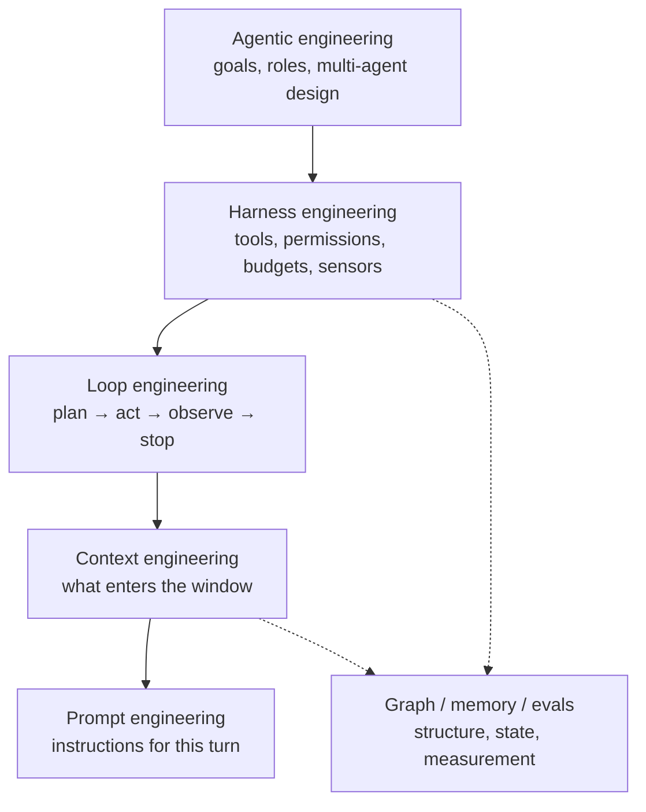

If you follow AI Twitter (or X), the last year has felt like a new "engineering" label every few weeks. Prompt engineering gave way to context engineering. Then harness engineering. Then loop engineering, agentic engineering, graph engineering.

It is easy to treat that as hype. In practice, most of these names are not competing products. They are **different layers of the same problem**: making probabilistic models behave like dependable software.

This post is a map of the vocabulary that actually shows up in 2025-2026 practice, from Anthropic and OpenAI write-ups to [Birgitta Böckeler's harness engineering framing](https://martinfowler.com/articles/exploring-gen-ai/harness-engineering.html) and the broader agentic-systems discussion. The goal is not to declare winners. It is to know **which layer you are stuck on**.

---

## 1. Prompt engineering

**What it is:** shaping the instructions for a single turn: role, constraints, output format, examples, refusal rules.

**What it is good for:** clear task definitions, structured outputs (JSON schemas), tone, decomposition of a question.

**What it does not fix:** wrong documents in the window, missing tools, runaway loops, or no way to verify the answer.

Prompt engineering is still real work. It is also the thinnest layer. A polished prompt inside a broken system is still a broken system.

---

## 2. Context engineering

Andrej Karpathy popularized a useful definition: the craft of filling the context window with **just the right information for the next step**.

That includes more than the user message:

- system instructions and tool schemas
- retrieved documents (RAG)
- conversation history and summaries
- prior tool results
- policies, schemas, and "negative space" (what you deliberately leave out)

Context is scarce. Bigger windows help, but they do not remove **context rot**: more tokens can dilute attention and raise cost without raising quality. Common failure modes are poisoning (bad facts in the window), distraction (too much noise), confusion (contradictory evidence), and overflow (important bits get truncated).

If your agent is "smart" in demos and unreliable in production, start here before rewriting the prompt for the tenth time.

---

## 3. Harness engineering

A shorthand that stuck in early 2026:

> **Agent = Model + Harness**

The harness is everything deterministic around the model: tool execution, permission checks, sandboxes, retries, budgets, logging, hooks, and the feedback that lets the agent correct itself.

Böckeler's coding-agent framing is especially clear. A good outer harness does two jobs:

1. **Guides (feedforward):** raise the odds of a good first attempt (project rules, architecture constraints, skills, templates).
2. **Sensors (feedback):** catch mistakes after an action (tests, linters, type checks, policy validators, sometimes an LLM-as-judge).

Anthropic and OpenAI have both written about long-running agent harnesses along the same lines: do not let the model call tools in the wild; validate, authorize, execute, and inject results back. Separate the model that proposes actions from the runtime that decides what is allowed.

Harness engineering is where demos become systems. Without it, agents leak tokens, loop forever, or escalate a prompt injection into a dangerous tool call.

---

## 4. Loop engineering

Loop engineering zooms into the part of the harness that creates autonomy: the **cycle**.

The intellectual ancestor is ReAct (reason + act): think, call a tool, observe the result, repeat. In production terms, loop engineering asks:

- What happens each turn?
- What state is carried across turns?
- When do we compact or summarize context?
- What are hard stop conditions (budget, steps, risk)?
- When must a human approve?

If harness engineering asks "what environment does the agent live in?", loop engineering asks "what cycle keeps it moving toward the goal, and when does it stop?"

Most agent failures that look like "the model is dumb" are actually loop failures: no termination policy, no observation of tool errors, or no compaction when the window fills up.

---

## 5. Agentic engineering

This is the system-level discipline: designing goal-directed autonomy, not just a chat wrapper.

It shows up in research and industry under names like agentic systems, AgentOps, and even dedicated workshops (for example, agentic engineering tracks at software-engineering venues). The questions are broader than a single loop:

- Should this be one agent or several?
- Which steps belong to the model, and which to ordinary code?
- How do you monitor, interrupt, and audit after deployment?
- How do you evaluate long-horizon behavior, not just single answers?

Agentic engineering sits above harness and loop design. You can have a solid harness for a bad product shape. You can also have a beautiful multi-agent diagram with no permissions model and no evals.

---

## 6. Graph engineering (two meanings; both real)

"Graph" gets used in two different ways. Mixing them causes confusion.

### Knowledge / retrieval graphs

GraphRAG and related work organize entities and relations so retrieval can do multi-hop reasoning better than flat chunk search. The 2026 trend is less "build the biggest graph" and more **schema-constrained, task-shaped graphs**: typed nodes, causal or domain schemas, sometimes agentic traversal that expands or edits the graph while answering.

Useful when relationships matter: org charts, dependency graphs, clinical concepts, incident cause chains.

### Workflow / control graphs

Frameworks like LangGraph treat the agent program itself as a graph: nodes are steps or agents, edges are control flow, state is shared. That is orchestration structure, not a knowledge base.

Same word, different layer. One is about **what the model knows**. The other is about **how the system runs**.

---

## 7. Two siblings you will keep meeting

These are not always branded as "\* engineering," but they dominate production work:

**Memory engineering.** Episodic vs semantic memory, cross-session identity, staleness, and token-efficient retrieval. Long context is not a free substitute for memory design; benchmarks like LongMemEval and BEAM exist because dumping history into the window fails at scale.

**Eval and AgentOps.** Unit tests are not enough for probabilistic systems. Teams increasingly treat eval suites as CI for agents: trajectory checks, tool-permission tests, regression sets for retrieval quality, and the ability to **stop** a runaway agent, not only observe it.

**Tool and protocol engineering.** MCP-style tool servers, registries, and permission matrices are part of the harness. The model proposes; the platform exposes a governed surface area.

---

## A practical way to use this vocabulary

When something fails, name the layer:

| Symptom | Likely layer |
| --- | --- |
| Ambiguous or badly formatted answers | Prompt |
| Hallucinations with "confident" wrong docs | Context / retrieval |
| Correct reasoning, dangerous or wasteful actions | Harness (permissions, budgets) |
| Never finishes, or finishes too early | Loop |
| Local steps work; the product still fails | Agentic design / evals |
| Multi-hop questions collapse | Graph / memory structure |

None of these layers make the others obsolete. As models get stronger, the relative payoff often shifts **outward**: from wording a message, to curating the window, to engineering the runtime and the loop around it.

---

## Takeaways

1. **Prompt engineering** still matters for clarity and structure, but it is the innermost layer.
2. **Context engineering** is usually the first production bottleneck: what the model sees each turn.
3. **Harness engineering** is the reliability layer: tools, permissions, guides, sensors, observability.
4. **Loop engineering** is the autonomy cycle inside that harness: act, observe, stop.
5. **Agentic engineering** is the system design around goals, multi-agent coordination, and operations.
6. **Graph engineering** either structures knowledge for retrieval or structures control flow for orchestration. Say which one you mean.
7. **Memory and evals** are how you keep agents coherent over time and prove they got better.

The useful question is not "which buzzword replaced which?" It is: **which layer is currently limiting you?** Fix that one first.
